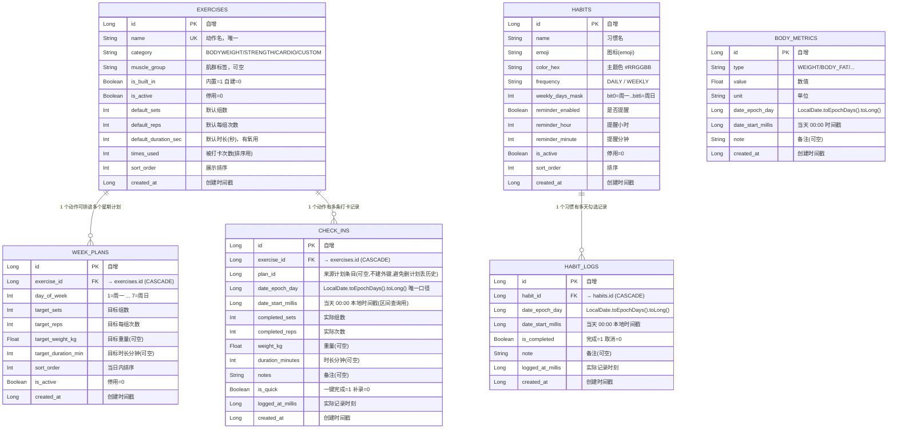
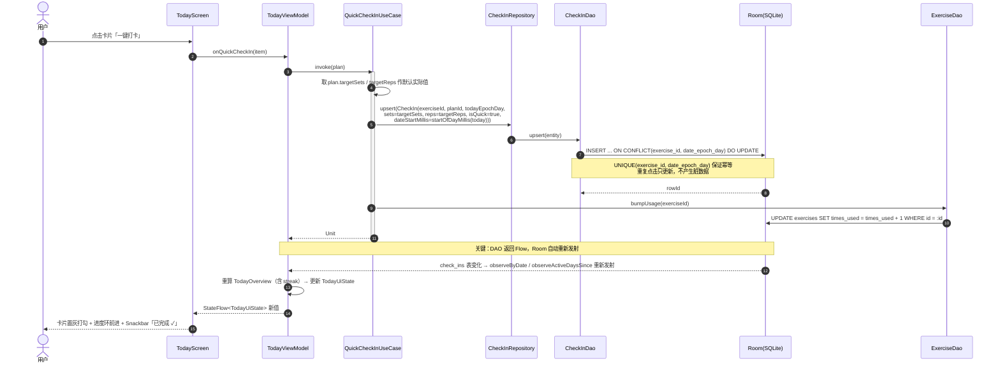
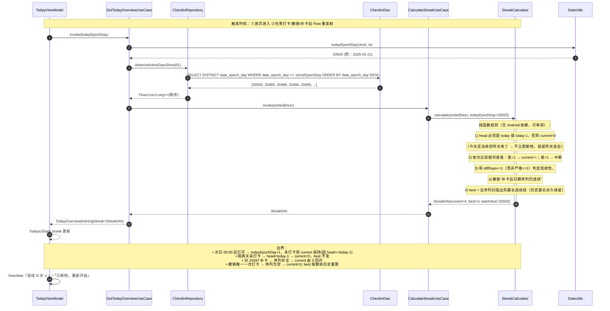
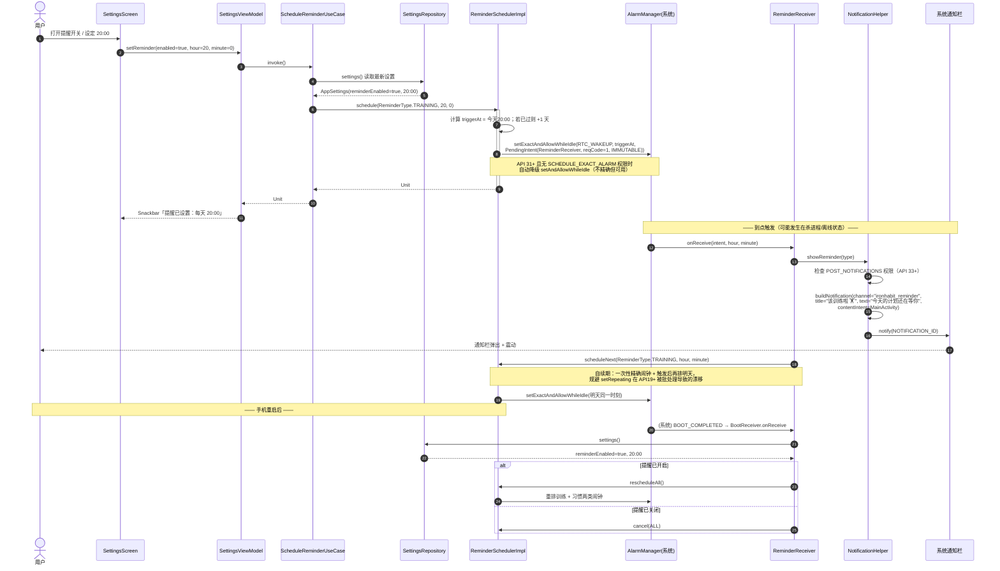
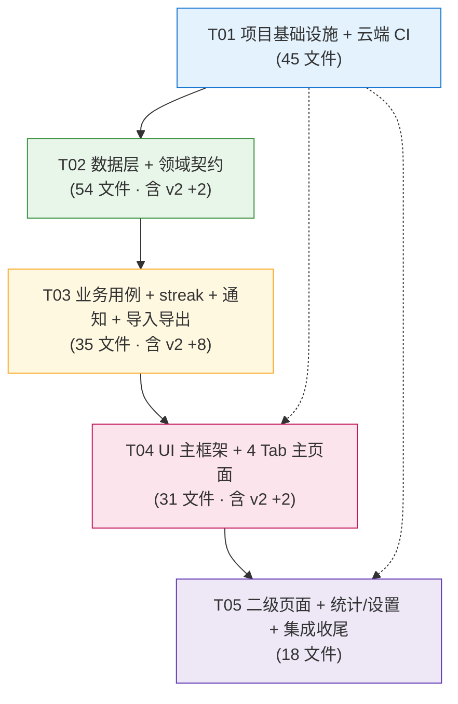

# 自律健身 App（IronHabit）— 系统架构设计 + 任务分解

> 版本：v1.0 ｜ 作者：高见远（架构师）｜ 上游输入：《PRD v1.0》（产品经理 许清楚）
> 交付对象：工程师（施工）、QA（测试）、主理人（汇总）
> 定位：**个人自用 · 单机离线（可选联网：默认关闭，仅限 AI 教练一期，见 `docs/ai-coach-local.md` §6） · 仅 Android · 无账号无广告 · 不上架**
> 输出语言：简体中文 ｜ 本文件为**唯一施工依据**，工程师按第 5 章任务顺序施工

---

## 目录

- [0. 治理原则（跨章节通用约定）](#0-治理原则跨章节通用约定)
- [A. 系统设计](#a-系统设计)
  - [1. 实现方案与技术选型](#1-实现方案与技术选型)
  - [2. 文件列表（施工图）](#2-文件列表施工图)
  - [3. 数据结构与接口](#3-数据结构与接口)
  - [4. 程序调用流程](#4-程序调用流程)
- [B. 任务分解](#b-任务分解)
  - [5. 任务列表（有序 · 带依赖）](#5-任务列表有序--带依赖)
  - [6. 依赖包清单](#6-依赖包清单)
  - [7. 共享知识（跨文件约定）](#7-共享知识跨文件约定)
  - [8. 待明确事项](#8-待明确事项)
- [附：P0 需求追溯矩阵](#附p0-需求追溯矩阵)
- [附：云端 CI 完整配方](#附云端-ci-完整配方真实可跑)

---

# 0. 治理原则（跨章节通用约定）

> 本节沉淀的是**"怎么下结论、怎么写约束"**的规则，优先级高于后续所有章节的具体内容。
> 起因：本项目曾有一句"本工程从未被真实编译过"被当成事实传递了数轮，误导了工程师判断。
> 为避免重演，凡写入本文档的结论与约束，一律遵守以下三条。

### 0.1 数字 / 清单类约束，必须**写清适用范围**

任何形如"总数 N 个文件""必须 / 不得做某事"的约束，都要显式声明**它管到哪、不管到哪**。

- **反面**：只写"§2 保持 171 个文件不变" → 后人做真实功能增量时，会误以为加文件就违规，于是不敢加、或偷偷加了却不改数字。
- **正面**（本文档现行写法，见 §2 抬头）：
  > "171 个文件不变"**仅适用于「只改版本数字 / 只改文档表述、不引入新功能」的变更**；
  > **真实功能增量允许且应当新增文件**，但必须同步更新计数与认领表 ——
  > **数字变化本身不是违规，数字与代码脱节才是违规**。

### 0.2 结论必须**标注来源**：✅ 实测 / 🔶 推演 / 🔗 引用

**约定**：凡写入本文档的判断性结论，都要能回答"这句话是怎么来的"。新增或修订结论时请带上标记：

| 标记 | 含义 | 要求 |
|------|------|------|
| **✅ 实测** | 由**真实执行**得出（编译 / 运行 / 读源码 / 解包 AAR / 查真机） | 必须附**可复现的依据**：命令与输出、文件路径+行号、产物字节数等 |
| **🔶 推演** | 由**逻辑推理**得出，尚未经真实执行验证 | 必须写明"**未验证**"，并给出**验证方法**（谁、怎么验） |
| **🔗 引用** | 转述他人 / 文档 / 官方文档的说法 | 必须给出**出处**；转述二手结论时**降级为 🔶**，不得冒充 ✅ |

**红线**：🔶 推演**不得**在传递中被改写成 ✅ 实测。接收方有责任追问来源。

**本文档关键结论的来源标注（速查）**：

| 结论 | 来源 | 依据 |
|------|------|------|
| `compileSdk` 必须 ≥ 35 | **✅ 实测** | `:app:checkDebugAarMetadata` 报错原文 + 二次编译 BUILD SUCCESSFUL（§3.8） |
| 本机已能编出可安装 APK | **✅ 实测** | `app-debug.apk` 18868962 字节，dex 内含 MainActivity / IronHabitApp / BootReceiver（§1.1） |
| Room 共 **6** 张表（非 7 张） | **✅ 实测** | `AppDatabase.kt:30-37` |
| Room **无**数据炸弹（仅 onDowngrade 破坏性） | **✅ 实测** | `DatabaseModule.kt:42` 只有 `fallbackToDestructiveMigrationOnDowngrade()` |
| `week_plans` / `check_ins` 外键子列均有索引 | **✅ 实测** | `WeekPlanEntity.kt:26-28`、`CheckInEntity.kt:27-30` |
| Vico 2.2.0 无饼图实现 | **✅ 实测** | 下载 AAR 解析类名 |
| kotlinx-datetime 0.6.1 的 API 形态 | **✅ 实测** | 解包 `sources.jar` 读源码 |
| schema v2 迁移只能用 `ADD COLUMN` | **🔶 推演（主理人已批准降级，原标 ✅ 实测）** | **完整推理链**：①【已知事实 A · 🔗 引用】`ALTER TABLE … DROP COLUMN` 需 SQLite ≥ 3.35、`RENAME COLUMN` 需 SQLite ≥ 3.25（来源：SQLite / Android 官方版本门槛文档）；②【已知事实 B · ✅ 实测】本工程 `minSdk = 24`（`app/build.gradle.kts`），即需覆盖 Android 7.0 起的老设备，其内置 SQLite 版本**低于**上述门槛；③【由此得出的结论】v2 迁移**只能 `ADD COLUMN`**，禁用 `DROP COLUMN` / `RENAME COLUMN`。**⚠️ 未在 API 24 设备上实测过 DROP/RENAME 的真实行为**（①②均为间接依据，属推演，不是实测）。验证方法：API 24 模拟器跑一次含 `DROP COLUMN` 的迁移，确认报错。**判错的代价**：仅"少用一种可选的迁移手段"，不影响任何已实现功能，故宁可标严。 |
| **`targetSdk` 保持 34 不会引入回归** | **🔶 推演** | 依据 AGP 官方语义；**未经真机回归验证**。验证方法：Android 15 模拟器装机后跑一遍 4 个 Tab |
| **首启空态不会崩** | **🔶 推演** | 静态审查了全部卫语句（`StreakCalculator:25` 等，见装机审查报告）；**未经装机验证**。验证方法：**首次装机后直接打开 App，空库走一遍 4 个 Tab**（这是装机验证的**头号必做项**） |
| 通知提醒链路可用 | **🔶 推演（已修复，待真机验证）** | 原两个 🟡（启动时不重排闹钟、缺一次性通知权限申请）**已在提交 `b8fb7fb`（v1.1）修复并 push**：启动协程补 `rescheduleAll()`；主 Activity 首帧可见时一次性申请 `POST_NOTIFICATIONS`（DataStore 标记只弹一次，复用 `shouldAskNotificationPermission()`）。**但从未在真机验证过（手上无可用设备）** → 结论仍为 **🔶，不得升格为"已验证可用"**。验证方法：真机设定 2 分钟后提醒 + 重启手机确认重排 |

> ⚠️ **上表 🔶 项正是下一步装机验证的重点**。**推演结论在装机前一律不得当作"已验证"对外宣称。**

### 0.3 Windows 上 Gradle 报错，先按 **GBK** 解码再判断

Gradle 在 Windows 中文环境下抛出的系统级错误，**错误信息是 GBK 编码的**，
在 UTF-8 终端里会显示为乱码或被忽略，**极易被误判为源码问题**。

| 已知坑 | 现象 | 真实原因 | 解法 |
|-------|------|---------|------|
| `mergeExtDexDebug` 失败 | 报错为 GBK「**拒绝访问。**」，对象是 `.part` 临时文件 | **Gradle 写 build-cache 被 Windows 拒绝**，属**环境权限**问题，**不是源码问题** | 清理残留 `.part` → 用 **`--no-build-cache`** 重跑：`./gradlew :app:assembleDebug --no-build-cache` |

**排错顺序**：先看报错的**原始字节 / 按 GBK 解码** → 再判断是环境问题还是代码问题。
**不要一看到构建失败就去改源码。**

---

# A. 系统设计

## 1. 实现方案与技术选型

### 1.1 核心技术难点

| # | 难点 | 本设计的解法 |
|---|------|-------------|
| D1 | **本机长期无 JDK / 无 Android SDK，无法本地出包**（v1 设计时的前提） | ⚠️ **前提已变更（基线更正）**：本机现已具备完整工具链，**可本地出包**（详见下方「本地构建环境与已知坑」）。原「全部构建搬到 GitHub Actions」的方案**保留**，用途收敛为产出**已签名 release APK**（keystore Secret 在 CI 侧，见 §附 CI 配方） |
| D2 | **keystore 无法本地生成**（v1 设计时假设用户无 JDK、跑不了 keytool） | ⚠️ **方案已作废（安全更正）**：原独立 workflow `generate-keystore.yml`（CI 用 `keytool` 生成 `.jks` 并上传 artifact）**已删除**——它把 base64 私钥 `cat` 进 Actions 日志、把 `.jks` 与 `.base64` 上传成**可下载的 Artifact**，口令还是写死的公开值，等于把**签名身份**连同口令一起公开，而 Android 的签名身份**无法吊销**。现口径：keystore 由用户**在本机**生成（见 `docs/CI.md` §2）；`android-release.yml` 在 4 个 Secret 缺任意一个时**立刻失败**，**不再**生成"临时 keystore" |
| D3 | **streak 跨天 / 补卡 / 断档**边界 | 全部日期以 **`LocalDate.toEpochDays()`（返回 `Int`，落库时 `.toLong()`）为主键口径**（见 7.3），streak 用**纯函数 `StreakCalculator`** 从日志现算，杜绝"缓存与日志不一致"这类 bug；补卡 = 对历史 `dateEpochDay` 做 upsert，天然融入 streak 计算 |
| D4 | **杀进程数据不丢 + 飞行模式全可用** | Room 落盘为唯一真源；无任何网络依赖库（依赖清单内**无** Retrofit/OkHttp/Ktor）；`Application` 只在首启做一次预置动作写入（幂等 `OnConflictStrategy.IGNORE`） |
| D5 | **"一键打卡"零摩擦 + 可选补录** | 卡片点击 → `QuickCheckInUseCase` 用计划目标值直接 upsert；长按/展开 → `DetailedCheckInUseCase` 写组/次/重量。「同一动作同一天」用 `UNIQUE(exercise_id, date_epoch_day)`（表列名 snake_case）保证**幂等**，重复点不会产生脏数据 |
| D6 | **本地提醒"到点"触发** | 明确结论见 1.3 —— 用 **AlarmManager**（`setExactAndAllowWhileIdle`）+ 触发后自续期 + `BOOT_COMPLETED` 重排 |

#### ⭐ 本地构建环境与已知坑（**基线：本机已能编译出可安装 APK**）

> **现状**：debug 产物 `app/build/outputs/apk/debug/app-debug.apk` 已能真实编译出来（18868962 字节），
> dex 内可解出 `com.ironhabit.app.MainActivity`、`IronHabitApp`、`data.notification.BootReceiver`。

**工具链位置（本机）**

| 项 | 路径 |
|----|------|
| JDK | `C:/Users/science/android-tools/jdk17`（17.0.20.1） |
| Gradle | `C:/Users/science/android-tools/gradle-8.9/bin/gradle`（**注意：不是 wrapper 里的 8.11.1**） |
| Android SDK | `C:/Users/science/AppData/Local/Android/Sdk`（platform = `android-35`，build-tools = `35.0.0`） |

**工程缺 `local.properties`，跑 gradle 前必须显式设 `ANDROID_HOME`：**

```bash
export ANDROID_HOME="C:/Users/science/AppData/Local/Android/Sdk"
./gradlew :app:assembleDebug
```

> **🔴 已知坑 1 · Windows 上 Gradle build-cache 写文件被拒绝访问**
> 现象：编译可顺利通过 `checkDebugAarMetadata`，但在 **`mergeExtDexDebug`** 阶段失败。
> 报错是 **GBK 编码的「拒绝访问。」**（英文环境看不到，极易误判为源码问题），报的对象是 `.part` 临时文件 ——
> 即 **Gradle 写 build-cache 时被 Windows 拒绝**，**属于环境权限问题，不是源码问题**。
> **解法**：清理残留的 `.part` 文件后，改用 **`--no-build-cache`** 重跑：
> ```bash
> ./gradlew :app:assembleDebug --no-build-cache
> ```
> 以后再遇到 `mergeExtDexDebug` 阶段的「拒绝访问」，**先想到这条，不要去改源码**。

> **🔴 已知坑 2 · `compileSdk` 下限只存在于 AAR 元数据中**
> 任何依赖版本变更后，**必须真实跑一次 `./gradlew :app:checkDebugAarMetadata`**，不得靠静态推演判断兼容性。
> 详见 §3.8 的经验条目。

> **🔴 已知坑 3 · 直接调用 `gradle.bat` 会 `EXIT=127`**
> 在 Windows / Git-Bash 下直接执行 `gradle.bat` 会因找不到启动器而返回 **`EXIT=127`**（表现为"命令未找到"）。
> **解法**：一律走 **`bin/gradle`（POSIX 启动器）**，即 `<GradleHome>/bin/gradle`（本机：`C:/Users/science/android-tools/gradle-8.9/bin/gradle`）。

> **🔴 已知坑 4 · `ANDROID_HOME` 必须是 Windows 形式路径**
> 在 Git-Bash 里若把 `ANDROID_HOME` 设成 POSIX 形式（如 `/c/Users/.../Android/Sdk`），Gradle 会报 **"SDK not found"**。
> **解法**：设成 **Windows 形式**（`C:/Users/science/AppData/Local/Android/Sdk`，正斜杠即可），即上方 `export ANDROID_HOME=...` 的写法。

### 1.2 分层架构（Clean Architecture，单 module 内分层）

个人自用项目**不拆多 Gradle module**（过度工程），但在**单个 `app` module 内严格分层**，依赖方向单向向下：

```
        ┌──────────────────────────────────────────────┐
        │  ui/  (Presentation)                         │
        │  Compose Screen + ViewModel + UiState        │
        │  ❗ 只依赖 domain，不直接碰 Room/DAO           │
        └───────────────┬──────────────────────────────┘
                        │ 调用 UseCase / 观察 Flow
        ┌───────────────▼──────────────────────────────┐
        │  domain/  (业务逻辑，纯 Kotlin，无 Android 依赖)│
        │  model · repository(接口) · usecase · util    │
        └───────────────┬──────────────────────────────┘
                        │ 依赖倒置：domain 定义接口，data 实现
        ┌───────────────▼──────────────────────────────┐
        │  data/  (实现层)                              │
        │  Room(entity/dao/db) · DataStore · preset     │
        │  RepositoryImpl · mapper · notification        │
        └──────────────────────────────────────────────┘
```

| 层 | 包路径 | 职责 | 允许依赖 |
|----|--------|------|---------|
| `ui` | `com.ironhabit.app.ui.**` | 渲染、交互、状态持有（`StateFlow<UiState>`） | `domain` |
| `domain` | `com.ironhabit.app.domain.**` | 业务规则（streak、打卡、统计算法）、接口定义 | 无（仅 Kotlin stdlib + kotlinx-datetime） |
| `data` | `com.ironhabit.app.data.**` | Room / DataStore / 通知调度 / JSON 备份的具体实现 | `domain` |
| `di` | `com.ironhabit.app.di.**` | Hilt 装配（把 `data` 实现绑定到 `domain` 接口） | `data` + `domain` |

> **例外约定**：`domain/util/StreakCalculator` 与 `DateUtils` 为纯函数，不得 import 任何 `android.*`，以便 JVM 单测。

### 1.3 关键库选型与理由

| 关注点 | 选型 | 版本 | 理由 / 否决项 |
|--------|------|------|--------------|
| UI 框架 | Jetpack Compose + **Material 3** | BOM `2024.12.01` | 与 8 个参考项目一致；M3 原生动态色、组件齐 |
| 依赖注入 | **Hilt**（KSP，非 KAPT） | `2.52` | 参考项目共识；KSP 编译更快；`2.52` 与 Kotlin `2.0.21` 官方兼容 |
| 本地持久化 | **Room**（KSP） | `2.6.1` | 编译期 SQL 校验、`Flow` 原生响应式、迁移可控 |
| 键值设置 | **DataStore Preferences** | `1.1.1` | 主题/单位/提醒开关等轻量设置；替代 SharedPreferences（无阻塞主线程） |
| 图表 | **自绘 Canvas**（Compose 原生 `Canvas`/`drawPath`/`drawArc`） | 0 依赖 | **不用任何第三方图表库**。理由：① Vico 2.2.0 **只有直角坐标图、无饼图实现**（主理人下载 AAR 解析类名实证），无法满足分类占比饼图；② ~~本机无 JDK/Android SDK，第三方图表库的**参数名无法本地编译验证**~~ **（该前提已过时，见 §1.1：本机工具链早已就绪且已真实编译通过；此条不再成立，但决策保留，理由见 §2.7）**；③ 两张图（趋势柱状 + 占比饼图）用 Canvas 手绘约 100 行即可，彻底消除依赖与版本风险。**同时否决 MPAndroidChart**（View 体系需 AndroidView 桥接） |
| 日期/时区 | **kotlinx-datetime** | `0.6.1` | 提供 `LocalDate`/`TimeZone`，**避免 java.time 在 minSdk 24 上必须开 core library desugaring**；纯 Kotlin，domain 层可单测 |
| 序列化 | **kotlinx.serialization-json** | `1.7.3` | P1 导入导出用；编译期生成、无反射、体积小；**否决 Gson**（反射开销 + 字段丢失静默） |
| 协程 | kotlinx-coroutines-android | `1.9.0` | 标准 |
| 导航 | navigation-compose | `2.8.5` | 4 Tab + 二级页标准方案 |
| 启动图 | core-splashscreen | `1.0.1` | Android 12+ 启动动画统一 |
| 测试 | JUnit4 + MockK + Turbine + Robolectric | — | 与参考项目 Lift/HabitPal 一致 |
| **编译目标**（编译期 API 面） | `compileSdk 35` ／ `targetSdk 34` ／ `minSdk 24` | `35` | **由真实编译校验得出，非静态推演**（详见 §3.8）：`androidx.core:core(-ktx):1.15.0` 的 **AAR 元数据**要求依赖方以 `compileSdk ≥ 35` 编译，AGP `checkDebugAarMetadata` 据此硬报错。`compileSdk` 与 `targetSdk` **不需要同步**——前者只是**编译期可用的 API 面**，后者才是**对系统的运行时行为声明**；本项目 `targetSdk` 刻意保持 34 不变 |

#### ⭐ 提醒调度：AlarmManager vs WorkManager —— 明确结论

**结论：P0 的每日提醒使用 `AlarmManager`，不使用 `WorkManager`。**

| 维度 | AlarmManager（**选用**） | WorkManager（否决） |
|------|------------------------|-------------------|
| 时间精度 | `setExactAndAllowWhileIdle` 可**精确到分钟**，即使 Doze 也会唤醒 | `PeriodicWorkRequest` 只保证"大约每天"，实测可延迟 **10~60 分钟以上**，且最小间隔 15 min、有 flex 窗口 |
| 与需求匹配 | P0-8 明确"**到点**触发提醒" → 需要精度 | 不满足"到点"语义 |
| 免网络 | 纯本地，SystemService | 同为本地，但多引入 `androidx.work` + `hilt-work` 两个依赖 |
| 复杂度 | 需处理 `SCHEDULE_EXACT_ALARM` 权限 + 触发后自续期 + 开机重排 | 无权限门槛，但每日周期会漂移 |
| 降级策略 | 用户未授予精确闹钟权限（API 31+）时自动降级为 `setAndAllowWhileIdle`（不精确但可用），并在设置页提示 | — |

**实现要点**（详见 §4.3 时序图）：
1. `ReminderReceiver` 收到闹钟 → `NotificationHelper` 发通知 → **立即用同一 PendingIntent 续排明天的闹钟**（一次性精确闹钟 + 自续期，规避 `setRepeating` 在 API 19+ 被批处理的失真）。
2. `BootReceiver`（监听 `BOOT_COMPLETED` / `MY_PACKAGE_REPLACED`）→ 重新读取 DataStore 中的提醒设置并重排，保证**重启后提醒不丢**。
3. `PendingIntent` 的 `requestCode` 由 `reminderType` 决定（训练=1，习惯=2），`FLAG_IMMUTABLE or FLAG_UPDATE_CURRENT`。
4. 清单声明 `POST_NOTIFICATIONS`（API 33+ 运行时申请）、`SCHEDULE_EXACT_ALARM`（API 31+）、`RECEIVE_BOOT_COMPLETED`、`VIBRATE`。

**WorkManager 在本项目中的定位**：**P0 不引入**。P1 的"休息计时器后台运行"将改用**前台服务（Foreground Service）**而非 WorkManager（计时需要秒级精度与前台通知）。此决策保证 P0 依赖面最小。

### 1.4 依赖管理：Version Catalog

所有版本集中在 `gradle/libs.versions.toml`，`build.gradle.kts` 一律用 `alias(...)` / `libs.xxx` 引用，**禁止**硬编码版本串。完整内容见 [§6](#6-依赖包清单)。

### 1.5 导航结构（4 Tab，落地 PRD §3.2）

- **一级（底部导航常驻）**：`today`（今日）/ `train`（训练）/ `discipline`（自律）/ `profile`（我的）
- **二级（全屏表单页，底部栏隐藏）**：见 §3.3 `Destinations`
- 返回栈策略：`popUpTo(startDestination){ saveState=true } + launchSingleTop=true + restoreState=true`（沿用 BaseFit 已验证写法）

---

## 2. 文件列表（施工图）

> 约定：包根 `com.ironhabit.app`；Kotlin 源根 `app/src/main/java/`。
> **总计 191 个文件（当前已落地 = 183@`938210c` + §2.11 的 6 + §2.12 的 2）** = 构建与配置 18（§2.1+§2.2）+ Kotlin 源文件 152（§2.3+§2.4+§2.5+§2.6+§2.8 的 133 ＋ §2.9 的 11 ＋ §2.11 的 6 ＋ §2.12 的 2）+ Android 资源 20（§2.7）+ Room schema 1（§2.9 的 `2.json`）。
> 各小节计数：§2.1=14 ｜ §2.2=4 ｜ §2.3=7 ｜ §2.4=37 ｜ §2.5=35 ｜ §2.6=45 ｜ §2.7=20 ｜ §2.8=9 ｜ **§2.9=12（v2 增量，已落地）** ｜ **§2.11=6（`938210c` 后增量，已落地）** ｜ **§2.12=2（M2.5 身体档案，已落地）**。合计 **191**。
> **⚠️ 计数更正（以 git 事实为准，共三次）**：① 原登记「总数 182（§2.9=11）」→ **实际 183（§2.9=12）**：§2.9 与 `docs/schema-v2.md` §8.2 均漏登 `SetRpeUseCase.kt`，详见 §2.9。② 原登记「总数 183（截至 `938210c`）」→ **实际 189（截至 `d734746`）**：`938210c` 之后新增 **6** 个 `.kt`，详见 §2.11。③ 原登记「总数 189（截至 `d734746`）」→ **实际 191（截至 `015d637`）**：M2.5 落地新增 **2** 个文件（`UserProfile.kt` 主源码 + `UserProfileTest.kt` 测试），详见 §2.12。
> **v3 剩余部分（饮食模块 + 本地 AI 教练）设计已登记、尚未施工**：将新增 **§2.10（28 个文件）**，落地后总数 **191 → 219**。见 `docs/schema-v3-meals.md`、`docs/ai-coach-local.md`。
> **🔑 两个数字的关系（避免误读）**：**191 = 已落地（截至提交 `015d637`）；219 = 含 v3 剩余预留** —— v3 的饮食与 AI 教练尚未施工，**切勿**把 219 误读为"已经写了 219 个文件"。
>
> **⭐「171 个文件」红线的适用范围（务必读，避免误判）**：
> 原「§2 保持 171 个不变」的红线**仅适用于「只改版本数字 / 只改文档表述、不引入新功能」的变更**（例：compileSdk 34 → 35 那次，见 §3.8）。
> **凡是真实功能增量**（如 v2：逐组打卡、RPE、计划 CRUD、习惯 CRUD、日期切换），**允许且应当新增文件**，
> 但**必须同步更新本节计数与 §5.2 认领表**——**数字变化本身不是违规，数字与代码脱节才是违规**。
> v2 增量的完整设计与理由见 **`docs/schema-v2.md`**。

### 2.1 根工程与构建（14）

| 相对路径 | 职责（一句话） |
|---------|--------------|
| `settings.gradle.kts` | 声明 pluginManagement/dependencyResolutionManagement 仓库与 `:app` 模块 |
| `build.gradle.kts` | 根构建脚本，声明全部插件 `apply false` |
| `gradle.properties` | JVM 参数、AndroidX、Kotlin 官方代码风格、非传递 R 类 |
| `gradle/libs.versions.toml` | **Version Catalog**：集中管理全部依赖版本（见 §6） |
| `gradle/wrapper/gradle-wrapper.properties` | 锁定 Gradle `8.11.1` |
| `gradle/wrapper/gradle-wrapper.jar` | Gradle Wrapper 二进制（**从 `references/repos/habit-tracker-main/gradle/wrapper/` 拷贝**） |
| `gradlew` | Unix 启动脚本（从 habit-tracker 拷贝，保持可执行位） |
| `gradlew.bat` | Windows 启动脚本（从 habit-tracker 拷贝） |
| `.gitignore` | 忽略 `build/`、`.gradle/`、`local.properties`、`keystore.properties`、`*.jks` |
| `README.md` | 项目说明 + 首次部署 / 出包 / 换机安装步骤 |
| `.github/workflows/android-ci.yml` | push/PR 触发：编译 + 单测 + 产出 debug APK |
| `.github/workflows/android-release.yml` | 打 tag / 手动触发：构建**已签名** release APK + 上传 artifact + 建 Release |
| `.github/workflows/generate-keystore.yml` | ⚠️ **（已删除 · 保留登记）**原职责「CI 内用 keytool 生成 `.jks` 并上传 artifact，供用户存入 Secret」**已作废**：私钥进日志 / 变成可下载 Artifact = **公开签名身份**（原因见 §1.1 D2 与 §附 B）；改由用户**在本机**生成（`docs/CI.md` §2） |
| `docs/CI.md` | keystore（**本机**生成）→ Secret 配置 → 出包 → 手机安装 的图文步骤 |

> ⚠️ **基线更正（安全）**：本表第 14 项 `.github/workflows/generate-keystore.yml` **已删除**——CI 生成 keystore 必然把私钥带进日志 / 可下载的 Artifact，等于**公开签名身份**（原因与替代口径见 §1.1 D2 与 §附 B）。
> 该行**保留登记**（不静默抹掉历史），故本表仍计 **14** 项、§5.2 的 T01 仍为 **45** —— 这是**登记口径**，锚点依旧为提交 `015d637`；**当前工作副本里本表实际存在 13 个文件**，`.github/workflows/` 目录下实际只有 **2** 个 workflow。
> 若要把口径改成「以当前工作副本为准」（§2 抬头 **191 → 190**），须同步更正 `docs/ai-coach-local.md`、`docs/schema-v3-meals.md` 中的同一数字，**不要在单份文档里改一半**。

### 2.2 `app` 模块构建与清单（4）

| 相对路径 | 职责 |
|---------|------|
| `app/build.gradle.kts` | app 模块：编译配置、`signingConfigs.release` 读 `keystore.properties`、全部依赖 |
| `app/proguard-rules.pro` | R8 保留规则（Room/Hilt/kotlinx.serialization 的 keep 规则） |
| `app/src/main/AndroidManifest.xml` | 权限 + Application/Activity/Receiver 声明 |
| `app/src/main/res/xml/backup_rules.xml` | Android 12+ 备份规则（允许备份 DB，实现换机不丢） |

### 2.3 `app` 入口与 DI（7）

| 相对路径 | 职责 |
|---------|------|
| `.../IronHabitApp.kt` | `@HiltAndroidApp`；启动时创建通知渠道、幂等播种内置动作 |
| `.../MainActivity.kt` | `@AndroidEntryPoint`；`setContent` 挂载主题 + 根 Scaffold |
| `.../di/AppModule.kt` | 提供 `CoroutineDispatcher`（IO/Default）、`Clock`(kotlinx-datetime)、`TimeZone` |
| `.../di/DatabaseModule.kt` | 提供 `AppDatabase` + 各 `Dao` |
| `.../di/RepositoryModule.kt` | `@Binds` 把 8 个 `*RepositoryImpl` 绑到 domain 接口 |
| `.../di/NotificationModule.kt` | 提供 `NotificationManagerCompat`、`AlarmManager`、`ReminderScheduler` 绑定 |
| `.../di/Qualifiers.kt` | 自定义 `@IoDispatcher` / `@ApplicationScope` 限定符 |

### 2.4 `data` 层（37）

| 相对路径 | 职责 |
|---------|------|
| `.../data/local/entity/ExerciseEntity.kt` | `exercises` 表（内置/自建动作） |
| `.../data/local/entity/WeekPlanEntity.kt` | `week_plans` 表（周一~周日计划条目） |
| `.../data/local/entity/CheckInEntity.kt` | `check_ins` 表（训练打卡记录） |
| `.../data/local/entity/HabitEntity.kt` | `habits` 表（习惯定义） |
| `.../data/local/entity/HabitLogEntity.kt` | `habit_logs` 表（习惯逐日勾选） |
| `.../data/local/entity/BodyMetricEntity.kt` | `body_metrics` 表（体重/体脂等，P1） |
| `.../data/local/entity/Converters.kt` | Room `@TypeConverter`（枚举/`LocalDate`→`Long`） |
| `.../data/local/dao/ExerciseDao.kt` | 动作库增删改查 + 分类筛选 |
| `.../data/local/dao/WeekPlanDao.kt` | 计划条目增删改查 + 按星期查询（联表过滤停用动作） |
| `.../data/local/dao/CheckInDao.kt` | 打卡记录 upsert/撤销/按日期区间/去重天数聚合 |
| `.../data/local/dao/HabitDao.kt` | 习惯定义增删改查 |
| `.../data/local/dao/HabitLogDao.kt` | 习惯日志 upsert/区间查询/连续天数所需日期序列 |
| `.../data/local/dao/BodyMetricDao.kt` | 身体数据增删改查 + 按类型趋势 |
| `.../data/local/dao/StatsDao.kt` | **纯聚合查询**：近 N 天趋势、分类占比、热力图、完成率（返回 raw DTO） |
| `.../data/local/AppDatabase.kt` | Room 数据库声明（6 实体 + 版本 + TypeConverter） |
| `.../data/local/DatabaseSeeder.kt` | 首启把内置动作写入 `exercises`（`IGNORE` 幂等） |
| `.../data/local/dto/StatsRaw.kt` | 聚合查询返回的 data class DTO（`DayCountRaw`、`CategoryRaw`、`TrendRaw`） |
| `.../data/preset/BuiltInExercises.kt` | **≥40 个内置动作**静态清单（自重/力量/有氧，含默认组次） |
| `.../data/preferences/SettingsDataStore.kt` | DataStore 键定义 + 读写（主题/单位/提醒开关/提醒时间/首启标记） |
| `.../data/mapper/ExerciseMapper.kt` | `ExerciseEntity ⇄ domain.Exercise` |
| `.../data/mapper/PlanMapper.kt` | `WeekPlanEntity ⇄ domain.WeekPlan` |
| `.../data/mapper/CheckInMapper.kt` | `CheckInEntity ⇄ domain.CheckIn` |
| `.../data/mapper/HabitMapper.kt` | `HabitEntity/HabitLogEntity ⇄ domain` |
| `.../data/mapper/BodyMetricMapper.kt` | `BodyMetricEntity ⇄ domain.BodyMetric` |
| `.../data/repository/ExerciseRepositoryImpl.kt` | 实现 `ExerciseRepository`（含分类筛选、停用、去重校验） |
| `.../data/repository/PlanRepositoryImpl.kt` | 实现 `PlanRepository`（按星期取计划 + 目标值） |
| `.../data/repository/CheckInRepositoryImpl.kt` | 实现 `CheckInRepository`（upsert/撤销/区间） |
| `.../data/repository/HabitRepositoryImpl.kt` | 实现 `HabitRepository`（定义 + 日志 + 今日状态） |
| `.../data/repository/StatsRepositoryImpl.kt` | 实现 `StatsRepository`（把 raw DTO 组装为 domain 统计模型） |
| `.../data/repository/BodyMetricRepositoryImpl.kt` | 实现 `BodyMetricRepository` |
| `.../data/repository/SettingsRepositoryImpl.kt` | 实现 `SettingsRepository`（包 DataStore） |
| `.../data/repository/BackupRepositoryImpl.kt` | 实现 `BackupRepository`（kotlinx.serialization JSON 导出/导入，纯本地文件） |
| `.../data/notification/NotificationChannels.kt` | 定义通知渠道 id/名称/重要级（训练、习惯两条渠道） |
| `.../data/notification/NotificationHelper.kt` | 构建并发出提醒通知（含点击跳转 PendingIntent、权限自检） |
| `.../data/notification/ReminderSchedulerImpl.kt` | **AlarmManager** 精确闹钟排期/取消/自续期/开机重排 |
| `.../data/notification/ReminderReceiver.kt` | `BroadcastReceiver`：收到闹钟→发通知→续排明天 |
| `.../data/notification/BootReceiver.kt` | `BroadcastReceiver`：开机/应用更新后重排提醒 |

> 上表 37 个文件 = 实体 7 + DAO 7 + 本地库/播种/DTO 3 + 预置动作 1 + DataStore 1 + 映射 5 + 仓库实现 8 + 通知 5。

### 2.5 `domain` 层（35）

| 相对路径 | 职责 |
|---------|------|
| `.../domain/model/Exercise.kt` | 领域模型 `Exercise` + `ExerciseCategory` 枚举 |
| `.../domain/model/WeekPlan.kt` | 领域模型 `WeekPlan`（含 `DayOfWeek` 1..7） |
| `.../domain/model/CheckIn.kt` | 领域模型 `CheckIn` |
| `.../domain/model/Habit.kt` | 领域模型 `Habit` + `HabitFrequency` |
| `.../domain/model/HabitLog.kt` | 领域模型 `HabitLog` |
| `.../domain/model/BodyMetric.kt` | 领域模型 `BodyMetric` + `BodyMetricType` |
| `.../domain/model/TodayOverview.kt` | 首页聚合视图模型（训练项 + 习惯项 + 进度 + streak） |
| `.../domain/model/StreakInfo.kt` | streak 结果模型（current / best / lastActiveDate） |
| `.../domain/model/StatsModels.kt` | 统计模型：`TrendPoint`/`CategoryShare`/`HeatmapCell`/`PeriodComparison` |
| `.../domain/model/AppSettings.kt` | 设置聚合模型（主题/单位/提醒） |
| `.../domain/model/BackupPayload.kt` | 导入导出根模型（`@Serializable`） |
| `.../domain/repository/ExerciseRepository.kt` | 动作仓库接口 |
| `.../domain/repository/PlanRepository.kt` | 计划仓库接口 |
| `.../domain/repository/CheckInRepository.kt` | 打卡仓库接口 |
| `.../domain/repository/HabitRepository.kt` | 习惯仓库接口 |
| `.../domain/repository/StatsRepository.kt` | 统计仓库接口 |
| `.../domain/repository/BodyMetricRepository.kt` | 身体数据仓库接口 |
| `.../domain/repository/SettingsRepository.kt` | 设置仓库接口 |
| `.../domain/repository/BackupRepository.kt` | 备份仓库接口 |
| `.../domain/repository/ReminderScheduler.kt` | 提醒调度接口（domain 只描述"排期/取消/重排"） |
| `.../domain/usecase/GetTodayOverviewUseCase.kt` | 组装首页「今日」数据（训练+习惯+进度+streak） |
| `.../domain/usecase/QuickCheckInUseCase.kt` | 一键打卡（用计划目标值 upsert） |
| `.../domain/usecase/DetailedCheckInUseCase.kt` | 补录打卡（组/次/重量/时长/备注） |
| `.../domain/usecase/UndoCheckInUseCase.kt` | 撤销某动作某天的打卡 |
| `.../domain/usecase/BackfillCheckInUseCase.kt` | 补卡（对历史日期 upsert） |
| `.../domain/usecase/ToggleHabitUseCase.kt` | 勾选/取消某习惯某天 |
| `.../domain/usecase/CalculateStreakUseCase.kt` | 调 `StreakCalculator` 算某习惯/训练的 current+best |
| `.../domain/usecase/GetHeatmapUseCase.kt` | 生成日历热力图数据（近 N 天密度+连击） |
| `.../domain/usecase/GetStatsUseCase.kt` | 生成趋势/占比/对比统计；单一 `invoke(days: Int = 30)` 返回 `StatsBundle`（见 §3.2） |
| `.../domain/usecase/ScheduleReminderUseCase.kt` | 读取设置→调 `ReminderScheduler`，统一提醒入口 |
| `.../domain/usecase/ExportDataUseCase.kt` | 导出 JSON 到应用私有目录并返回 Uri |
| `.../domain/usecase/ImportDataUseCase.kt` | 从 Uri 读 JSON 并覆盖写库（事务） |
| `.../domain/usecase/SeedExercisesUseCase.kt` | 首启播种内置动作（幂等） |
| `.../domain/util/DateUtils.kt` | 日期口径：`todayEpochDay(clock, tz)`、`startOfDayMillis(epochDay, tz)`、`weekdayMon1(epochDay)` |
| `.../domain/util/StreakCalculator.kt` | **纯函数**：由 `List<Long>(epochDay, 降序)` 算 current/best（支持"今天未打卡但昨天打了"不立即断档） |

### 2.6 `ui` 层（45）

| 相对路径 | 职责 |
|---------|------|
| `.../ui/theme/Color.kt` | M3 色板（浅/深） |
| `.../ui/theme/Type.kt` | 字体排版 |
| `.../ui/theme/Theme.kt` | `IronHabitTheme`（支持浅/深/跟随系统） |
| `.../ui/navigation/Destinations.kt` | 路由常量 + 二级页 `createRoute()` 工厂 |
| `.../ui/navigation/IronHabitNavGraph.kt` | `NavHost` 全量路由注册 |
| `.../ui/navigation/BottomBar.kt` | 4 Tab `NavigationBar` + 可见性判定 |
| `.../ui/navigation/AppRoot.kt` | 根 `Scaffold`（TopBar + BottomBar + SnackbarHost） |
| `.../ui/components/ProgressRing.kt` | 今日完成度圆环（含 streak 大字） |
| `.../ui/components/ExerciseCheckCard.kt` | 训练打卡卡片（一键打卡 + 展开补录入口） |
| `.../ui/components/HabitRow.kt` | 习惯勾选行 |
| `.../ui/components/HeatmapGrid.kt` | 类 GitHub 贡献图（日历热力图） |
| `.../ui/components/TrendChart.kt` | **Canvas 手绘**折线/柱状趋势图（0 第三方依赖） |
| `.../ui/components/CategoryPieChart.kt` | **Canvas 手绘**分类占比饼图（`drawArc`，0 第三方依赖） |
| `.../ui/components/EmptyState.kt` | 统一空态（插画 + 引导按钮） |
| `.../ui/components/LoadingSkeleton.kt` | 统一骨架屏 |
| `.../ui/components/AppSnackbarHost.kt` | 统一 Snackbar 反馈（写入操作反馈） |
| `.../ui/screens/today/TodayScreen.kt` | Tab1「今日」页面 |
| `.../ui/screens/today/TodayViewModel.kt` | 今日页 VM |
| `.../ui/screens/today/TodayUiState.kt` | 今日页 UiState |
| `.../ui/screens/train/TrainScreen.kt` | Tab2「训练」页面（周计划/动作库/历史 三分段） |
| `.../ui/screens/train/TrainViewModel.kt` | 训练页 VM |
| `.../ui/screens/train/TrainUiState.kt` | 训练页 UiState |
| `.../ui/screens/discipline/DisciplineScreen.kt` | Tab3「自律」页面（习惯列表 + 热力图 + 小结） |
| `.../ui/screens/discipline/DisciplineViewModel.kt` | 自律页 VM |
| `.../ui/screens/discipline/DisciplineUiState.kt` | 自律页 UiState |
| `.../ui/screens/profile/ProfileScreen.kt` | Tab4「我的」页面（图表 + 身体数据 + 设置入口） |
| `.../ui/screens/profile/ProfileViewModel.kt` | 我的页 VM |
| `.../ui/screens/profile/ProfileUiState.kt` | 我的页 UiState |
| `.../ui/screens/exercise/AddEditExerciseScreen.kt` | 新增/编辑动作表单 |
| `.../ui/screens/exercise/AddEditExerciseViewModel.kt` | 动作表单 VM |
| `.../ui/screens/exercise/ExerciseDetailScreen.kt` | 动作详情 + 历史 |
| `.../ui/screens/exercise/ExerciseDetailViewModel.kt` | 动作详情 VM |
| `.../ui/screens/plan/AddEditPlanScreen.kt` | 新增/编辑计划条目表单 |
| `.../ui/screens/plan/AddEditPlanViewModel.kt` | 计划表单 VM |
| `.../ui/screens/habit/AddEditHabitScreen.kt` | 新增/编辑习惯表单（含提醒时间） |
| `.../ui/screens/habit/AddEditHabitViewModel.kt` | 习惯表单 VM |
| `.../ui/screens/history/HistoryScreen.kt` | 打卡历史（按日期倒序 + 完成率） |
| `.../ui/screens/history/HistoryViewModel.kt` | 历史页 VM |
| `.../ui/screens/checkin/CheckInSheet.kt` | 展开补录底部弹层（组/次/重量/备注） |
| `.../ui/screens/bodymetrics/BodyMetricsScreen.kt` | 身体数据录入 + 趋势（P1） |
| `.../ui/screens/bodymetrics/BodyMetricsViewModel.kt` | 身体数据 VM |
| `.../ui/screens/settings/SettingsScreen.kt` | 设置页（提醒/主题/单位/关于） |
| `.../ui/screens/settings/SettingsViewModel.kt` | 设置页 VM |
| `.../ui/screens/settings/BackupScreen.kt` | 导入/导出页（P1） |
| `.../ui/screens/settings/BackupViewModel.kt` | 备份页 VM |

> **落点确认（不新增文件）**：精确闹钟权限引导 UI 落在 **`ui/screens/settings/SettingsScreen.kt`**——当用户开启提醒且系统未授予 `SCHEDULE_EXACT_ALARM`（API 31+）时，在提醒开关下方展示引导条（跳转系统"闹钟与提醒"设置页）；用户拒绝则降级 `setAndAllowWhileIdle` 并显示"已降级为不精确提醒"。该 UI 由 `SettingsViewModel` 持有的 `AppSettings` 派生状态驱动，**仅复用现有 20 个 `ui` 文件，当时文件总数保持 171 不变**（v2 增量后为 183，见 §2.9）。

> **为何不用图表库（T04 决策）**：`TrendChart.kt` / `CategoryPieChart.kt` 改用 **Compose 原生 `Canvas` 手绘**。依据：**①（主因，仍成立）** Vico 2.2.0 只提供直角坐标图、**无饼图**实现，无法满足 P0-6 的分类占比图；~~② 且本机无 JDK/Android SDK，任何第三方图表库的参数名都无法本地编译验证~~ —— **⚠️ 该前提已过时（属设计当时的旧前提）**：本机工具链早已就绪（JDK 17 `C:\Users\science\android-tools\jdk17`、Gradle 8.9 `C:\Users\science\android-tools\gradle-8.9`、SDK `C:\Users\science\AppData\Local\Android\Sdk`），`compileSdk` 已按真实报错由 34 改为 35，`:app:assembleDebug` **BUILD SUCCESSFUL**，产物 `app-debug.apk` 约 **18.87–19.37 MB** —— 故"图表库无法本地验证"**不再成立**；但**决策保留**（主因①已足以否决图表库，自绘亦零依赖、无版本风险，两图合计约 100 行）。相应已从依赖清单移除 Vico（见 §6）。

### 2.7 资源（20）

| 相对路径 | 职责 |
|---------|------|
| `.../res/values/strings.xml` | **全部中文文案**（含 Tab 名、空态、按钮、通知文案） |
| `.../res/values/colors.xml` | 基础色（启动图/通知小图标用） |
| `.../res/values/themes.xml` | `Theme.IronHabit` 宿主主题 |
| `.../res/xml/data_extraction_rules.xml` | Android 12+ 数据迁移规则 |
| `.../res/xml/file_paths.xml` | FileProvider 路径（导出 JSON 分享用） |
| `.../res/drawable/ic_launcher_background.xml` | 启动图标背景 |
| `.../res/drawable/ic_launcher_foreground.xml` | 启动图标前景 |
| `.../res/drawable/ic_notification.xml` | 通知小图标（单色） |
| `.../res/mipmap-anydpi-v26/ic_launcher.xml` | 自适应图标 |
| `.../res/mipmap-anydpi-v26/ic_launcher_round.xml` | 自适应圆形图标 |
| `.../res/mipmap-hdpi/ic_launcher.webp` | 高密度启动图标（**从 habit-tracker 拷贝 webp**） |
| `.../res/mipmap-hdpi/ic_launcher_round.webp` | 高密度圆形启动图标 |
| `.../res/mipmap-mdpi/ic_launcher.webp` | 中密度启动图标 |
| `.../res/mipmap-mdpi/ic_launcher_round.webp` | 中密度圆形启动图标 |
| `.../res/mipmap-xhdpi/ic_launcher.webp` | 超高密度启动图标 |
| `.../res/mipmap-xhdpi/ic_launcher_round.webp` | 超高密度圆形启动图标 |
| `.../res/mipmap-xxhdpi/ic_launcher.webp` | 超超高密度启动图标 |
| `.../res/mipmap-xxhdpi/ic_launcher_round.webp` | 超超高密度圆形启动图标 |
| `.../res/mipmap-xxxhdpi/ic_launcher.webp` | 超超超高密度启动图标 |
| `.../res/mipmap-xxxhdpi/ic_launcher_round.webp` | 超超超高密度圆形启动图标 |

> 说明：`res/xml/backup_rules.xml` 已登记在 §2.2（app 模块构建与清单），此处不重复计数。

### 2.8 测试（9）

| 相对路径 | 职责 |
|---------|------|
| `app/src/test/java/.../test/MainDispatcherRule.kt` | 单测主线程调度器规则 |
| `app/src/test/java/.../domain/util/StreakCalculatorTest.kt` | streak 边界（跨天/断档/补卡/未打卡今日） |
| `app/src/test/java/.../domain/util/DateUtilsTest.kt` | 日期口径与跨周/跨月 |
| `app/src/test/java/.../domain/usecase/QuickCheckInUseCaseTest.kt` | 一键打卡幂等 + 目标值写入 |
| `app/src/test/java/.../domain/usecase/BackfillCheckInUseCaseTest.kt` | 补卡对 streak 的影响 |
| `app/src/test/java/.../domain/usecase/ToggleHabitUseCaseTest.kt` | 习惯勾选/取消 |
| `app/src/test/java/.../domain/usecase/CalculateStreakUseCaseTest.kt` | UseCase 组合 streak |
| `app/src/androidTest/java/.../AppDatabaseTest.kt` | Room 建库 + 迁移 + 唯一约束 |
| `app/src/androidTest/java/.../CheckInDaoTest.kt` | 打卡 upsert/区间/去重天数 |

> **路径口径（消除歧义）**：§2.8 中 `app/src/test/java/.../` 的省略根 = **`app/src/test/java/com/ironhabit/app`**（单测源根）；`app/src/androidTest/java/.../` 的省略根 = **`app/src/androidTest/java/com/ironhabit/app`**（instrumentation 源根）。**均非** §2.3–§2.6 的 main 源根（`app/src/main/java/com/ironhabit/app`）。

### 2.9 v2 增量新增文件（12）

> 全部源自 **`docs/schema-v2.md`**（schema v1 → v2）：逐组打卡 bitmask / RPE / 动作三态来源 / 多肌群 /
> 计划「用户手动改过」标记 / 习惯增删改排序 / 日期切换。**主理人已拍板确认**（见该文档 §10）。
> 包根同 §2.3：`app/src/main/java/com/ironhabit/app`。

| 相对路径 | 职责 |
|---------|------|
| `.../data/local/Migrations.kt` | `MIGRATION_1_2`（v1 → v2，**仅 ADD COLUMN**；受 minSdk 24 限制，禁止 DROP/RENAME COLUMN） |
| `.../domain/usecase/ToggleSetUseCase.kt` | 勾选/取消某一组，维护 `completed_sets_mask` 与派生值 |
| `.../domain/usecase/UpdateExerciseUseCase.kt` | 改动作并置 `source = 'CUSTOM'`（对用户承诺过，单向不可逆） |
| `.../domain/usecase/SetRpeUseCase.kt` | **RPE 落库**（`check_ins.rpe`，渐进超负荷算法的输入源）；**补登**（提交 `4675d99`） |
| `.../domain/usecase/UpsertPlanItemUseCase.kt` | 新增/改计划条目并置 `is_user_edited = 1`；**显式 upsert，禁用 REPLACE** |
| `.../domain/usecase/RemovePlanItemUseCase.kt` | 计划条目**软删除**（`is_active = 0` + `is_user_edited = 1`），**禁用 DELETE** |
| `.../domain/usecase/ResetPlanItemUseCase.kt` | 「恢复为推荐」（`is_user_edited = 0`），交还 AI 接管 |
| `.../domain/usecase/ReorderHabitsUseCase.kt` | 习惯排序（写已有的 `sort_order`） |
| `.../domain/usecase/DeleteHabitUseCase.kt` | 删除习惯 |
| `.../ui/components/SetCheckboxRow.kt` | 逐组勾选行（①②③④） |
| `.../ui/components/PlanDateStrip.kt` | 日期栏 `‹ 日期 [今天] ›` + weekday chip 行 + 左右滑动切换 |
| `app/schemas/com.ironhabit.app.AppDatabase/2.json` | Room schema v2（**KSP 生成**，必须纳入版本管理，否则 v2→v3 无法写迁移） |

> **认领**：`Migrations.kt` + `2.json` → **T02**（+2）；**8 个 UseCase** → **T03**（+8）；
> `SetCheckboxRow.kt` + `PlanDateStrip.kt` → **T04**（+2）。见 §5.2。
>
> **⚠️ 计数更正说明（以 git 事实为准）**：本节原登记 **11** 个文件（7 个 UseCase），**实际 12 个（8 个 UseCase）**
> —— 依据提交 `4675d99` 的 `git show --name-status`（新增 `A` 文件共 **12** 个，含 `SetRpeUseCase.kt`；`938210c` 无新增文件，13 个全为修改）。
> 根因：原 `docs/schema-v2.md` §8.2 的新增清单**漏登 `SetRpeUseCase.kt`**（Room `updateRpe` 的封装用例，22 行纯新增），本节随之漏算。
> **本次补登 → v2 总数 171 → 183（原登记 182）。**

### 2.10 v3 **剩余**增量新增文件（28）· **设计已登记，待施工**

> 来源：**`docs/schema-v3-meals.md`**（饮食模块）+ **`docs/ai-coach-local.md`**（本地规则版 AI 教练）。
> **用户档案（M2.5）已于提交 `dcf2df1` 落地** → 其文件**移出本节**、登记到 **§2.12**（例外见下"3 个未落地文件"）。
> 本节的 28 个文件**不计入 §2 抬头"已落地 191"**；待施工落地后，总数即为 **191 → 219**（§0.1 红线：数字与代码同步）。
> 包根同 §2.3：`app/src/main/java/com/ironhabit/app`；另含 1 个 Room schema 文件。
> **28 = A 饮食 19 + B 本地 AI 教练 9**（**不含用户档案** —— 档案已落地，见 §2.12）。
> ⚠️ **⚠️ 本表为设计阶段推算，落地后须以 git 事实复核**（`git diff --name-status <v3 开工前 HEAD>..<v3 完成 HEAD>` 的 `A` 行）—— 复核责任人：软件架构师；发现偏差一律按「原登记 X → 实际 Y，原因 Z」登记更正。

> **🚫 3 个未落地的档案文件（已从本节删除，见 §2.12 / `schema-v3-meals.md` §7.5.8）**：
> `ProfileEditScreen.kt` / `ProfileEditViewModel.kt`（实际把编辑器做成**设置页内联区块**）、`ProfileSummaryCard.kt`（实际为 `ProfileScreen.kt` 内的 **private 可组合项**）。
> **原登记 31，实际待施工 27，原因：这 3 个文件 M2.5 未建（功能以内联形式落地）**。

#### A. 饮食模块（19）

> ⚠️ **M2.5（用户档案）已从本小节移出** —— 详见 §2.12；被删除的 3 个未落地文件见 §2.10 抬头说明。

| 相对路径 | 职责 |
|---------|------|
| `.../data/local/entity/MealEntity.kt` | `meals` 表实体（每日实例；`UNIQUE(date_epoch_day, meal_type)`） |
| `.../data/local/dao/MealDao.kt` | 当日查询 / `COALESCE(SUM…)` 汇总 / 勾选 / 软删 / **显式 upsert** |
| `.../data/local/dto/MealTotalsRaw.kt` | 聚合投影 DTO（与 `StatsRaw.kt` 同风格） |
| `.../data/mapper/MealMapper.kt` | `MealEntity ⇄ domain.Meal`；`items_text` ⇄ `List<String>` |
| `.../data/repository/MealRepositoryImpl.kt` | `MealRepository` 实现（软删/upsert 语义收敛于此） |
| `.../data/preset/BuiltInMealTemplates.kt` | 内置餐次模板常量（按 `meal_type` 分组） |
| `.../domain/model/Meal.kt` | `Meal` + `MealType` 枚举 |
| `.../domain/model/DietModels.kt` | `DietTarget` / `MealTotals` |
| `.../domain/repository/MealRepository.kt` | 仓库接口 |
| `.../domain/diet/DietPlanGenerator.kt` | **纯函数规则引擎**（Mifflin-St Jeor，零 Android 依赖） |
| `.../domain/usecase/GetTodayMealsUseCase.kt` | 组装当日「餐列表 + 合计 + 目标」 |
| `.../domain/usecase/ToggleMealUseCase.kt` | 勾选 / 取消一餐 |
| `.../domain/usecase/GenerateDietPlanUseCase.kt` | 生成饮食计划（幂等，保护用户修改） |
| `.../domain/usecase/UpsertMealUseCase.kt` | 编辑一餐 → `is_user_edited = 1` |
| `.../domain/usecase/DeleteMealUseCase.kt` | **软删**一餐 |
| `.../ui/components/MealBlock.kt` | 餐次列表渲染 |
| `.../ui/components/DietTotalsBar.kt` | 热量 / 蛋白汇总条 |
| `app/schemas/com.ironhabit.app.data.local.AppDatabase/3.json` | Room schema v3（**KSP 生成**，必须入库） |
| `app/src/test/java/.../domain/diet/DietPlanGeneratorTest.kt` | 规则引擎单测（纯 JVM） |

#### B. 本地规则版 AI 教练（9）· 见 `docs/ai-coach-local.md`

| 相对路径 | 职责 |
|---------|------|
| `.../ui/components/ProfileSummaryCard.kt` | **共享只读档案概要卡**（主理人裁定"方案 B"：不得有两份概要卡）。**纯展示**：`ProfileSummaryCard(profile, onClick, modifier)`，禁含页面专属逻辑。⚠️ 创建它时**必须连带删除** `ProfileScreen.kt` 内的 private 旧版（见下方脚注） |
| `.../domain/ai/PlanAdvisor.kt` | provider 抽象接口（`source` + 两个**纯函数**签名；为将来联网预留实现） |
| `.../domain/ai/AdviceModels.kt` | `PlanProposal`/`PlannedDay`/`PlanItemDraft`/`ExerciseSuggestion`/`ExerciseProgress`/`AdviceSource` + 枚举 |
| `.../domain/ai/LocalRuleAdvisor.kt` | **本地规则引擎**（`object`，`planWeek` + `suggestExercises`，零 Android / 零网络） |
| `.../domain/usecase/GenerateTrainingPlanUseCase.kt` | 组装输入 → `advisor.planWeek` → 显式 upsert（保护 `is_user_edited` 行） |
| `.../domain/usecase/SuggestExercisesUseCase.kt` | `suggest()` 只读 + `adopt(name)` 幂等写入（`source = AI_SUGGESTED`） |
| `.../ui/screens/ai/AiCoachScreen.kt` | AI 教练页（档案卡 / 生成计划 / 教练解读 / 补充动作 4 区块） |
| `.../ui/screens/ai/AiCoachViewModel.kt` | 页面状态 + 生成 / 收入动作（`UiState` 内联） |
| `app/src/test/java/.../domain/ai/LocalRuleAdvisorTest.kt` | 纯 JVM 单测（手改行保留 / 幂等 / 器械伤病排除 / 超负荷边界 / 空档案兜底） |

> **认领（🔶 推演，落地时以实际为准）**：
> **T02** = `MealEntity`/`MealDao`/`MealTotalsRaw`/`MealMapper`/`MealRepositoryImpl`/`BuiltInMealTemplates`/`Meal`/`DietModels`/`MealRepository`/`3.json`（**10** —— M2.5 的 `UserProfile` 等 **4 个已移出**，见 §2.12）；
> **T03** = `DietPlanGenerator` + 5 个饮食 UseCase + `DietPlanGeneratorTest`（**7**）；
> **T04** = `MealBlock`/`DietTotalsBar`（**2**）；
> **T04/T05（AI 教练）** = `ProfileSummaryCard`/`PlanAdvisor`/`AdviceModels`/`LocalRuleAdvisor`/`LocalRuleAdvisorTest`/`GenerateTrainingPlanUseCase`/`SuggestExercisesUseCase`/`AiCoachScreen`/`AiCoachViewModel`（**9**）；伴随修改 `Destinations`（加 `AI_COACH` 路由，仅此一项）/ `BottomBar` / `IronHabitNavGraph` / `AppModule` / `strings.xml` / `CheckInRepository` / `CheckInRepositoryImpl` / `CheckInDao` / `CheckInDaoTest` / **`ProfileScreen.kt`（连带，见下）**（**0 个额外新增**）。
> **合计 28** = 饮食 19 + AI 教练 9（**用户档案已移出**，归入 §2.12 已落地）。
>
> **🔗 跨任务连带改动（工程师必须"建 + 改"一起做，勿只建不改）**：
> `ui/components/ProfileSummaryCard.kt` 由 **AI 教练任务（T04/T05）创建**，但同一任务**必须回头改 `ui/screens/profile/ProfileScreen.kt` 一处** ——
> **删除** M2.5 落在其中的 **private `ProfileSummaryCard`**，改为调用新共享组件（🔴 **不允许新旧并存**）。
> 组件硬约束见 `docs/ai-coach-local.md` §7.5：① 签名固定 `(profile, onClick, modifier)`，纯展示；② 禁硬编码跳转 / 禁 AI 页专属文案 / 禁引 ViewModel·NavController；③ AI 页的额外信息一律放卡片**外面**另加区块，不得改组件签名。
>
> **↔ 无任务 claim 冲突**：`ProfileViewModel.kt` / `ProfileUiState.kt` / `SettingsScreen.kt` / `SettingsViewModel.kt` / `SettingsDataStore.kt` / `SettingsRepository*.kt` 已被 **M2.5 占用（已改）**，AI 教练**不改**；`ProfileScreen.kt` 是**唯一被连带修改**的 M2.5 文件（见上）；`strings.xml` / `IronHabitNavGraph.kt` 仅作**追加式**改动。
> **更正说明**：`docs/schema-v3-meals.md` §8.1 原写"新增 18"、§8.2 原写"修改 7"、§8.3 原写"修改 7"、§8.4 原写"新增 20"，**实际为 19 / 8 / 9 / 31，已在该文逐一更正**；**M2.5 落地后再更正**（git 事实）为 **§8.3 新增 4→2、修改 9→10**、**§8.4 新增 31→27（剩余待施工）**。

### 2.11 `938210c` 之后的功能增量（6 = **1 主源码 + 5 回归测试**）· **已落地**

> **组成（务必看清，勿把 +6 全读作主源码规模）**：6 个 `.kt` = **1 个主源码** `ui/components/PlanGoalText.kt`（`e689cac`）+ **5 个回归测试**（`2106890`）。**主源码规模仅 +1，其余 5 个是 `app/src/test` 下的测试文件。**
> 来源：提交 `938210c..d734746`（`e825e18` Round3 修复 / `6771f24` 计数对齐 / `2106890` 补齐 v2/v3 回归测试 / `8bbc027`·`d734746` 版本号 / `e689cac` 计划目标重量显示修复）。
> **以 `git diff --name-status 938210c..HEAD` 的 `A` 行实测**：新增 **6** 个 `.kt`（1 主 + 5 测试）。此增量在 `938210c` 的 QA 里程碑**之后**，故未并入 §2.9。
> ⚠️ 本节的 6 个文件**已落地，计入 §2 抬头"已落地 189"**；**尚未由主理人重新指派到 T01–T05**（§5.2 的认领表暂不拆分，见该表脚注）。

| 相对路径 | 职责 | 来源提交 |
|---------|------|---------|
| `.../ui/components/PlanGoalText.kt` | 计划「目标重量」文案渲染（今日卡片 + 训练页计划行共用） | `e689cac` |
| `app/src/test/java/.../data/repository/CheckInRpeUpsertTest.kt` | RPE upsert 保留旧值回归 | `2106890` |
| `app/src/test/java/.../data/repository/StreakDirtyDataTest.kt` | streak 脏数据回归 | `2106890` |
| `app/src/test/java/.../domain/util/StreakFutureDayImpactTest.kt` | 未来日对 streak 的影响回归 | `2106890` |
| `app/src/test/java/.../ui/screens/habit/AddEditHabitViewModelTest.kt` | 习惯编辑 VM 回归 | `2106890` |
| `app/src/test/java/.../ui/screens/today/TodayViewModelDateCursorTest.kt` | 今日页日期游标回归 | `2106890` |

> **⚠️ 计数更正（以 git 事实为准）**：§2 抬头原登记「**已落地 183**（截至 `938210c`）」，**实际 189（截至 `d734746`）**
> —— **原登记 183，实际 189，原因：`938210c` 之后新增 6 个 `.kt`**（上表，`git diff --name-status 938210c..d734746` 的 `A` 行实测；`kt/java` 计数 144 → 150 印证）。
> `docs/schema-v3-meals.md` 亦出现在该 diff 的 `A` 行，但**非 app 源文件，不计入本表**。

### 2.12 M2.5 身体档案增量（2 = **1 主源码 + 1 测试**）· **已落地**

> 来源：提交 **`dcf2df1`**（`feat: 我的档案（M2.5）——10 字段存 DataStore 不建表，写入 coerceIn，我的页概要卡 + 设置页编辑区`）。
> **组成**：2 个 `.kt` = **1 个主源码** `domain/model/UserProfile.kt` + **1 个测试** `UserProfileTest.kt`（18 个单测）。**勿把 +2 读作"新增 2 个 UI 文件"**。
> 主理人实测：编译通过、63 个单测全绿、`2.json` 指纹未变（`3de3e735a177b07d1fa40a662f37a82f`）、模拟器上 10 字段填写→杀进程→重启全部保留。
> ⚠️ 本节的 2 个文件**已落地，计入 §2 抬头"已落地 191"**。

| 相对路径 | 职责 |
|---------|------|
| `.../domain/model/UserProfile.kt` | `UserProfile` + `Gender`/`Goal`/`Equipment`/`InjuryArea`/`DietRestriction` + **`ProfileLimits`**（存 `SettingsDataStore`，**不落库**；同文件多模型） |
| `app/src/test/java/.../domain/model/UserProfileTest.kt` | `UserProfile` 单测 18 个（派生属性 / 边界 / 默认值 / 枚举映射） |

**落地形态偏离（详见 `docs/schema-v3-meals.md` §7.5.8 偏离登记）**：档案编辑器**未**做成独立二级页 `ProfileEditScreen`（§7.5.5 原建议），而是做成**设置页内联的「我的档案」区块**；概要卡**未**独立成 `ui/components/ProfileSummaryCard.kt`，而是 `ProfileScreen.kt` 内的 **private 可组合项**。→ 因此下方 3 个文件**不再存在于任何清单**：`ProfileEditScreen.kt` / `ProfileEditViewModel.kt` / `ProfileSummaryCard.kt`。

> **⚠️ 计数更正（以 git 事实为准）**：§2 抬头原登记「**已落地 189**（截至 `d734746`）」，**实际 191（截至 `015d637`）**
> —— **原登记 189，实际 191，原因：M2.5 落地新增 2 个 app 文件**（上表；`git diff --name-status d734746..015d637` 的 `A` 行实测，`kt/java` 计数 150 → 152 印证）。
> `docs/ai-coach-local.md` 亦是该 diff 的 `A` 行，但**为设计文档，非 app 源文件，不计入 §2**。

### 2.13 联网一期（AI 教练 · DeepSeek）增量 · **设计已登记，待施工（不计数）**

> 主理人 **2026-09-15** 拍板启动「联网一期」，裁定 N1–N7 已定稿登记于 `docs/ai-coach-local.md` §6.2（§11 #8 留档）。
> **本节不改变任何既有计数**：联网一期**不加新表、不改 schema**（`2.json` 指纹不变）；预计新增 **6–8 个 app 文件**（预测清单见 `docs/ai-coach-local.md` §6.3：`DelegatingPlanAdvisor` / `RemoteLlmAdvisor` / `AiPromptBuilder` / `DeepSeekClient` / `AiCredentialsStore` / `AiRemoteModels` / `AiModule`，±1 以落地为准），登记为**待施工、落地后以 `git diff --name-status` 复核**并再登记一节。
> 权限影响（**已核实落地**）：`AndroidManifest.xml` 新增且仅新增 `android.permission.INTERNET`（N1）；无 Key / 断网 / 调用失败时行为与纯离线版一致（N4 `DelegatingPlanAdvisor` 回落本地规则）。
> HTTP 实现倾向 `HttpURLConnection` 直连（N8 建议，待主理人确认；若改选 OkHttp 须先更新 §7.7 与 §6.2 依赖红线口径）。

---

## 3. 数据结构与接口

### 3.1 ER 关系图（Room 实体）



**关键索引 / 约束（必须在实体上声明）**

| 表 | 索引 / 约束（列名 snake_case） | 目的 |
|----|-----------|------|
| `exercises` | `Index("name", unique=true)`、`Index("category")`、`Index("is_active")` | 名称去重（播种幂等）、分类筛选、停用过滤 |
| `week_plans` | `Index("day_of_week")`、`Index("exercise_id")`、`Index("day_of_week","exercise_id", unique=true)` | 首页按星期查询；同一天同一动作不重复排 |
| `check_ins` | `Index("exercise_id")`、`Index("date_epoch_day")`、`Index("date_start_millis")`、`Index("exercise_id","date_epoch_day", unique=true)` | **幂等打卡**（重复点不产生脏数据）、区间聚合 |
| `habits` | `Index("is_active")` | 列表过滤 |
| `habit_logs` | `Index("habit_id")`、`Index("date_epoch_day")`、`Index("habit_id","date_epoch_day", unique=true)` | 幂等勾选、热力图聚合 |
| `body_metrics` | `Index("type")`、`Index("date_epoch_day")`、`Index("type","date_epoch_day", unique=true)` | 类型趋势、同日同类型唯一 |

> **外键**：`check_ins` 与 `habit_logs` 用 `ForeignKey.CASCADE`；`week_plans.exercise_id` 用 `CASCADE`。`check_ins.plan_id` **不建外键**（删除计划不得抹掉历史打卡）——这是"历史视图可靠"的关键。
> **迁移**：`exportSchema=true`，`fallbackToDestructiveMigrationOnDowngrade()` 仅在降级时启用；正式升级走显式 `Migration`。

### 3.2 领域模型与接口类图（classDiagram）

```mermaid
classDiagram
    %% ================= 领域模型 =================
    class Exercise {
        +Long id
        +String name
        +ExerciseCategory category
        +String? muscleGroup
        +Boolean isBuiltIn
        +Boolean isActive
        +Int? defaultSets
        +Int? defaultReps
        +Int? defaultDurationSec
        +Int sortOrder
        +Int timesUsed
        +Long createdAt
    }
    class ExerciseCategory {
        <<enumeration>>
        BODYWEIGHT
        STRENGTH
        CARDIO
        CUSTOM
    }
    class WeekPlan {
        +Long id
        +Long exerciseId
        +Int dayOfWeek
        +Int targetSets
        +Int targetReps
        +Float? targetWeightKg
        +Int? targetDurationMin
        +Int sortOrder
        +Boolean isActive
        +Long createdAt
    }
    class CheckIn {
        +Long id
        +Long exerciseId
        +Long? planId
        +Long dateEpochDay
        +Long dateStartMillis
        +Int completedSets
        +Int completedReps
        +Float? weightKg
        +Int? durationMinutes
        +String? notes
        +Boolean isQuick
        +Long loggedAtMillis
        +Long createdAt
    }
    class Habit {
        +Long id
        +String name
        +String emoji
        +String colorHex
        +HabitFrequency frequency
        +Int weeklyDaysMask
        +Boolean reminderEnabled
        +Int? reminderHour
        +Int? reminderMinute
        +Boolean isActive
        +Int sortOrder
        +Long createdAt
    }
    class HabitFrequency {
        <<enumeration>>
        DAILY
        WEEKLY
    }
    class HabitLog {
        +Long id
        +Long habitId
        +Long dateEpochDay
        +Long dateStartMillis
        +Boolean isCompleted
        +String? note
        +Long loggedAtMillis
        +Long createdAt
    }
    class BodyMetric {
        +Long id
        +BodyMetricType type
        +Float value
        +String unit
        +Long dateEpochDay
        +Long dateStartMillis
        +String? note
        +Long createdAt
    }
    class BodyMetricType {
        <<enumeration>>
        WEIGHT
        BODY_FAT
        MUSCLE_MASS
        WAIST
        CHEST
        ARM
        HIP
    }
    class ThemeMode {
        <<enumeration>>
        LIGHT
        DARK
        SYSTEM
    }
    class UnitSystem {
        <<enumeration>>
        METRIC
        IMPERIAL
    }
    class AppSettings {
        +ThemeMode themeMode
        +UnitSystem unitSystem
        +Boolean reminderEnabled
        +Int reminderHour
        +Int reminderMinute
        +Boolean isFirstLaunch
    }
    class TrendPoint {
        +Long epochDay
        +Int count
    }
    class CategoryShare {
        +ExerciseCategory category
        +Int count
        +Float ratio
    }
    class HeatmapCell {
        +Long epochDay
        +Int count
        +Int level
    }
    class StreakInfo {
        +Int current
        +Int best
        +Long? lastActiveEpochDay
    }
    class TodayOverview {
        +Long dateEpochDay
        +List~TodayPlanItem~ plans
        +List~HabitItem~ habits
        +Int completedCount
        +Int totalCount
        +StreakInfo trainingStreak
    }
    class TodayPlanItem {
        +WeekPlan plan
        +Exercise exercise
        +Boolean isCompleted
        +CheckIn? checkIn
    }
    class HabitItem {
        +Habit habit
        +Boolean isCompletedToday
        +StreakInfo streak
    }

    Exercise --> ExerciseCategory
    WeekPlan --> Exercise
    CheckIn --> Exercise
    Habit --> HabitFrequency
    HabitLog --> Habit
    BodyMetric --> BodyMetricType
    CategoryShare --> ExerciseCategory
    AppSettings --> ThemeMode
    AppSettings --> UnitSystem
    TodayOverview --> TodayPlanItem
    TodayOverview --> HabitItem
    TodayOverview --> StreakInfo
    TodayPlanItem --> WeekPlan
    TodayPlanItem --> CheckIn
    HabitItem --> Habit
    HabitItem --> StreakInfo

    %% ================= 仓库接口 =================
    class ExerciseRepository {
        <<interface>>
        +observeActive() Flow~List~Exercise~~
        +observeByCategory(category) Flow~List~Exercise~~
        +getById(id) Exercise?
        +upsert(exercise) Long
        +setActive(id, active)
        +nameExists(name, excludeId) Boolean
        +bumpUsage(exerciseId)
        +seedBuiltIns() Int
    }
    class PlanRepository {
        <<interface>>
        +observePlansForDay(dayOfWeek) Flow~List~WeekPlan~~
        +observeAll() Flow~List~WeekPlan~~
        +upsert(plan) Long
        +delete(id)
    }
    class CheckInRepository {
        <<interface>>
        +observeByDate(epochDay) Flow~List~CheckIn~~
        +observeByExercise(exerciseId) Flow~List~CheckIn~~
        +observeBetween(startEpochDay, endEpochDay) Flow~List~CheckIn~~
        +getForExerciseOnDate(exerciseId, epochDay) CheckIn?
        +upsert(checkIn) Long
        +delete(exerciseId, epochDay)
        +observeActiveDaysSince(epochDay) Flow~List~Long~~
    }
    class HabitRepository {
        <<interface>>
        +observeActiveHabits() Flow~List~Habit~~
        +observeLogsBetween(startEpochDay, endEpochDay) Flow~List~HabitLog~~
        +observeActiveDays(habitId) Flow~List~Long~~
        +getLogOnDate(habitId, epochDay) HabitLog?
        +upsertHabit(habit) Long
        +setLog(habitId, epochDay, done, note?)
    }
    class StatsRepository {
        <<interface>>
        +trendPoints(days) List~TrendPoint~
        +categoryShare() List~CategoryShare~~
        +heatmap(days) List~HeatmapCell~~
        +completionRate(startEpochDay, endEpochDay) Float
    }
    class BodyMetricRepository {
        <<interface>>
        +observeByType(type) Flow~List~BodyMetric~~
        +latest(type) BodyMetric?
        +upsert(metric) Long
        +delete(id)
    }
    class SettingsRepository {
        <<interface>>
        +settings() Flow~AppSettings~~
        +setTheme(mode)
        +setUnit(system)
        +setReminderEnabled(enabled)
        +setReminderTime(hour, minute)
        +markFirstLaunchCompleted()
    }
    class BackupRepository {
        <<interface>>
        +export(): String
        +import(json) Result~Unit~
    }
    class ReminderType {
        <<enumeration>>
        TRAINING
        HABIT
    }
    class ReminderScheduler {
        <<interface>>
        +schedule(type, hour, minute)
        +scheduleNext(type, hour, minute)
        +cancel(type)
        +cancelAll()
        +rescheduleAll()
    }

    ExerciseRepository ..> Exercise
    PlanRepository ..> WeekPlan
    CheckInRepository ..> CheckIn
    HabitRepository ..> Habit
    HabitRepository ..> HabitLog
    StatsRepository ..> TrendPoint
    StatsRepository ..> CategoryShare
    StatsRepository ..> HeatmapCell
    ReminderScheduler ..> ReminderType
    StatsRepository ..> TodayOverview
    BodyMetricRepository ..> BodyMetric

    %% ================= UseCase =================
    class GetTodayOverviewUseCase {
        +invoke(epochDay) Flow~TodayOverview~
    }
    class QuickCheckInUseCase {
        +invoke(plan: WeekPlan) Unit
        +invoke(item: TodayPlanItem) Unit
    }
    class DetailedCheckInUseCase {
        +invoke(input: DetailedCheckInInput) Unit
        +invoke(exerciseId, planId, epochDay, sets, reps, weightKg, durationMinutes, notes) Unit
    }
    class UndoCheckInUseCase {
        +invoke(exerciseId, epochDay) Unit
    }
    class BackfillCheckInUseCase {
        +invoke(exerciseId, epochDay, sets, reps) Unit
    }
    class ToggleHabitUseCase {
        +invoke(habitId, epochDay, done) Unit
    }
    class CalculateStreakUseCase {
        +invoke(epochDays) StreakInfo
    }
    class ScheduleReminderUseCase {
        +invoke() Unit
    }
    class GetStatsUseCase {
        +invoke(days: Int = 30) StatsBundle
    }
    class GetHeatmapUseCase {
        +invoke(days: Int = 90) List~HeatmapCell~
    }
    class SeedExercisesUseCase {
        +invoke() Int
    }
    class StatsBundle {
        +trend: List~TrendPoint~
        +categoryShare: List~CategoryShare~
        +comparison: PeriodComparison
    }
    class PeriodComparison {
        +currentTotal: Int
        +previousTotal: Int
        +deltaPercent: Float
    }
    class ExportDataUseCase {
        +invoke() Uri
    }
    class ImportDataUseCase {
        +invoke(uri: Uri) Result~Unit~
    }
    class StreakCalculator {
        <<object>>
        +calculate(sortedDescEpochDays: List~Long~, todayEpochDay: Long) StreakInfo
    }
    class DateUtils {
        <<object>>
        +todayEpochDay(clock, tz) Long
        +startOfDayMillis(epochDay, tz) Long
        +weekdayMon1(epochDay) Int
    }

    GetTodayOverviewUseCase --> PlanRepository
    GetTodayOverviewUseCase --> CheckInRepository
    GetTodayOverviewUseCase --> HabitRepository
    GetTodayOverviewUseCase --> ExerciseRepository
    GetTodayOverviewUseCase --> CalculateStreakUseCase
    QuickCheckInUseCase --> CheckInRepository
    QuickCheckInUseCase --> ExerciseRepository
    DetailedCheckInUseCase --> CheckInRepository
    DetailedCheckInUseCase --> ExerciseRepository
    UndoCheckInUseCase --> CheckInRepository
    BackfillCheckInUseCase --> CheckInRepository
    ToggleHabitUseCase --> HabitRepository
    CalculateStreakUseCase --> StreakCalculator
    ScheduleReminderUseCase --> SettingsRepository
    ScheduleReminderUseCase --> ReminderScheduler
    CalculateStreakUseCase --> DateUtils
    GetStatsUseCase --> StatsRepository
    GetStatsUseCase ..> StatsBundle
    StatsBundle ..> TrendPoint
    StatsBundle ..> CategoryShare
    StatsBundle ..> PeriodComparison
    GetHeatmapUseCase --> StatsRepository
    SeedExercisesUseCase --> ExerciseRepository
    ExportDataUseCase --> BackupRepository
    ImportDataUseCase --> BackupRepository

    %% ================= ViewModel =================
    class TodayViewModel {
        +uiState StateFlow~TodayUiState~
        +onQuickCheckIn(item)
        +onToggleHabit(habit)
    }
    class TrainViewModel {
        +uiState StateFlow~TrainUiState~
        +onAddPlan(...)
        +onDeletePlan(id)
    }
    class DisciplineViewModel {
        +uiState StateFlow~DisciplineUiState~
        +onToggle(habitId, epochDay, done)
    }
    class ProfileViewModel {
        +uiState StateFlow~ProfileUiState~
    }
    TodayViewModel --> GetTodayOverviewUseCase
    TodayViewModel --> QuickCheckInUseCase
    TodayViewModel --> ToggleHabitUseCase
    TrainViewModel --> PlanRepository
    TrainViewModel --> ExerciseRepository
    DisciplineViewModel --> ToggleHabitUseCase
    ProfileViewModel --> GetStatsUseCase
    ProfileViewModel --> SettingsRepository
```



> **`PeriodComparison` 口径（T03 已落盘，重要）**：`PeriodComparison` **不是**由仓库提供的计数方法，而是 `GetStatsUseCase` 内部由 `StatsRepository.trendPoints(span * 2)` 取**前/后两段**后自算：`currentTotal = 后段合计`、`previousTotal = 前段合计`；`deltaPercent` 规则为——`previousTotal == 0` 时，若 `currentTotal` 也为 0 则 `0f`、否则 `100f`；`previousTotal > 0` 时 `(current - previous) / previous * 100f`。**仓库层不存在 `comparison()` 之类的计数方法**，请勿新增。（字段名以落盘 `StatsModels.kt` 为准：`currentTotal` / `previousTotal` / `deltaPercent`。）

> **导出/导入用例返回类型（T03 已落盘）**：`ExportDataUseCase.invoke(): Uri`（**成功返回 FileProvider Uri；失败直接抛异常**，由 UI 侧 `try/catch`）；`ImportDataUseCase.invoke(uri: Uri): Result<Unit>`（失败返回 `Result.failure`，不抛）。

### 3.3 DAO 接口方法签名（Room）

> 全部返回 `Flow` 的查询天然响应式，写入 / 单次读取操作为 `suspend`。以下逐个 DAO 列出**全部**方法签名（方法名 / 参数名 / 返回类型均以落盘 `data/local/dao/*Dao.kt` 为准）。
> **列名口径**：SQL 中的**表列名**一律 snake_case（以 §3.1 ER 图为唯一依据）；Kotlin 参数名/方法名保持 camelCase；`@Query` 中投影给 raw DTO 的 `SELECT ... AS 别名` 用 **camelCase**（须与 `data/local/dto/StatsRaw.kt` 字段同名）。Room 实体用 `@ColumnInfo(name = "snake_case")` 映射（或实体属性直接使用 snake_case）。

**ExerciseDao**
```kotlin
@Query("SELECT * FROM exercises WHERE is_active = 1 ORDER BY sort_order, name")
fun observeActive(): Flow<List<ExerciseEntity>>

@Query("SELECT * FROM exercises WHERE is_active = 1 AND category = :category ORDER BY sort_order, name")
fun observeByCategory(category: ExerciseCategory): Flow<List<ExerciseEntity>>

@Query("SELECT * FROM exercises WHERE id = :id") suspend fun getById(id: Long): ExerciseEntity?
@Query("SELECT * FROM exercises ORDER BY sort_order, name") suspend fun getAll(): List<ExerciseEntity>
@Query("SELECT COUNT(*) FROM exercises WHERE name = :name AND id != :excludeId")
suspend fun countByName(name: String, excludeId: Long): Int
@Insert(onConflict = OnConflictStrategy.IGNORE) suspend fun insertIgnore(entity: ExerciseEntity): Long
@Insert(onConflict = OnConflictStrategy.IGNORE) suspend fun insertAllIgnore(entities: List<ExerciseEntity>): List<Long>
@Insert(onConflict = OnConflictStrategy.REPLACE) suspend fun upsert(entity: ExerciseEntity): Long
@Insert(onConflict = OnConflictStrategy.REPLACE) suspend fun insertAll(entities: List<ExerciseEntity>): List<Long>
@Query("UPDATE exercises SET is_active = :active WHERE id = :id") suspend fun setActive(id: Long, active: Boolean)
@Query("UPDATE exercises SET times_used = times_used + 1 WHERE id = :id") suspend fun bumpUsage(id: Long)
@Query("DELETE FROM exercises") suspend fun clearAll()
```

**WeekPlanDao**
```kotlin
@Query("""
  SELECT wp.* FROM week_plans wp
  INNER JOIN exercises e ON wp.exercise_id = e.id
  WHERE wp.day_of_week = :day AND wp.is_active = 1 AND e.is_active = 1
  ORDER BY wp.sort_order, wp.id
""")
fun observeActiveByDay(day: Int): Flow<List<WeekPlanEntity>>

@Query("SELECT * FROM week_plans WHERE is_active = 1 ORDER BY day_of_week, sort_order")
fun observeAll(): Flow<List<WeekPlanEntity>>

@Query("SELECT * FROM week_plans ORDER BY day_of_week, sort_order") suspend fun getAll(): List<WeekPlanEntity>
@Query("SELECT * FROM week_plans WHERE id = :id") suspend fun getById(id: Long): WeekPlanEntity?
@Insert(onConflict = OnConflictStrategy.REPLACE) suspend fun upsert(entity: WeekPlanEntity): Long
@Insert(onConflict = OnConflictStrategy.REPLACE) suspend fun insertAll(entities: List<WeekPlanEntity>): List<Long>
@Query("DELETE FROM week_plans WHERE id = :id") suspend fun deleteById(id: Long)
@Query("DELETE FROM week_plans") suspend fun clearAll()
```

**CheckInDao**
```kotlin
@Query("SELECT * FROM check_ins WHERE date_epoch_day = :epochDay ORDER BY created_at DESC")
fun observeByDate(epochDay: Long): Flow<List<CheckInEntity>>

@Query("SELECT * FROM check_ins WHERE exercise_id = :exerciseId ORDER BY date_epoch_day DESC")
fun observeByExercise(exerciseId: Long): Flow<List<CheckInEntity>>

@Query("SELECT * FROM check_ins WHERE exercise_id = :exerciseId AND date_epoch_day = :epochDay LIMIT 1")
suspend fun getForExerciseOnDate(exerciseId: Long, epochDay: Long): CheckInEntity?

/** 全部有打卡的日期，降序（streak 输入）。 */
@Query("SELECT date_epoch_day FROM check_ins GROUP BY date_epoch_day ORDER BY date_epoch_day DESC")
fun observeActiveDays(): Flow<List<Long>>

/** 自 `sinceEpochDay`（含）起有打卡的日期，降序（streak 输入；`0L` = 全部历史）。 */
@Query("SELECT DISTINCT date_epoch_day FROM check_ins WHERE date_epoch_day >= :sinceEpochDay ORDER BY date_epoch_day DESC")
fun observeActiveDaysSince(sinceEpochDay: Long): Flow<List<Long>>

@Query("SELECT * FROM check_ins WHERE date_epoch_day BETWEEN :startEpochDay AND :endEpochDay ORDER BY date_epoch_day")
fun observeBetween(startEpochDay: Long, endEpochDay: Long): Flow<List<CheckInEntity>>

@Insert(onConflict = OnConflictStrategy.REPLACE)     // UNIQUE(exercise_id,date_epoch_day) → 幂等 upsert
suspend fun upsert(entity: CheckInEntity): Long

@Insert(onConflict = OnConflictStrategy.REPLACE) suspend fun insertAll(entities: List<CheckInEntity>): List<Long>

@Query("DELETE FROM check_ins WHERE exercise_id = :exerciseId AND date_epoch_day = :epochDay")
suspend fun deleteOn(exerciseId: Long, epochDay: Long)

@Query("SELECT COUNT(*) FROM check_ins WHERE date_epoch_day = :epochDay") suspend fun countOn(epochDay: Long): Int
@Query("SELECT * FROM check_ins ORDER BY date_epoch_day") suspend fun getAll(): List<CheckInEntity>
@Query("DELETE FROM check_ins") suspend fun clearAll()
```

> 注：`CheckInRepository`（domain 层）只暴露 `observeActiveDaysSince(epochDay)`（今日页传 `0L` 取全历史）；DAO 的**无参** `observeActiveDays()` 为底层便捷方法，仓库层**未**再包装，勿据其在 §3.2 类图中臆造 `CheckInRepository.observeActiveDays()`。

**HabitDao / HabitLogDao**
```kotlin
// HabitDao
@Query("SELECT * FROM habits WHERE is_active = 1 ORDER BY sort_order, id")
fun observeActive(): Flow<List<HabitEntity>>
@Query("SELECT * FROM habits WHERE is_active = 1 ORDER BY sort_order, id")
suspend fun getActive(): List<HabitEntity>
@Query("SELECT * FROM habits WHERE id = :id") suspend fun getById(id: Long): HabitEntity?
@Query("SELECT * FROM habits ORDER BY sort_order, id") suspend fun getAll(): List<HabitEntity>
@Insert(onConflict = OnConflictStrategy.REPLACE) suspend fun upsert(entity: HabitEntity): Long
@Insert(onConflict = OnConflictStrategy.REPLACE) suspend fun insertAll(entities: List<HabitEntity>): List<Long>
@Query("DELETE FROM habits WHERE id = :id") suspend fun deleteById(id: Long)
@Query("DELETE FROM habits") suspend fun clearAll()

// HabitLogDao
@Query("SELECT * FROM habit_logs WHERE habit_id = :habitId AND date_epoch_day = :epochDay LIMIT 1")
suspend fun getOn(habitId: Long, epochDay: Long): HabitLogEntity?
@Query("SELECT * FROM habit_logs WHERE date_epoch_day BETWEEN :startEpochDay AND :endEpochDay")
fun observeBetween(startEpochDay: Long, endEpochDay: Long): Flow<List<HabitLogEntity>>
@Query("SELECT * FROM habit_logs WHERE habit_id = :habitId ORDER BY date_epoch_day DESC")
fun observeByHabit(habitId: Long): Flow<List<HabitLogEntity>>
/** 全部【已完成】的日期，降序（习惯连续天数计算所需；未完成记录不计入）。 */
@Query("SELECT date_epoch_day FROM habit_logs WHERE habit_id = :habitId AND is_completed = 1 GROUP BY date_epoch_day ORDER BY date_epoch_day DESC")
fun observeActiveDays(habitId: Long): Flow<List<Long>>
@Insert(onConflict = OnConflictStrategy.REPLACE) suspend fun upsert(entity: HabitLogEntity): Long
@Insert(onConflict = OnConflictStrategy.REPLACE) suspend fun insertAll(entities: List<HabitLogEntity>): List<Long>
@Query("DELETE FROM habit_logs WHERE habit_id = :habitId AND date_epoch_day = :epochDay")
suspend fun deleteOn(habitId: Long, epochDay: Long)
@Query("SELECT * FROM habit_logs ORDER BY date_epoch_day") suspend fun getAll(): List<HabitLogEntity>
@Query("DELETE FROM habit_logs") suspend fun clearAll()
```

> **⚠️ 口径红线（T04 已修复的真 bug，防回归）**：`habit_logs` 的**取消勾选是 UPSERT 把 `is_completed` 置 0、不删行**。因此**凡按"活跃日 / 连续天数"聚合的查询都必须显式加 `AND is_completed = 1`**，否则会与 `GetTodayOverviewUseCase` 在 Kotlin 侧 `filter { it.isCompleted }` 的口径不一致（表现为：今日页显示断档、自律页却显示连续）。**严禁"优化"掉这个过滤条件**（详见 §7.6）。

**BodyMetricDao**
```kotlin
@Query("SELECT * FROM body_metrics WHERE type = :type ORDER BY date_epoch_day DESC")
fun observeByType(type: BodyMetricType): Flow<List<BodyMetricEntity>>
@Query("SELECT * FROM body_metrics WHERE type = :type ORDER BY date_epoch_day DESC LIMIT 1")
suspend fun latest(type: BodyMetricType): BodyMetricEntity?
@Query("SELECT * FROM body_metrics ORDER BY date_epoch_day DESC") suspend fun getAll(): List<BodyMetricEntity>
@Insert(onConflict = OnConflictStrategy.REPLACE) suspend fun upsert(entity: BodyMetricEntity): Long
@Insert(onConflict = OnConflictStrategy.REPLACE) suspend fun insertAll(entities: List<BodyMetricEntity>): List<Long>
@Query("DELETE FROM body_metrics WHERE id = :id") suspend fun deleteById(id: Long)
@Query("DELETE FROM body_metrics") suspend fun clearAll()
```

**StatsDao（只读聚合）**
```kotlin
// 别名一律 camelCase（对应 data/local/dto/StatsRaw.kt 的字段名）
@Query("""
  SELECT date_epoch_day AS epochDay, COUNT(*) AS count FROM check_ins
  WHERE date_epoch_day BETWEEN :startEpochDay AND :endEpochDay
  GROUP BY date_epoch_day ORDER BY date_epoch_day
""")
suspend fun trendRows(startEpochDay: Long, endEpochDay: Long): List<DayCountRaw>

@Query("""
  SELECT date_epoch_day AS epochDay, COUNT(*) AS count FROM check_ins
  WHERE date_epoch_day BETWEEN :startEpochDay AND :endEpochDay
  GROUP BY date_epoch_day ORDER BY date_epoch_day
""")
suspend fun heatmapRows(startEpochDay: Long, endEpochDay: Long): List<TrendRaw>

@Query("""
  SELECT e.category AS category, COUNT(*) AS count
  FROM check_ins c INNER JOIN exercises e ON c.exercise_id = e.id
  GROUP BY e.category
""")
suspend fun categoryShareRows(): List<CategoryRaw>

@Query("SELECT COUNT(*) FROM check_ins WHERE date_epoch_day BETWEEN :startEpochDay AND :endEpochDay")
suspend fun checkInCount(startEpochDay: Long, endEpochDay: Long): Int

@Query("SELECT COUNT(DISTINCT date_epoch_day) FROM check_ins WHERE date_epoch_day BETWEEN :startEpochDay AND :endEpochDay")
suspend fun distinctActiveDays(startEpochDay: Long, endEpochDay: Long): Int
```

> `completionRate` 定义：**区间内有打卡的天数 ÷ 区间总天数 × 100**（见 §3.5 第 5 条）。

### 3.4 导出 / 导入 JSON Schema（`BackupPayload`，kotlinx.serialization）

```jsonc
{
  "schemaVersion": 1,
  "exportedAt": 1767225600000,
  "appVersion": "1.0",
  "exercises": [
    { "id": 1, "name": "俯卧撑", "category": "BODYWEIGHT", "muscleGroup": "胸",
      "isBuiltIn": true, "isActive": true, "defaultSets": 3, "defaultReps": 15,
      "defaultDurationSec": null, "sortOrder": 1, "timesUsed": 0 }
  ],
  "weekPlans": [
    { "id": 10, "exerciseId": 1, "dayOfWeek": 1, "targetSets": 3, "targetReps": 15,
      "targetWeightKg": null, "targetDurationMin": null, "sortOrder": 1, "isActive": true }
  ],
  "checkIns": [
    { "id": 100, "exerciseId": 1, "planId": 10, "dateEpochDay": 20500,
      "dateStartMillis": 1767225600000, "completedSets": 3, "completedReps": 15,
      "weightKg": null, "durationMinutes": null, "notes": null, "isQuick": true,
      "loggedAtMillis": 1767225700000 }
  ],
  "habits": [
    { "id": 5, "name": "每日喝水", "emoji": "💧", "colorHex": "#2196F3",
      "frequency": "DAILY", "weeklyDaysMask": 127, "reminderEnabled": true,
      "reminderHour": 9, "reminderMinute": 0, "isActive": true, "sortOrder": 1 }
  ],
  "habitLogs": [
    { "id": 200, "habitId": 5, "dateEpochDay": 20500, "dateStartMillis": 1767225600000,
      "isCompleted": true, "note": null, "loggedAtMillis": 1767226000000 }
  ],
  "bodyMetrics": [
    { "id": 300, "type": "WEIGHT", "value": 70.5, "unit": "kg",
      "dateEpochDay": 20500, "dateStartMillis": 1767225600000, "note": null }
  ],
  "settings": { "themeMode": "SYSTEM", "unitSystem": "METRIC",
                "reminderEnabled": true, "reminderHour": 20, "reminderMinute": 0 }
}
```

> 导入策略：**整体替换**（清空 6 张表后按 JSON 重建，`id` 保留原值以便外键自洽），包在一个 `@Transaction` 内；失败整体回滚并返回错误。

> **导出落盘路径（T03 已落盘）**：`ExportDataUseCase` 把 JSON 写到 **`filesDir/exports/ironhabit_backup_<millis>.json`**，并通过 **`FileProvider`（authority = `com.ironhabit.app.fileprovider`）** 返回分享用 `Uri`。对应 `res/xml/file_paths.xml` 中声明 `<files-path name="exports" path="exports/" />`（须与 `AndroidManifest.xml` 的 `<provider>` 声明一致）。

### 3.5 T02 已落地偏离登记（任务 T02 实现时的**加法式**调整，未改原有字段）

> 说明：以下均为 T02 已落盘实现的增补项（只增不改），T03/T04/T05 请**按此处的最终形态**调用，勿照 §3.3 旧签名。整体仍在 §2 **当时**的 171 个文件内，**不新增文件**（v2 功能增量后为 183，见 §2.9）。

| # | 类别 | 已落地增补 | 用途 |
|---|------|-----------|------|
| 1 | `ExerciseRepository` 接口 | `bumpUsage(exerciseId: Long)`、`seedBuiltIns()` | 打卡后累加使用次数；首启幂等播种内置动作 |
| 2 | `ReminderScheduler` 接口 | `scheduleNext(type, hour, minute)`、`cancelAll()` | 触发后自续期明天；一键取消全部提醒 |
| 3 | `SettingsRepository` 接口 | `markFirstLaunchCompleted()` | 记录首启已完成（控制播种/引导只跑一次） |
| 4 | DAO 增补 | 各表 `getAll()` / `insertAll(list)` / `clearAll()`；`CheckInDao.observeByExercise(exerciseId)` | 导入导出整体重建；按动作查历史 |
| 5 | 领域模型补字段 | `CheckIn`/`HabitLog` +`dateStartMillis`、`loggedAtMillis`；`Exercise`/`WeekPlan`/`Habit` +`sortOrder`、`createdAt`；`Exercise` +`timesUsed`；`BodyMetric` +`dateStartMillis`、`note` | 与 §3.1 ER 图列对齐 |
| 6 | SQL 列名 | 一律 snake_case（依 §3.1 ER 图）；`@ColumnInfo(name=...)` 映射 | §3.3 中曾出现的驼峰列名视为**笔误，已订正** |
| 7 | `StatsRepository.completionRate` | **定义 = 区间内有打卡的天数 ÷ 区间总天数 × 100**（返回 0..100 的 `Float`/`Int`） | 历史视图与统计的完成率口径 |

### 3.6 T03/T04 已落地偏离登记（主理人已批准的**改进型**调整）

| # | 类别 | 落地调整 | 理由 |
|---|------|---------|------|
| 1 | **图表方案（移除 Vico）** | `TrendChart.kt` / `CategoryPieChart.kt` 改用 **Compose 原生 `Canvas` 手绘**（柱状/折线 + `drawArc` 饼图）；依赖清单**移除 Vico**（§1.3/§2.6/§6.1/§6.2 已同步） | Vico 2.2.0 无饼图实现（主理人下载 AAR 实证）；且无本地 JDK/SDK，第三方图表库 API 不可验证 |
| 2 | **UiState 文案用资源 id** | 一次性提示/错误改为 `@StringRes val xxxRes: Int?` + `val xxxArgs: List<String>`，由 Screen 侧 `stringResource(res, *args)` 解析（§7.2 已补注记） | 遵守 §7.5「代码内禁止硬编码中文字符串」；VM 无 `Context`/`R`，放 `String` 无法合规 |
| 3 | **ProfileViewModel 依赖用例** | 类图关系 `ProfileViewModel --> GetStatsUseCase`（不再直连 `StatsRepository`；保留 `--> SettingsRepository`）（§3.2 已改） | 统计聚合口径（补零/归一/区间计算）收敛到 UseCase 层，避免 VM 重复实现 |
| 4 | **仓库补两个只读方法** | `CheckInRepository.observeBetween(startEpochDay, endEpochDay): Flow<List<CheckIn>>`；`HabitRepository.observeActiveDays(habitId): Flow<List<Long>>`（§3.2 已写入类体） | TrainScreen「历史」分段与 DisciplineScreen「每习惯 streak」需要区间/按习惯 Flow，避免 N 次单日查询拼接 |
| 5 | **`DetailedCheckInUseCase` 重载** | 除多参版本外，另有 `invoke(input: DetailedCheckInInput)`；`DetailedCheckInInput` 为**同文件内**定义的 data class | 表单页/补录弹层按"输入对象"调用更简洁，避免长参数列表 |
| 6 | **`QuickCheckInUseCase` 重载** | 除 `invoke(plan: WeekPlan)` 外，另有 `invoke(item: TodayPlanItem)`（内部转发到 `item.plan`） | 今日页卡片天然持有 `TodayPlanItem`，免去手动取 `.plan` |
| 7 | **`GetHeatmapUseCase` 默认参数** | `invoke(days: Int = 90)`（有默认值） | 自律页热力图默认近 90 天，调用方可不传参 |
| 8 | **Screen 可选导航回调** | `TrainScreen` 追加可选参数 `onAddPlan` / `onEditPlan` / `onAddExercise` / `onOpenExercise` / `onOpenHistory`（**均有默认值 `{}`**）；`TodayScreen` 追加可选 `onEditHabit: (Long) -> Unit = {}` | T04 先立骨架、T05 接二级页；默认值保证原调用点不受影响 |
| 9 | **二级页扩展缝 + 底栏规则** | `ui/navigation/IronHabitNavGraph.kt` 的 `registerSecondaryRoutes(navController)`：**T04 留空、T05 填充**；底栏可见性规则 = `currentRoute in Destinations.TabRoutes`（自适应，无需按页面枚举） | 解耦"框架"与"二级页"，避免 T04/T05 冲突 |
| 10 | **今日页重试机制** | `TodayViewModel` 比 §7.2 范式多一条 `retryTrigger`：`retryTrigger.flatMapLatest { checkInRepository.observeActiveDaysSince(0L).mapLatest { getTodayOverview(today) } }` + `onRetry()`（注记见 §7.2） | "加载失败 → 重试"需要可重新触发上游 Flow，而非一次性 `viewModelScope.launch` |
| 11 | **Tab 跳转用显式 NavOptions** | 用 `NavOptions.Builder().setPopUpTo(graph.startDestinationId, false, true).setLaunchSingleTop(true).setRestoreState(true).build()`，**不依赖** `androidx.navigation` 的 Kotlin DSL 扩展导入 | 规避 DSL 扩展的导入/版本差异，行为显式可读 |

> 说明：以上均为 T03/T04 已批准/落盘的调整，**只增不改**，T05 请按此处的最终形态实现。整体仍在 §2 **当时**的 171 个文件内，**不新增文件**（v2 功能增量后为 183，见 §2.9）。

### 3.7 字段一致性基线（对落盘代码 T01–T05 的全量交叉审计）

> 背景：§3.1–§3.4 为**手写**，代码由另一人实现，曾出现 `toEpochDay()`、`changePercent` 两处"文档写了代码里没有的名字"。本节记录一次**逐字段 / 逐方法**的全量比对（文档 `+字段: 类型` ↔ `val 字段: 类型`）的基线与口径，供后续任何人改动时对照。

| 审计对象 | 结论 | 说明 |
|---------|------|------|
| **§3.1 ER 图** | ✅ 0 处偏差 | 工程**共 6 张表**：`exercises`/`week_plans`/`check_ins`/`habits`/`habit_logs`/`body_metrics`（无第 7 张表；设置经 DataStore 而非表）。全部列名（snake_case）与类型 ↔ 实体 `@ColumnInfo(name=...)` 一致 |
| **§3.2 领域模型** | ✅ 已对齐 | 含枚举 `ExerciseCategory`/`HabitFrequency`/`BodyMetricType`/`ThemeMode`/`UnitSystem`/`ReminderType`；全部属性名与类型 ↔ `domain/model/*.kt` |
| **§3.2 仓库接口（9 个）** | ✅ 已对齐 | 方法名/参数名/返回类型 ↔ `domain/repository/*.kt`（含 §3.5 登记的 `bumpUsage`/`seedBuiltIns`/`markFirstLaunchCompleted`/`scheduleNext`/`cancelAll`） |
| **§3.2 用例（13 个）** | ✅ 已对齐 | 含 `GetHeatmapUseCase`/`SeedExercisesUseCase` 与 `QuickCheckInUseCase`/`DetailedCheckInUseCase` 的重载 ↔ `domain/usecase/*.kt` |
| **§3.3 DAO（7 个）** | ✅ 已对齐 | 全部方法名/参数名/返回类型 ↔ `data/local/dao/*Dao.kt` |
| **§3.4 JSON** | ✅ 已对齐 | `BackupPayload` 全部 `@Serializable` 字段 ↔ `domain/model/BackupPayload.kt`（camelCase） |

**两条消除歧义的硬口径**（避免再次漂移）：

1. **列名 vs 投影别名**：`@Query` 里的**表列名**一律 **snake_case**；而 `SELECT ... AS 别名` 给 raw DTO 的投影别名一律 **camelCase**（必须与 `data/local/dto/StatsRaw.kt` 字段同名，例如 `AS epochDay`）。二者不可混用。
2. **"可空"以 domain 为准**：域模型允许 `null` 的字段（如 `Exercise.defaultSets: Int?`、`Habit.reminderHour: Int?`、`BodyMetric.note: String?`）在 **Entity 列上非空**（`Int` / `Int = 0`），可空↔非空的转换在 `data/mapper/*Mapper.kt` 内完成。**§3.2 类图的类型标注以 domain 模型为准**，§3.1 ER 的类型标注为 SQLite 存储类型，两者**有意不同**，非笔误。

### 3.8 `compileSdk` 偏离登记（34 → 35；`targetSdk` / `minSdk` 不变）

> **现状口径（基线）**：本工程**已能编译出可安装的 APK** —— debug 产物
> `app/build/outputs/apk/debug/app-debug.apk`，18868962 字节，dex 内可解出
> `com.ironhabit.app.MainActivity`、`IronHabitApp`、`data.notification.BootReceiver`。
> 后续所有判断请以「已能编出可安装 APK」为新基线。
>
> `compileSdk` 由 34 升为 35。此项**由真实编译校验得出**：本机工具链（JDK 17 / SDK `android-35` / Gradle）
> 搭好后发起真实编译，在 `:app:checkDebugAarMetadata` 阶段报错 —— `androidx.core:core` 与 `core-ktx` 1.15.0
> 的 **AAR 元数据**声明「依赖方必须以 `compileSdk >= 35` 编译」，AGP 据此阻断构建。
>
> **口径澄清**：`compileSdk` 与 `targetSdk` **不需要同步** —— 前者是**编译期可用的 API 面**，
> 后者是**对系统的运行时行为声明**。本项目 `targetSdk` 保持 34 不变。

**编译器报错原文**（`:app:checkDebugAarMetadata`）：
```
Dependency 'androidx.core:core:1.15.0' requires libraries and applications that
depend on it to compile against version 35 or later of the Android APIs.
:app is currently compiled against android-34.
Recommended action: Update this project to use a newer compileSdk of at least 35, for example 35.
（androidx.core:core-ktx:1.15.0 同）
```

| # | 类别 | 最终形态 | 原因 |
|---|------|---------|------|
| 1 | **`compileSdk`** | **34 → 35**（`app/build.gradle.kts`：`android { compileSdk = 35 }`） | 依赖 `androidx.core:core:1.15.0`（及 `core-ktx:1.15.0`，即 §6.1 的 `coreKtx = "1.15.0"`）的 **AAR 元数据**声明「依赖方必须以 API 35+ 编译」；AGP 在 `checkDebugAarMetadata` 阶段**硬性校验并报错**，`compileSdk` 低于 35 无法通过。**由真实编译校验得出，非静态推演**——该下限写在 AAR 元数据里，源码与 `gradle/libs.versions.toml` 中都看不到，静态审查必然漏掉 |
| 2 | **`targetSdk`** | **保持 34（刻意不升）** | `targetSdk` 决定**运行时行为**开关（Android 15 对 `targetSdk ≥ 35` 的应用会强制 edge-to-edge 布局、变更权限/后台行为等）。本项目**无本机设备做回归测试**，贸然升级会引入不可控的布局/行为回归。AGP 明确 `compileSdk` **可独立于** `targetSdk`/`minSdk` 升级——`compileSdk` 只决定**编译期可见的 API 表面、不改变运行时行为**，故**只升编译期 API 表面，不动运行时行为**。这是**有意的最小变更，不是遗漏** |
| 3 | **`minSdk`** | **保持 24（不变）** | 与本次偏离无关；`minSdk` 决定可安装的最低设备版本，任何上调都会缩小机型覆盖面，无理由改动 |

> **✅ 实测验证记录（二次编译，本机工具链 JDK 17 / SDK android-35 / Gradle 8.9）**
> ```
> > Task :app:checkDebugAarMetadata     通过
> > Task :app:kspDebugKotlin            通过
> > Task :app:compileDebugKotlin        通过（仅 CheckInSheet.kt:148 两处 warning）
> > Task :app:packageDebug
> BUILD SUCCESSFUL in 13m 18s
> 41 actionable tasks: 21 executed, 20 up-to-date
> ```
> 产物 `app/build/outputs/apk/debug/app-debug.apk`，**18868962 字节**。
> 旁证：与前一版 APK **字节数完全相同、md5 不同** → **确定性构建**，代码未变、仅元数据差异，
> 可作为"同一份东西重新编了一遍"的证据。
> **结论**：`compileSdk = 35` 已由真实编译验证通过，不再是"由 AAR 元数据推断"。
>
> **⭐ 经验条目（红线，务必遵守）**：本项目**任何依赖版本变更后，必须真实跑一次 `checkDebugAarMetadata`**，
> **不得靠静态推演判断兼容性**。
> 理由：`compileSdk` 下限这类约束只存在于 **AAR 元数据**中，不会出现在源码、`libs.versions.toml`
> 或任何文档里，静态审查 100% 漏掉；只有 AGP 的 `checkDebugAarMetadata` 任务会把它变成硬错误。
> 命令（本地需先指定 SDK 路径）：
> ```bash
> export ANDROID_HOME="C:/Users/science/AppData/Local/Android/Sdk"
> ./gradlew :app:checkDebugAarMetadata
> ```
> 通过条件：`BUILD SUCCESSFUL`。未跑过此任务 = **不得**宣称"依赖升级完成"。

**同步面（本次已一并改掉的表述，保证全文一致）**：
- §D `app/build.gradle.kts` 片段：`compileSdk = 35`；`minSdk = 24`、`targetSdk = 34` 加注「有意保持」。
- §A / §C「云端 CI 配方」：Android SDK 预装包 `platforms;android-34 build-tools;34.0.0` → `platforms;android-35 build-tools;35.0.0`；release 校验改用 `build-tools/35.0.0/apksigner`。（`compileSdk = 35` 需预装 `android-35` 平台；`build-tools 35.0.0` 与 AGP 8.7.3 默认值对齐。）

> **红线复核**：以上**仅修改版本数字**，当时 §2 施工图文件清单**保持 171 个不变**（§2.1..§2.8 = 14/4/7/37/35/45/20/9），
> **未增删任何文件条目**。（后续 v2 功能增量新增 §2.9 的 12 个文件 → 总数 183，属**真实功能增量**，不受本条红线约束，见 §2 抬头的红线适用范围说明。）

---

## 4. 程序调用流程

### 4.1 链路①「今日一键打卡」写入链路



### 4.2 链路②「streak 计算与更新」链路（含跨天/补卡边界）



### 4.3 链路③「本地通知提醒」调度链路



---

# B. 任务分解

## 5. 任务列表（有序 · 带依赖）

> **硬性约束**：共 **5 个任务**（上限 5）；每个任务 ≥ 3 个文件；T01 为基础设施（配置 + 入口 + CI 全包）；不按单文件拆分。
> **施工顺序**：T01 → T02 → T03 → T04 → T05。T04 与 T05 在 T03 完成后可由两名工程师并行（T05 依赖 T04 的导航骨架，故建议 T04 先落地 `AppRoot/NavGraph/Destinations` 三个文件后再并行）。

### T01 · 项目基础设施 + 云端 CI（P0）

| 项 | 内容 |
|----|------|
| **任务号** | T01 |
| **任务名** | 项目基础设施与云端 CI 出包流水线 |
| **涉及文件** | 根：`settings.gradle.kts`、`build.gradle.kts`、`gradle.properties`、`gradle/libs.versions.toml`、`gradle/wrapper/gradle-wrapper.properties`、`gradle/wrapper/gradle-wrapper.jar`、`gradlew`、`gradlew.bat`、`.gitignore`、`README.md`、`docs/CI.md`；CI：`.github/workflows/android-ci.yml`、`.github/workflows/android-release.yml`（原 `.github/workflows/generate-keystore.yml` **已删除**，见 §2.1 脚注）；app：`app/build.gradle.kts`、`app/proguard-rules.pro`、`app/src/main/AndroidManifest.xml`；入口/DI：`IronHabitApp.kt`、`MainActivity.kt`、`di/AppModule.kt`、`di/DatabaseModule.kt`、`di/RepositoryModule.kt`、`di/NotificationModule.kt`、`di/Qualifiers.kt`；资源：`res/values/{strings,colors,themes}.xml`、`res/xml/{backup_rules,data_extraction_rules,file_paths}.xml`、`res/drawable/*`、`res/mipmap-*/*`（共 45 个文件 = §2.1 的 14 + §2.2 的 4 + §2.3 的 7 + §2.7 的 20；**登记口径**，其中已删除 1 个，见 §2.1 脚注） |
| **依赖** | 无 |
| **完成判据** | ① 仓库 push 后 `android-ci.yml` 绿灯；② 本机生成 keystore 并**配好 4 个 Secret**（`SIGNING_KEY` / `KEY_STORE_PASSWORD` / `KEY_ALIAS` / `KEY_PASSWORD`，见 `docs/CI.md` §2、§3）后触发 `android-release.yml`，`Artifacts` 中可下载**已签名** `app-release.apk`，Release 页有资产；③ 手机安装 APK 能启动（显示空白壳 + 4 Tab 骨架即可） |
| **优先级** | P0 |

### T02 · 数据层（Room + DataStore + 预置动作库 + 仓库实现 + 领域模型/接口）（P0）

| 项 | 内容 |
|----|------|
| **任务号** | T02 |
| **任务名** | 数据持久层与领域契约 |
| **涉及文件** | 实体：`data/local/entity/{ExerciseEntity,WeekPlanEntity,CheckInEntity,HabitEntity,HabitLogEntity,BodyMetricEntity,Converters}.kt`；DAO：`data/local/dao/{ExerciseDao,WeekPlanDao,CheckInDao,HabitDao,HabitLogDao,BodyMetricDao,StatsDao}.kt`；`data/local/AppDatabase.kt`、`data/local/DatabaseSeeder.kt`、`data/local/dto/StatsRaw.kt`；`data/preset/BuiltInExercises.kt`（**≥40 动作**）；`data/preferences/SettingsDataStore.kt`；映射：`data/mapper/{ExerciseMapper,PlanMapper,CheckInMapper,HabitMapper,BodyMetricMapper}.kt`；仓库实现：`data/repository/{ExerciseRepositoryImpl,PlanRepositoryImpl,CheckInRepositoryImpl,HabitRepositoryImpl,StatsRepositoryImpl,BodyMetricRepositoryImpl,SettingsRepositoryImpl,BackupRepositoryImpl}.kt`；领域：`domain/model/*.kt`（11 个）、`domain/repository/*.kt`（9 个）（共 52 个文件 = §2.4 去掉通知 5 个后的 32 + §2.5 的模型/仓库 20） |
| **依赖** | T01 |
| **完成判据** | ① `./gradlew :app:assembleDebug` 通过（KSP 生成 Room/Hilt 代码无错）；② `AppDatabaseTest`（androidTest）建库 + 唯一约束 + 外键 CASCADE 断言通过；③ 首启 `DatabaseSeeder` 写入 ≥40 条内置动作，二次启动不重复（`IGNORE` 幂等）；④ 杀进程重启后数据仍可读出 |
| **优先级** | P0 |

### T03 · 业务用例 + streak 算法 + 通知调度 + 导入导出（P0）

| 项 | 内容 |
|----|------|
| **任务号** | T03 |
| **任务名** | 领域用例、连续打卡算法与本地提醒 |
| **涉及文件** | `domain/util/DateUtils.kt`、`domain/util/StreakCalculator.kt`；用例：`domain/usecase/{GetTodayOverview,QuickCheckIn,DetailedCheckIn,UndoCheckIn,BackfillCheckIn,ToggleHabit,CalculateStreak,GetHeatmap,GetStats,ScheduleReminder,ExportData,ImportData,SeedExercises}UseCase.kt`（13）；通知：`data/notification/{NotificationChannels,NotificationHelper,ReminderSchedulerImpl,ReminderReceiver,BootReceiver}.kt`；测试：`app/src/test/.../test/MainDispatcherRule.kt`、`StreakCalculatorTest.kt`、`DateUtilsTest.kt`、`QuickCheckInUseCaseTest.kt`、`BackfillCheckInUseCaseTest.kt`、`ToggleHabitUseCaseTest.kt`、`CalculateStreakUseCaseTest.kt`（共 27 个文件 = §2.5 的用例 13 + 工具 2 + §2.4 的通知 5 + §2.8 的单测 7） |
| **依赖** | T02 |
| **完成判据** | ① `./gradlew :app:testDebugUnitTest` 全绿，其中 `StreakCalculatorTest` 覆盖：跨天、今天未打卡但昨天打了、隔两天断档、补卡后回升、撤销归零、best 永久保留（**≥6 个用例**）；② 真机/模拟器设定 2 分钟后提醒，能收到本地通知且**飞行模式下同样触发**；③ 重启手机后提醒仍生效（BootReceiver 重排）；④ 导出 JSON 可被 `ImportDataUseCase` 原样还原 |
| **优先级** | P0 |

### T04 · UI 主框架 + 4 大 Tab 主页面 + 共享组件（P0）

| 项 | 内容 |
|----|------|
| **任务号** | T04 |
| **任务名** | 导航框架、四大主页面与共享 UI 组件 |
| **涉及文件** | 主题：`ui/theme/{Color,Type,Theme}.kt`；导航：`ui/navigation/{Destinations,IronHabitNavGraph,BottomBar,AppRoot}.kt`；组件：`ui/components/{ProgressRing,ExerciseCheckCard,HabitRow,HeatmapGrid,TrendChart,CategoryPieChart,EmptyState,LoadingSkeleton,AppSnackbarHost}.kt`；主页面：`ui/screens/today/{TodayScreen,TodayViewModel,TodayUiState}.kt`、`ui/screens/train/{TrainScreen,TrainViewModel,TrainUiState}.kt`、`ui/screens/discipline/{DisciplineScreen,DisciplineViewModel,DisciplineUiState}.kt`、`ui/screens/profile/{ProfileScreen,ProfileViewModel,ProfileUiState}.kt`；补录弹层：`ui/screens/checkin/CheckInSheet.kt`（共 29 个文件 = §2.6 的主题 3 + 导航 4 + 组件 9 + 主页面 12 + 弹层 1） |
| **依赖** | T01、T02、T03 |
| **完成判据** | ① 4 Tab 可切换、底部栏在二级页自动隐藏；②「今日」页完成"打开即见今日计划 + 一键打卡 + 进度环 + streak 大字"，**打开到看到今日 ≤1 次操作**；③ 打卡后卡片置灰、进度环前进（Room Flow 自动刷新，无需手动 refresh）；④ 三态齐全（加载骨架 / 空态引导 / 错误 Snackbar）；⑤ 全程飞行模式可用 |
| **优先级** | P0 |

### T05 · 二级表单页 + 统计/历史/设置/身体数据 + 集成收尾与测试（P0）

| 项 | 内容 |
|----|------|
| **任务号** | T05 |
| **任务名** | 二级页面、统计与设置，全量集成收尾 |
| **涉及文件** | 动作：`ui/screens/exercise/{AddEditExerciseScreen,AddEditExerciseViewModel,ExerciseDetailScreen,ExerciseDetailViewModel}.kt`；计划：`ui/screens/plan/{AddEditPlanScreen,AddEditPlanViewModel}.kt`；习惯：`ui/screens/habit/{AddEditHabitScreen,AddEditHabitViewModel}.kt`；历史：`ui/screens/history/{HistoryScreen,HistoryViewModel}.kt`；身体数据：`ui/screens/bodymetrics/{BodyMetricsScreen,BodyMetricsViewModel}.kt`；设置：`ui/screens/settings/{SettingsScreen,SettingsViewModel,BackupScreen,BackupViewModel}.kt`；测试：`app/src/androidTest/.../AppDatabaseTest.kt`、`CheckInDaoTest.kt`（共 18 个文件 = §2.6 的二级页 16 + §2.8 的 androidTest 2）。**注意**：精确闹钟权限（`SCHEDULE_EXACT_ALARM`）引导 UI 落在 `SettingsScreen.kt` 内（复用，不新增文件，见 §2.6 落点确认） |
| **依赖** | T04 |
| **完成判据** | ① 9 项 P0 全部可点通（见附录追溯矩阵）；② 「训练」页 3 分段（周计划/动作库/历史）齐全，可增删改计划条目与自建动作；③「我的」页 2 张图（近 30 天趋势 + 分类占比）离线渲染且在数据变化后自动刷新；④ 设置页可切主题/单位/提醒并重启后保持；⑤ `assembleRelease` 出签名 APK，冷启动无崩溃 |
| **优先级** | P0 |

### 5.1 任务依赖图



### 5.2 文件认领对照表（任务 ↔ §2，可逐行核对）

| 任务 | 认领的 §2 小节 | 文件数 |
|------|--------------|-------:|
| T01 基础设施 + CI | §2.1(14) + §2.2(4) + §2.3(7) + §2.7(20) | **45** |
| T02 数据层 + 领域契约 | §2.4 去通知后(32) + §2.5 模型/仓库(11+9=20) + **§2.9 v2 增量(2：`Migrations.kt`、`2.json`)** | **54** |
| T03 用例 + streak + 通知 + 导入导出 + 单测 | §2.5 用例/工具(13+2=15) + §2.4 通知(5) + §2.8 单测(7) + **§2.9 v2 增量(8 个 UseCase)** | **35** |
| T04 UI 主框架 + 4 Tab | §2.6 主题/导航/组件/主页面/弹层(3+4+9+12+1=29) + **§2.9 v2 增量(2：`SetCheckboxRow`、`PlanDateStrip`)** | **31** |
| T05 二级页 + 统计/设置收尾 | §2.6 二级页(16) + §2.8 androidTest(2) | **18** |
| **合计（已落地）** | 覆盖 §2 全部 **11** 小节（§2.1..§2.9 + §2.11 + §2.12） | **191** |

> 与 §2 各小节总数完全对齐（§2.1..§2.9 = 14+4+7+37+35+45+20+9+12 = **183**；§2.11 = **6**；§2.12 = **2** → 合计 **191**。更正链：182→183 见 §2.9；183→189 见 §2.11；**189→191 见 §2.12**）。
> **§2.11（6）与 §2.12（2）共 8 个文件暂不拆分到 T01–T05** —— 它们是 QA 里程碑之后的修复、回归测试与 M2.5 增量，按"最小改动"原则只登记来源、不重排任务认领；主理人若要求可后续补派。
> v2 增量的 **12** 个文件已按依赖关系归入 T02(+2) / T03(+8) / T04(+2)，见 §2.9 与 `docs/schema-v2.md` §11。
> **v3 剩余部分（设计已登记、待施工）**：§2.10 的 **28** 个文件落地后需并入 T02/T03/T04/T05（届时更新本表），总数 **191 → 219**。见 `docs/schema-v3-meals.md` §8 与 `docs/ai-coach-local.md` §7。
> **⚠️ claim 冲突防范**：M2.5 已占用（修改）`ProfileViewModel.kt` / `ProfileUiState.kt` / `SettingsScreen.kt` / `SettingsViewModel.kt` / `SettingsDataStore.kt` / `SettingsRepository*.kt` → **AI 教练（§2.10 B）不得 claim 这些文件**；新增 `domain/ai/*`、`ui/screens/ai/*` 及共享组件 `ui/components/ProfileSummaryCard.kt`；叠加式改动仅限 `strings.xml` 追加、`IronHabitNavGraph.kt` 注册 Tab。
> **🔗 唯一连带修改**：`ProfileScreen.kt`（删 private `ProfileSummaryCard` → 调新共享组件）。主理人硬要求：**必须删旧版、禁止并存**（依据：`targetWeightKg` 曾因同一格式化逻辑写两遍而出 bug）。详见 §2.10 脚注与 `docs/ai-coach-local.md` §7.5。

---

## 6. 依赖包清单

### 6.1 `gradle/libs.versions.toml`（完整内容，可直接使用）

```toml
[versions]
# ---- 构建工具链 ----
agp                = "8.7.3"
kotlin             = "2.0.21"
ksp                = "2.0.21-1.0.28"
# ---- 核心 ----
coreKtx            = "1.15.0"
lifecycle          = "2.8.7"
activityCompose    = "1.9.3"
composeBom         = "2024.12.01"
navigationCompose  = "2.8.5"
splashscreen       = "1.0.1"
# ---- DI / 持久化 ----
hilt               = "2.52"
hiltNavigation     = "1.2.0"
room               = "2.6.1"
datastore          = "1.1.1"
# ---- 业务库 ----
kotlinxSerialization = "1.7.3"
kotlinxDatetime    = "0.6.1"
coroutines         = "1.9.0"
# ---- 测试 ----
junit              = "4.13.2"
mockk              = "1.13.13"
turbine            = "1.2.0"
robolectric        = "4.14.1"
androidxTestJunit  = "1.2.1"
androidxTestRunner = "1.6.2"
androidxTestCore   = "1.6.1"

[libraries]
# ---- AndroidX 基础 ----
androidx-core-ktx              = { group = "androidx.core", name = "core-ktx", version.ref = "coreKtx" }
androidx-lifecycle-runtime-ktx = { group = "androidx.lifecycle", name = "lifecycle-runtime-ktx", version.ref = "lifecycle" }
androidx-lifecycle-runtime-compose = { group = "androidx.lifecycle", name = "lifecycle-runtime-compose", version.ref = "lifecycle" }
androidx-lifecycle-viewmodel-compose = { group = "androidx.lifecycle", name = "lifecycle-viewmodel-compose", version.ref = "lifecycle" }
androidx-activity-compose      = { group = "androidx.activity", name = "activity-compose", version.ref = "activityCompose" }
androidx-core-splashscreen     = { group = "androidx.core", name = "core-splashscreen", version.ref = "splashscreen" }

# ---- Compose (BOM 管版本) ----
androidx-compose-bom       = { group = "androidx.compose", name = "compose-bom", version.ref = "composeBom" }
androidx-ui                = { group = "androidx.compose.ui", name = "ui" }
androidx-ui-graphics       = { group = "androidx.compose.ui", name = "ui-graphics" }
androidx-ui-tooling        = { group = "androidx.compose.ui", name = "ui-tooling" }
androidx-ui-tooling-preview= { group = "androidx.compose.ui", name = "ui-tooling-preview" }
androidx-ui-test-junit4    = { group = "androidx.compose.ui", name = "ui-test-junit4" }
androidx-ui-test-manifest  = { group = "androidx.compose.ui", name = "ui-test-manifest" }
androidx-material3         = { group = "androidx.compose.material3", name = "material3" }
androidx-material-icons-extended = { group = "androidx.compose.material", name = "material-icons-extended" }
androidx-navigation-compose= { group = "androidx.navigation", name = "navigation-compose", version.ref = "navigationCompose" }

# ---- Hilt ----
hilt-android              = { group = "com.google.dagger", name = "hilt-android", version.ref = "hilt" }
hilt-compiler             = { group = "com.google.dagger", name = "hilt-compiler", version.ref = "hilt" }
androidx-hilt-navigation-compose = { group = "androidx.hilt", name = "hilt-navigation-compose", version.ref = "hiltNavigation" }

# ---- Room ----
room-runtime  = { group = "androidx.room", name = "room-runtime", version.ref = "room" }
room-ktx      = { group = "androidx.room", name = "room-ktx", version.ref = "room" }
room-compiler = { group = "androidx.room", name = "room-compiler", version.ref = "room" }

# ---- DataStore ----
androidx-datastore-preferences = { group = "androidx.datastore", name = "datastore-preferences", version.ref = "datastore" }

# ---- 业务库 ----
kotlinx-serialization-json = { group = "org.jetbrains.kotlinx", name = "kotlinx-serialization-json", version.ref = "kotlinxSerialization" }
kotlinx-datetime = { group = "org.jetbrains.kotlinx", name = "kotlinx-datetime", version.ref = "kotlinxDatetime" }
kotlinx-coroutines-android = { group = "org.jetbrains.kotlinx", name = "kotlinx-coroutines-android", version.ref = "coroutines" }

# ---- 测试 ----
junit                   = { group = "junit", name = "junit", version.ref = "junit" }
mockk                   = { group = "io.mockk", name = "mockk", version.ref = "mockk" }
turbine                 = { group = "app.cash.turbine", name = "turbine", version.ref = "turbine" }
robolectric             = { group = "org.robolectric", name = "robolectric", version.ref = "robolectric" }
kotlinx-coroutines-test = { group = "org.jetbrains.kotlinx", name = "kotlinx-coroutines-test", version.ref = "coroutines" }
androidx-test-ext-junit = { group = "androidx.test.ext", name = "junit", version.ref = "androidxTestJunit" }
androidx-test-runner    = { group = "androidx.test", name = "runner", version.ref = "androidxTestRunner" }
androidx-test-core      = { group = "androidx.test", name = "core-ktx", version.ref = "androidxTestCore" }

[plugins]
android-application   = { id = "com.android.application", version.ref = "agp" }
kotlin-android        = { id = "org.jetbrains.kotlin.android", version.ref = "kotlin" }
kotlin-compose        = { id = "org.jetbrains.kotlin.plugin.compose", version.ref = "kotlin" }
kotlin-serialization  = { id = "org.jetbrains.kotlin.plugin.serialization", version.ref = "kotlin" }
ksp                   = { id = "com.google.devtools.ksp", version.ref = "ksp" }
hilt                  = { id = "com.google.dagger.hilt.android", version.ref = "hilt" }
```

### 6.2 依赖用途一览（group:artifact:version）

| 依赖 | 坐标 | 用途 |
|------|------|------|
| Compose BOM | `androidx.compose:compose-bom:2024.12.01` | 统一 Compose 各库版本 |
| Compose UI | `androidx.compose.ui:ui` / `ui-graphics` / `ui-tooling-preview` | UI 基础 |
| Material 3 | `androidx.compose.material3:material3` | M3 组件 |
| 图标扩展 | `androidx.compose.material:material-icons-extended` | Tab/操作图标 |
| Activity Compose | `androidx.activity:activity-compose:1.9.3` | `setContent` |
| Splash | `androidx.core:core-splashscreen:1.0.1` | 启动图 |
| Navigation | `androidx.navigation:navigation-compose:2.8.5` | 4 Tab + 二级页导航 |
| Lifecycle | `androidx.lifecycle:lifecycle-runtime-ktx:2.8.7`、`lifecycle-viewmodel-compose:2.8.7`、`lifecycle-runtime-compose:2.8.7` | VM + `collectAsStateWithLifecycle` |
| Hilt | `com.google.dagger:hilt-android:2.52` + `hilt-compiler`(ksp) | 依赖注入 |
| Hilt Navigation | `androidx.hilt:hilt-navigation-compose:1.2.0` | `hiltViewModel()` |
| Room | `androidx.room:room-runtime:2.6.1`、`room-ktx:2.6.1`、`room-compiler:2.6.1`(ksp) | 本地库 |
| DataStore | `androidx.datastore:datastore-preferences:1.1.1` | 设置存储 |
| 图表 | **（无第三方依赖）** Compose 原生 `Canvas` 手绘柱状/折线趋势图 + 饼图 | 见 §1.3；不引入任何图表库 |
| kotlinx-datetime | `org.jetbrains.kotlinx:kotlinx-datetime:0.6.1` | 日期/时区（免 desugaring） |
| kotlinx-serialization | `org.jetbrains.kotlinx:kotlinx-serialization-json:1.7.3` | JSON 导入导出 |
| Coroutines | `org.jetbrains.kotlinx:kotlinx-coroutines-android:1.9.0` | 异步 |
| 测试 | `junit:junit:4.13.2`、`io.mockk:mockk:1.13.13`、`app.cash.turbine:turbine:1.2.0`、`org.jetbrains.kotlinx:kotlinx-coroutines-test:1.9.0`、`org.robolectric:robolectric:4.14.1`、`androidx.test.ext:junit:1.2.1`、`androidx.test:runner:1.6.2`、`androidx.test:core-ktx:1.6.1` | 单测 + instrumentation |

> **明确不引入**：Retrofit / OkHttp / Ktor（**核心链路**无网络需求；联网一期 AI 教练倾向 `HttpURLConnection` 直连、零新依赖，见 `docs/ai-coach-local.md` §6.5 N8——若最终裁定改用 OkHttp，须先同步修订本条与 §7.7 红线口径）、WorkManager（见 1.3）、Firebase / GMS（无账号无云）、**Vico / MPAndroidChart（图表改用 Compose 原生 Canvas 手绘，见 1.3）**、Gson（kotlinx.serialization 替代）。CI 可用一条 grep 校验依赖清单中不含 `retrofit|okhttp|ktor|firebase|play-services|vico`。

---

## 7. 共享知识（跨文件约定）

### 7.1 包名与命名规范

| 项 | 约定 |
|----|------|
| **包名（namespace / applicationId）** | `com.ironhabit.app` ｜ 理由：`iron`（铁/自律）+ `habit`（习惯）贴合定位；短、无商标风险、非 `com.example`。**已定稿 `com.ironhabit.app`（主理人已确认）**，全工程 183 个文件统一使用该包名 |
| 类命名 | `XxxEntity`（Room）/ `XxxDao` / `XxxRepositoryImpl` / `XxxRepository`（接口）/ `XxxUseCase` / `XxxViewModel` / `XxxScreen` / `XxxUiState` |
| 文件名 | **一文件可含多个同类**（如 `StatsModels.kt` 放多个 data class），但**一个 Screen/ViewModel 一个文件** |
| 路由名 | snake_case：`today`、`train`、`discipline`、`profile`、`add_edit_exercise?exerciseId=-1`（`-1`=新增） |
| 常量 | 顶层 `object` 或 `companion object` + `const val`，如 `ReminderType.TRAINING` |
| Composable | 大驼峰；`@Preview` 一律以 `Preview` 结尾并标 `@Preview(showBackground=true)` |

### 7.2 状态管理约定（UiState 范式）

```kotlin
// 1) 每个页面一个不可变 UiState data class，默认值即"加载中/空"
data class TodayUiState(
    val isLoading: Boolean = true,
    val dateEpochDay: Long = 0L,
    val plans: List<TodayPlanItem> = emptyList(),
    val habits: List<HabitItem> = emptyList(),
    val completedCount: Int = 0,
    val totalCount: Int = 0,
    val streak: StreakInfo = StreakInfo(0, 0, null),
    @StringRes val errorRes: Int? = null,          // 错误提示：资源 id，非字符串
    val errorArgs: List<String> = emptyList(),
    @StringRes val snackbarRes: Int? = null,       // 一次性提示，用后置 null
    val snackbarArgs: List<String> = emptyList(),
)

// 2) ViewModel 只暴露 StateFlow，内部 MutableStateFlow
private val _uiState = MutableStateFlow(TodayUiState())
val uiState: StateFlow<TodayUiState> = _uiState.asStateFlow()

// 3) 一次性事件（Snackbar/导航）用 Channel，避免旋转后重复弹出
private val _events = Channel<TodayEvent>(Channel.BUFFERED)
val events = _events.receiveAsFlow()
```

> **注记（T04 已落地，强制约定）**：**UiState 中的用户可见文案一律用资源 id，不用 `String`**。理由：§7.5 明令「代码内禁止硬编码中文字符串」，而 ViewModel 拿不到 `Context`/`R`，若在 VM 里放 `String` 必然违规。因此统一为：
> - 提示/错误字段 = `@StringRes val xxxRes: Int?` + `val xxxArgs: List<String>`；
> - UI 侧用 `stringResource(res, *args.toTypedArray())` 解析（或 `context.getString(res, *args)`）；
> - ViewModel 只传 `R.string.xxx` 与参数，绝不拼接中文。
> 本约定对 `TodayUiState`/`TrainUiState`/`DisciplineUiState`/`ProfileUiState` 等全部页面一致适用。

**硬性规则**（对应 SKILL.md 反模式清单）：
- ❌ 禁止 `GlobalScope` / `runBlocking`（主线程）；异步一律 `viewModelScope` 或注入的 `@ApplicationScope`。
- ❌ 禁止暴露 `MutableStateFlow`；❌ 禁止在 Composable 内做副作用（用 `LaunchedEffect`）。
- ✅ Flow 必须在 **ViewModel 层**用 `stateIn(viewModelScope, SharingStarted.WhileSubscribed(5_000), initial)` 转成 StateFlow，UI 用 `collectAsStateWithLifecycle()`。
- ✅ Flow 必须挂 `.catch { _uiState.update { it.copy(isLoading=false, error=…) } }`。
- ✅ 所有 Dispatcher 通过 DI 注入（`@IoDispatcher`），不硬编码。
- ✅ **需要"重试"的页面用 trigger + `flatMapLatest`**（T04 已落地，见 §3.6 第 10 条）：`.catch{}` 把 `isLoading=false` 与错误置位后，重试不能靠重新 `launch` 一次性请求，而要用可重新触发的上游 Flow，例如 `TodayViewModel` 的 `retryTrigger.flatMapLatest { checkInRepository.observeActiveDaysSince(0L).mapLatest { getTodayOverview(today) } }` + `onRetry()`（`onRetry()` 即向 `retryTrigger` 发新值）。

### 7.3 日期与时区处理约定（**最关键约定**）

| 规则 | 说明 |
|------|------|
| **唯一日期口径** | `LocalDate.toEpochDays()`（**返回 `Int`**，如 20500）→ 落库时 `.toLong()`。**函数名带 s，kotlinx-datetime 不存在 `toEpochDay()`**。**所有"按天"的查询/去重/唯一约束都用它**，杜绝时区漂移导致的"同一天两条记录" |
| 展示用时间戳 | 另存 `dateStartMillis = LocalDate.atStartOfDayIn(TimeZone.currentSystemDefault()).toEpochMilliseconds()`，供日历/区间查询排序使用 |
| "今天" | **必须**经 `DateUtils.todayEpochDay(clock, tz)` 获取，禁止在业务代码里散落 `System.currentTimeMillis()` 做日期运算 |
| 注入 | `Clock` 与 `TimeZone` 由 Hilt 提供，**测试时可替换为固定时钟**，保证 streak 单测可复现 |
| 星期 | 统一 `1=周一 … 7=周日`；由 `DateUtils.weekdayMon1(epochDay)` 计算（`LocalDate.dayOfWeek.value` 天然满足） |
| 存储 | 时间戳一律 UTC 毫秒；日期一律 epochDay。**不使用字符串存日期** |
| 跨天边界 | 不做"自定义一天从几点开始"，一律以本地 00:00 为界（个人项目够用，避免复杂度） |

> **⚠️ kotlinx-datetime 0.6.1 API 事实（源码实证，非推测）**——本结论由主理人下载 `kotlinx-datetime-jvm-0.6.1-sources.jar` 直接读源码确认：
>
> ```kotlin
> // commonMain/LocalDate.kt
> public fun toEpochDays(): Int                      // ⚠️ 带 s，返回 Int（无 toEpochDay()）
> public fun fromEpochDays(epochDays: Int): LocalDate
> // commonMain/TimeZone.kt —— 以下两个是【扩展函数】，必须显式 import
> public expect fun LocalDate.atStartOfDayIn(timeZone: TimeZone): Instant
> public expect fun Instant.toLocalDateTime(timeZone: TimeZone): LocalDateTime
> // commonMain/Instant.kt —— 成员方法，不可 import
> public fun Instant.toEpochMilliseconds(): Long
> ```
>
> 落地要求：
> 1. `toEpochDays()` 返回 `Int`，写库前必须 `.toLong()`；读库后 `fromEpochDays(it.toInt())`。
> 2. **必须显式 import**：`import kotlinx.datetime.atStartOfDayIn`、`import kotlinx.datetime.toLocalDateTime`（漏 import 编译失败）。
> 3. `toEpochMilliseconds()` 是 `Instant` 的**成员**，**不要** import。
> 4. 全工程**禁止**出现 `toEpochDay()`（无 s）这种写法。

### 7.4 错误处理约定

- `Repository` 层：`suspend` 写入方法直接抛出异常（Room 少失败），`Flow` 查询不吞异常。
- `UseCase` 层：返回领域结果或抛异常。**导入导出分别约定**：
  - `ExportDataUseCase.invoke(): Uri` —— **成功返回 Uri；失败直接抛出异常**，由 UI（ViewModel/屏幕）`try/catch` 后转成 `@StringRes` 错误提示。
  - `ImportDataUseCase.invoke(uri: Uri): Result<Unit>` —— **失败返回 `Result.failure`，不抛异常**（错误消息为中文，供 UI 展示）。
- `ViewModel` 层：统一 `try/catch` → 写 `uiState.error`（中文）+ 写 `_events` 触发 Snackbar；**不把异常抛给 UI**。
- UI 层：错误态 = 顶部 Snackbar + 「重试」；页面级加载失败 = 整页占位 + 重试按钮。
- 用户可见错误文案**一律中文**，禁止直接把 `e.message`（可能是英文/堆栈）暴露到界面。

### 7.5 资源与文案约定

| 项 | 约定 |
|----|------|
| **语言** | **全部用户可见文案为简体中文**，统一放 `res/values/strings.xml`，代码内**禁止硬编码中文字符串**（除 `BuiltInExercises` 的动作名，因是数据预置） |
| 命名 | `tab_today`/`tab_train`/`tab_discipline`/`tab_profile`；`empty_today_plan`；`action_quick_checkin`；`notif_training_title` … |
| 空态 | 每页必须有 `empty_*` 文案 + 引导按钮（PRD §3.3 逐屏要求） |
| Snackbar | 每个写操作（打卡/勾选/保存/删除）必须给 Snackbar 反馈 |
| 图标 | 通知小图标必须单色（`ic_notification.xml`），自适应图标 5 密度齐全 |
| 主题 | `IronHabitTheme(themeMode)` 支持 `LIGHT/DARK/SYSTEM`，取自 `SettingsDataStore` |
| 颜色 | 深色模式必须验证（PRD P1-6），色值走 M3 `colorScheme`，禁止硬编码 `Color(0xFF...)` 到组件内 |

### 7.6 数据库与迁移约定

- `exportSchema = true`，schema JSON 纳入版本管理（`app/schemas/`）。
- 破坏性迁移**仅允许**在降级时（`fallbackToDestructiveMigrationOnDowngrade`）；正式版本升级必须写 `Migration`。
- **不得**把业务逻辑写进 `DatabaseSeeder`（只做幂等播种）。
- **软删除/软取消的查询口径红线（重要，防回归）**：`habit_logs` 取消勾选 = UPSERT 把 `is_completed` 置 0、**不删行**。因此凡是**按"活跃日 / 连续天数"聚合**的 SQL 都必须显式过滤 `is_completed = 1`（如 `HabitLogDao.observeActiveDays`），以与 `GetTodayOverviewUseCase` 的 Kotlin 侧 `filter { it.isCompleted }` 口径保持一致；否则会出现"今日页断档、自律页连续"的矛盾。**该过滤条件不得被"优化"删除**（见 §3.3）。

### 7.7 离线与网络红线（口径更正：可选联网 · 默认关闭）

> **口径更正（联网一期，主理人 2026-09-15 拍板；裁定登记见 `docs/ai-coach-local.md` §6.2 / §11 #8）**：原「零网络」红线修订为「**核心链路（打卡 / 统计 / 提醒 / 备份）仍严格零网络；联网仅限 AI 教练一期，默认关闭，无 Key / 断网 / 调用失败时行为与纯离线版一致**」。
> 已核实落地：`AndroidManifest.xml` 已新增且**仅新增** `android.permission.INTERNET`（N1），其余权限仍全部为本地能力。

- 依赖清单**必须**通过 CI 的 grep 校验：`grep -RE "retrofit|okhttp|ktor|firebase|play-services|volley" app/build.gradle.kts gradle/libs.versions.toml` **必须无输出**（联网一期倾向 `HttpURLConnection` 直连、零新依赖，见 N8；若裁定引入 OkHttp 须先改本条）。
- `AndroidManifest.xml` 的 `INTERNET` 权限**仅服务于 AI 教练**（联网一期 N1）；不得再新增任何云服务 / 账号 / 同步类权限（CI 侧以权限白名单校验，见附录 CI 配方）。

### 7.8 测试约定

- 纯逻辑（`StreakCalculator`、`DateUtils`、UseCase）→ **JVM 单测**（快），用固定 `Clock`。
- Room / DAO → **Robolectric 或 androidTest**（内存库 `inMemoryDatabaseBuilder`）。
- ViewModel 用 MockK + Turbine 测状态发射序列（参考 SKILL.md 范式）。
- 单测必须覆盖 streak 的 6 个边界（见 T03 完成判据）。

---

## 8. 已确认事项（原「待明确事项」）

> 以下 3 条**均已由主理人拍板确认**，已锁进设计，不再是开放项。

| # | 事项 | 结论（已确认） | 影响面 |
|---|------|--------------|--------|
| Q1 | **包名最终定稿** | **已确认**：采用 `com.ironhabit.app` | 183 个文件的包声明 + `applicationId` |
| Q2 | **提醒的精确度诉求** | **已确认**：需要**精确到点**，保留 AlarmManager `setExactAndAllowWhileIdle` 方案与 API 31+ `SCHEDULE_EXACT_ALARM` 权限引导（用户拒绝则降级 `setAndAllowWhileIdle`，并在设置页提示） | 权限引导 UI 落在 `ui/screens/settings/SettingsScreen.kt`（复用，不新增文件） |
| Q3 | **工程如何上传到 GitHub、Secret 怎么配**（本机无 git 且 github.com 被 hosts+代理双重拦截） | **已确认**：由用户自行把工程上传到 GitHub；`docs/CI.md` 须按"零本地环境"前提写清两条上传路径（① GitHub 网页上传 ② 另一台电脑用 git 推送）与 4 个 Secret（`SIGNING_KEY`、`KEY_STORE_PASSWORD`、`KEY_ALIAS`、`KEY_PASSWORD`）的配置位置（仓库 `Settings → Secrets and variables → Actions`） | 决定 T01 能否真正"跑到绿灯" |

> 另注（非阻塞）：`Lift` / `HabitPal-App` / `habit-tracker` 仓库内**未发现 LICENSE 文件**——本设计**只借鉴其分层与写法范式，不复制任何代码**，规避许可风险；`BaseFit` / `MysLog` / `Gritly` 为 MIT，`Habitized` 为 GPL-3.0（**已确认**，仅借鉴玩法）。

---

## 附：P0 需求追溯矩阵

| P0 | 功能 | 主要落点（文件 / 类） | 任务 |
|----|------|-------------------|------|
| P0-1 | 动作库（≥40 内置 + 自建） | `BuiltInExercises.kt`、`ExerciseEntity`、`ExerciseDao`、`ExerciseRepository(Impl)`、`TrainScreen`、`AddEditExerciseScreen` | T02/T05 |
| P0-2 | 周训练计划（周一~周日） | `WeekPlanEntity`、`WeekPlanDao`、`PlanRepository`、`AddEditPlanScreen`、`TrainScreen(周计划段)` | T02/T05 |
| P0-3 | 今日视图 + 一键打卡 + 可选补录 | `TodayScreen/ViewModel`、`GetTodayOverviewUseCase`、`QuickCheckInUseCase`、`DetailedCheckInUseCase`、`CheckInSheet`、`ProgressRing` | T03/T04 |
| P0-4 | 习惯追踪（每日/每周） | `HabitEntity`、`HabitLogEntity`、`HabitDao`、`HabitLogDao`、`ToggleHabitUseCase`、`DisciplineScreen`、`HabitRow` | T02/T03/T04 |
| P0-5 | 连续打卡 streak（当前 + 历史最长） | `StreakCalculator`、`CalculateStreakUseCase`、`StreakInfo`、`ProgressRing`（streak 大字） | T03/T04 |
| P0-6 | 统计图表（趋势 + 分类占比） | `StatsDao`、`StatsRepository(Impl)`、`GetStatsUseCase`、`TrendChart`、`CategoryPieChart`、`ProfileScreen` | T02/T03/T04 |
| P0-7 | 本地持久化 Room（杀进程不丢） | `AppDatabase`、全部 Entity/Dao、无网络依赖（原登记「无 INTERNET 权限」→ **口径更正**：联网一期已增 `INTERNET` 且仅限 AI 教练、默认关闭，见 §7.7） | T01/T02 |
| P0-8 | 本地通知提醒（可开关、离线、重启不丢） | `ReminderSchedulerImpl`(AlarmManager)、`ReminderReceiver`、`BootReceiver`、`NotificationHelper`、`ScheduleReminderUseCase`、`SettingsScreen` | T01/T03/T05 |
| P0-9 | 打卡历史视图 | `HistoryScreen/ViewModel`、`CheckInDao`、`GetHeatmapUseCase`、`HeatmapGrid` | T03/T05 |

---

## 附：云端 CI 完整配方（真实可跑）

> ⚠️ **A / C / D 节为与仓库同源的配方；B 节所述工作流已删除**（CI 代生成 keystore = 公开签名身份），
> 该节保留编号与原因登记，实时行为以 `.github/workflows/` 下现有 **2 个** workflow 为准。

### A. `.github/workflows/android-ci.yml`（push/PR：编译 + 单测 + debug APK）

```yaml
name: Android CI

on:
  push:
    branches: [ "main", "master" ]
  pull_request:
    branches: [ "main", "master" ]
  workflow_dispatch:

jobs:
  build:
    runs-on: ubuntu-latest
    steps:
      - name: Checkout
        uses: actions/checkout@v4

      - name: Set up JDK 17
        uses: actions/setup-java@v4
        with:
          distribution: temurin
          java-version: '17'

      - name: Setup Android SDK
        uses: android-actions/setup-android@v3
        with:
          packages: 'platform-tools platforms;android-35 build-tools;35.0.0'

      - name: Setup Gradle
        uses: gradle/actions/setup-gradle@v4

      - name: Make gradlew executable
        run: chmod +x ./gradlew

      - name: 网络红线校验（可选联网 · 默认关闭口径）
        run: |
          if grep -RE "retrofit|okhttp|ktor|firebase|play-services|volley" \
               app/build.gradle.kts gradle/libs.versions.toml; then
            echo "::error::检测到网络/云服务依赖，违反依赖红线（联网一期仅允许 HttpURLConnection，见 docs/ai-coach-local.md §6.5 N8）"
            exit 1
          fi
          # 联网一期（2026-09-15）：INTERNET 已放行，仅限 AI 教练（默认关闭）。
          # 权限白名单 = 当前 AndroidManifest 实际权限集（已核实）；出现白名单之外的权限即失败
          allowed="android\.permission\.(INTERNET|SCHEDULE_EXACT_ALARM|USE_EXACT_ALARM|POST_NOTIFICATIONS|RECEIVE_BOOT_COMPLETED|VIBRATE)"
          if grep -o "android\.permission\.[A-Z_]*" app/src/main/AndroidManifest.xml \
             | sort -u | grep -vE "^${allowed}$"; then
            echo "::error::发现白名单之外的权限声明，不得新增云服务/账号/同步类权限"
            exit 1
          fi
          echo "网络约束校验通过 ✅（核心链路零网络 · INTERNET 仅限 AI 教练 · 无 Key 时与纯离线版一致）"

      - name: Run unit tests
        run: ./gradlew testDebugUnitTest --stacktrace

      - name: Build debug APK
        run: ./gradlew assembleDebug --stacktrace

      - name: Upload debug APK
        uses: actions/upload-artifact@v4
        with:
          name: ironhabit-debug-apk
          path: app/build/outputs/apk/debug/*.apk
          if-no-files-found: error
```

### B. `.github/workflows/generate-keystore.yml`（**已删除**；保留编号仅为不动 C / D 的引用）

> **本工作流已删除，不再有对应 YAML。** 原方案是「CI 代生成 keystore」：在云端用 JDK 自带 `keytool`
> 现场生成 `.jks`，把 base64 私钥 `cat` 进 Actions 日志，并把 `.jks` 与 `.base64` **上传成可下载的 Artifact**；
> 而当时的两个口令是**写死在 workflow 里的公开值**。三者叠加 = 把**签名身份连同口令一起交给所有人**，
> 且 Android 的签名身份**无法吊销**（谁能签，谁就能造出一个手机愿意当作"正常升级"安装的 APK）。
>
> **现口径（替代方案）**：keystore 由**用户在本机**用 `keytool` 生成，私钥与两个口令只留在
> **本机 + GitHub Secret** 两处——只填进 Secret 输入框，**不**打印、**不**上传、**不**进仓库。
> 生成步骤见 `docs/CI.md` §2（生成 + 取 base64）、§3（配置 4 个 Secret）；
> 若曾使用过本工作流产出的 keystore，一律按**已泄露**处理（补救流程见 `docs/CI.md` §10）。

### C. `.github/workflows/android-release.yml`（出**已签名** APK + Release）

```yaml
name: Android Release (Signed APK)

on:
  push:
    tags: [ "v*" ]
  workflow_dispatch:

permissions:
  contents: write

jobs:
  release:
    runs-on: ubuntu-latest
    steps:
      - name: Checkout
        uses: actions/checkout@v4
        with:
          fetch-depth: 0

      - name: Set up JDK 17
        uses: actions/setup-java@v4
        with:
          distribution: temurin
          java-version: '17'

      - name: Setup Android SDK
        uses: android-actions/setup-android@v3
        with:
          packages: 'platform-tools platforms;android-35 build-tools;35.0.0'

      - name: Setup Gradle
        uses: gradle/actions/setup-gradle@v4

      - name: Make gradlew executable
        run: chmod +x ./gradlew

      - name: Prepare signing config
        env:
          SIGNING_KEY_B64: ${{ secrets.SIGNING_KEY }}
          SIGNING_STORE_PASSWORD: ${{ secrets.KEY_STORE_PASSWORD }}
          SIGNING_KEY_ALIAS: ${{ secrets.KEY_ALIAS }}
          SIGNING_KEY_PASSWORD: ${{ secrets.KEY_PASSWORD }}
        run: |
          # 4 个 Secret 任一缺失 → 立刻失败；不再生成"临时 keystore"（那等于公开签名身份）
          missing=""
          if [ -z "$SIGNING_KEY_B64" ]; then missing="$missing SIGNING_KEY"; fi
          if [ -z "$SIGNING_STORE_PASSWORD" ]; then missing="$missing KEY_STORE_PASSWORD"; fi
          if [ -z "$SIGNING_KEY_ALIAS" ]; then missing="$missing KEY_ALIAS"; fi
          if [ -z "$SIGNING_KEY_PASSWORD" ]; then missing="$missing KEY_PASSWORD"; fi
          if [ -n "$missing" ]; then
            echo "::error::缺少签名所需的 Secret：$missing"
            echo "::error::本流水线不再生成临时 keystore（那会泄露签名私钥），缺少 Secret 时直接失败。"
            echo "::error::请在 仓库 Settings → Secrets and variables → Actions 中配置全部 4 个 Secret：SIGNING_KEY、KEY_STORE_PASSWORD、KEY_ALIAS、KEY_PASSWORD。"
            echo "::error::keystore 需在你自己电脑上生成、并取出 base64 填入 SIGNING_KEY，完整步骤见 docs/CI.md 第 2 节；Secret 配置位置见第 3 节。"
            exit 1
          fi
          echo "$SIGNING_KEY_B64" | base64 -d > keystore.jks
          if [ ! -s keystore.jks ]; then
            echo "::error::SIGNING_KEY 解码失败或为空：请确认该 Secret 的值是 keystore 文件的一整行 base64（生成方法见 docs/CI.md 第 2.2 节）。"
            exit 1
          fi
          echo "KEY_STORE_PASSWORD=$SIGNING_STORE_PASSWORD" >> "$GITHUB_ENV"
          echo "KEY_ALIAS=$SIGNING_KEY_ALIAS" >> "$GITHUB_ENV"
          echo "KEY_PASSWORD=$SIGNING_KEY_PASSWORD" >> "$GITHUB_ENV"

      - name: Write keystore.properties
        run: |
          {
            echo "storeFile=keystore.jks"
            echo "storePassword=$KEY_STORE_PASSWORD"
            echo "keyAlias=$KEY_ALIAS"
            echo "keyPassword=$KEY_PASSWORD"
          } > keystore.properties

      - name: Run unit tests
        run: ./gradlew testDebugUnitTest --stacktrace

      - name: Build signed release APK
        run: ./gradlew :app:assembleRelease --stacktrace

      - name: Verify APK is signed
        run: |
          APK=$(find app/build/outputs/apk/release -name "*.apk" | head -n 1)
          echo "APK=$APK"
          "$ANDROID_HOME/build-tools/35.0.0/apksigner" verify --verbose "$APK"

      - name: Upload signed APK
        uses: actions/upload-artifact@v4
        with:
          name: ironhabit-release-apk
          path: app/build/outputs/apk/release/*.apk
          if-no-files-found: error

      - name: Create GitHub Release
        if: startsWith(github.ref, 'refs/tags/')
        uses: softprops/action-gh-release@v2
        with:
          files: app/build/outputs/apk/release/*.apk
          generate_release_notes: true

      - name: Clean up signing material
        if: always()
        run: rm -f keystore.jks keystore.properties
```

### D. `app/build.gradle.kts` 签名段（读 `keystore.properties`，缺失则回落到 debug 签名 —— **仅本地适用**；CI 侧缺 Secret 时流水线直接失败，见 §附 C）

```kotlin
import java.util.Properties

val keystoreProps = Properties().apply {
    val f = rootProject.file("keystore.properties")
    if (f.exists()) f.inputStream().use { load(it) }
}

android {
    namespace = "com.ironhabit.app"
    // 首次真实编译修正：androidx.core:core(-ktx):1.15.0 的 AAR 元数据要求 compileSdk ≥ 35（原 34）。详见 §3.8
    compileSdk = 35

    defaultConfig {
        applicationId = "com.ironhabit.app"
        minSdk = 24        // 有意保持 24（与本次偏离无关，见 §3.8）
        targetSdk = 34     // 有意保持 34：只升编译期 API 表面，不开启 Android 15 运行时行为变更（见 §3.8）
        versionCode = 1
        versionName = "1.0"
        testInstrumentationRunner = "androidx.test.runner.AndroidJUnitRunner"
        vectorDrawables { useSupportLibrary = true }
    }

    signingConfigs {
        if (keystoreProps.getProperty("storeFile") != null) {
            create("release") {
                storeFile = rootProject.file(keystoreProps.getProperty("storeFile"))
                storePassword = keystoreProps.getProperty("storePassword")
                keyAlias = keystoreProps.getProperty("keyAlias")
                keyPassword = keystoreProps.getProperty("keyPassword")
            }
        }
    }

    buildTypes {
        release {
            isMinifyEnabled = true
            isShrinkResources = true
            proguardFiles(
                getDefaultProguardFile("proguard-android-optimize.txt"),
                "proguard-rules.pro"
            )
            signingConfig = signingConfigs.findByName("release")
        }
    }

    compileOptions {
        sourceCompatibility = JavaVersion.VERSION_17
        targetCompatibility = JavaVersion.VERSION_17
    }
    kotlinOptions { jvmTarget = "17" }
    buildFeatures { compose = true }
    packaging { resources { excludes += "/META-INF/{AL2.0,LGPL2.1}" } }
    lint { abortOnError = false; checkReleaseBuilds = false }
}
```

> **首次出包三步**（写入 `docs/CI.md`，工程师据此执行）：
> 1. 把工程 push 到 GitHub 仓库；
> 2. 在**本机**用 `keytool` 生成 keystore（此步需要一台装有 JDK 的电脑，是唯一无法省掉本地环境的环节）→ 取出**一整行** base64 → 在仓库配置 **4 个 Secret**（`SIGNING_KEY` / `KEY_STORE_PASSWORD` / `KEY_ALIAS` / `KEY_PASSWORD`），详见 `docs/CI.md` §2、§3；**私钥与口令不得进日志、Artifact、仓库或聊天**；
> 3. 打 tag（如 `v1.0.0`）或手动运行 **Android Release** → 在 Release / Artifacts 下载已签名 APK → 手机安装（首次需允许"安装未知来源应用"）。

---

**（文档结束）** — 工程师请按 §5 的 T01→T05 顺序施工；任何与本文不符的实现，以本文为准，变更请回传架构师确认。
