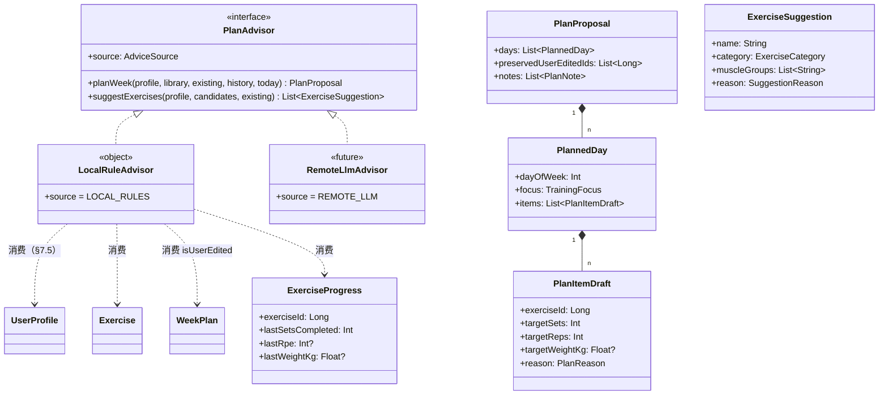
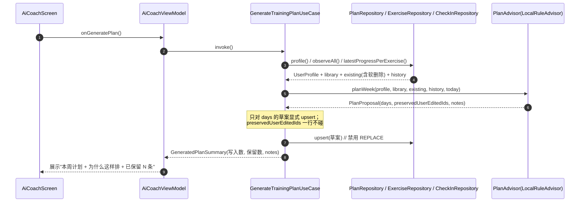
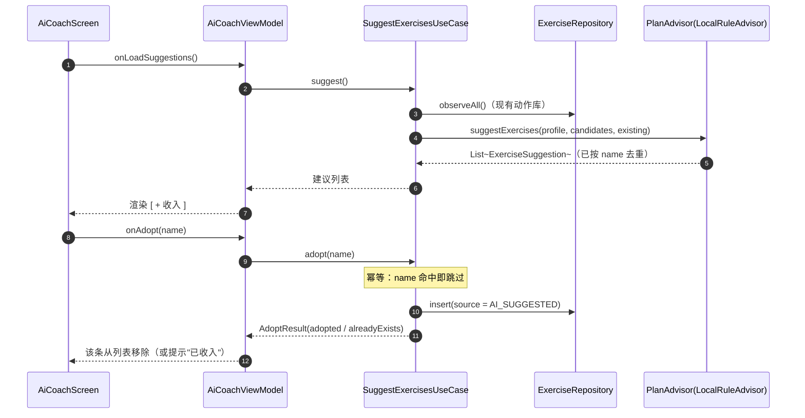
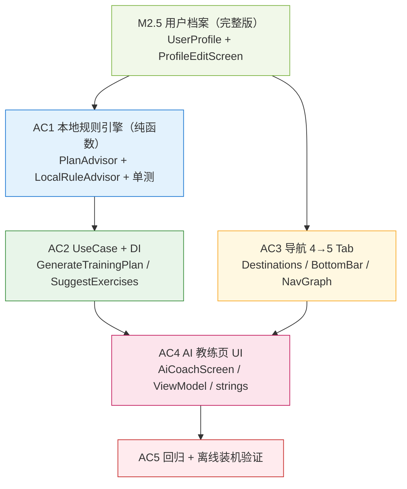

# IronHabit · 本地规则版「AI 教练」增量设计

> **范围**：只涉及 `docs/`（本文件为设计文档）；**不含任何 `app/src/` 代码改动**。
> **前置**：`docs/schema-v3-meals.md` §7.5（**用户档案完整版**）—— 本文件的「AI 教练」与饮食模块**共用同一个 `UserProfile`**（不新造模型）。
> **用户已拍板（本文件的设计前提）**：
> 1. **先做完全离线的「本地规则版」**，不做联网、不接任何模型 API；
> 2. 从**身体档案**开工（档案已由 `schema-v3-meals.md` §7.5 定稿）。
>
> **治理标记**（架构 §0.2）：✅ 实测 / 🔶 推演 / 🔗 引用。
> 本文件引用的既有事实均为 **🔗 引用**（附文件与行号）；对未来行为的判断为 **🔶 推演**。

---

## 0. 一句话结论

App 里**没有**任何「AI」功能（底部只有 4 个 Tab，预览版有第 5 个「AI 教练」）。本设计把预览里的第 4 个 Tab「AI 教练」**用完全离线的确定性规则**落地一版 —— **不联网、不接模型、不加 `INTERNET` 权限**，产出「按档案生成的训练计划 + 按伤病/器械筛出的补充动作」两类结果，且**文案绝不宣称是模型推理**（"本地规则版"）。

---

## 1. 与预览的对应关系 + **诚实落差**（必须先讲清）

预览 `deliverables/ironhabit-preview.html` 的「AI 教练」页（`scrAI()`，`:589-631`）含 6 块内容。本地规则版**逐块给结论**：

| 预览区块（行号） | 预览行为 | **本地规则版** | 说明 |
|-----------------|---------|---------------|------|
| ① 我的身体档案卡（`:594-604`） | 只读卡 + 「编辑完整档案」 | ✅ **照做**（复用 `ProfileSummaryCard` + 跳 `ProfileEditScreen`，见 `schema-v3-meals.md` §7.5.5） | 纯展示，零规则 |
| ② 生成计划（`:605-607`） | 「生成训练计划」+「生成饮食计划」 | ✅ **照做**：训练计划走本文件 §4；**饮食计划直接复用** `GenerateDietPlanUseCase`（`schema-v3-meals.md` §7.5.4），本文件不新增饮食代码 | 按钮双入口 |
| ③ 本周训练计划（AI）+「为什么这样调」（`:608-621`） | 生成后展示 + 自适应理由 | ✅ **照做**：`PlanProposal` 自带 `notes`（"为什么这样排"），由规则**确定性**产出 | 对应预览 `:615-621` |
| ④ 问问 AI 教练（自由问答输入框，`:622-627`） | **脚本化**的假对话 + 输入框 | ⚠️ **本轮不实现自由问答，但保留"禁用入口"** | 自由文本问答**必须**有模型 → 属联网阶段。本地版把该块替换为**只读的「教练解读」**（把 BMR/TDEE/计划理由**逐条列出来**），**并保留一个明确标注「需要联网，当前版本不支持」的禁用说明行**（见 §2 ③、§6.2 N5）。**不做静默删除**：用户能看见"这里本来有个自由问答，现在还不支持"，而不是疑惑它为何消失。**也不摆一个敲进去没反应的输入框**（预览的输入框本身也不工作） |
| ⑤ 渐进超负荷建议 `rpeAdvCard()`（`:299-315`） | 「下次这组该怎么练」 | ✅ **照做**（**核心亮点**）：预览自己就标了「**纯本地规则，断网也算得出来**」（`:303`）—— 这正是"离线仍可用"的那一层，本地版必做 | 数据来自既有打卡 + RPE（v2 已落地） |
| ⑥ AI 补充动作 · 一键收入（`:633-655`） | 按档案+伤病筛补强动作 | ✅ **照做**：`suggestExercises`（幂等，写入 `exercises`） | 幂等键 = `name` |
| （页内）AI 教练设置 · DeepSeek + API Key（`Profile` 页 `:672-676`、配置表 `:783`） | 服务商 / API Key / 联网策略 | ❌ **本地版整块隐藏** | 零网络时**不得**摆一个填了也没用的 API Key 框。留到"联网阶段待决事项"（§6） |

> **诚实原则（写死，主理人已裁定）**：本地版**任何界面不得**出现「AI 正在思考 / 模型 / 大模型 / 智能生成 / AI 分析」等**暗示联网推理**的措辞。统一用「**本地规则**」「**根据你的档案**」「**规则解读**」。
> **硬要求（主理人原话意图）**：徽标与文案必须让用户**一眼看出这不是大模型** —— **宁可朴素，也不要让人误以为背后有云**。故：页首徽标 `ai_local_badge`＝「**本地规则版 · 完全离线，无需联网**」常驻；Tab 名沿用预览的「AI 教练」**仅为与预览一致**，页内不得出现任何"智能感"装饰（如"思考中/正在生成"的假动效）。
> **不做静默删除**：本地版不具备的能力（如自由问答、联网设置）**必须显式标注"需要联网，当前版本不支持"**（见 §1 ④、§6.2），**不得**让它无声消失 —— 用户已问过"AI 功能怎么没有"，一处没有解释的缺失会被再问一次。

---

## 2. 页面结构（AI 教练页 · 单页，4 个区块）

```
AI 教练
 ├─ [顶部徽标] 本地规则版 · 完全离线，无需联网          ← ai_local_badge
 ├─ ① 我的身体档案（只读卡）                          ← ProfileSummaryCard（复用）
 │      · 完整只读展示（身高/体重/年龄/性别/体脂/目标/器械/伤病/忌口）
 │      · [编辑完整档案 ›] → ProfileEditScreen（profile/edit）
 │      · 档案未填全时：行内提示 profile_incomplete_hint（非阻断）
 ├─ ② 生成计划
 │      · [生成训练计划 / 重新生成]   → GenerateTrainingPlanUseCase（本文件 §4）
 │      · [生成饮食计划 / 重新生成]   → GenerateDietPlanUseCase（复用 §7.5.4）
 │      · 生成结果：本周计划摘要 + 「为什么这样排」notes（可折叠）
 │      · 幂等/保护提示：若存在用户手改行 → 显示「已保留你手动改过的 X 条」
 ├─ ③ 教练解读（替代预览的"自由问答"）
 │      · 只读逐条：BMR / 建议日摄入 / 蛋白目标 / 计划理由 / 伤病避让说明
 │      · 自由问答：**显式保留一个禁用说明行**（可见、不可用）
 │        文案 ai_freechat_disabled＝「自由问答需要联网，当前版本不支持」
 │        （**不静默删除、不放假输入框**，见 §1 诚实原则）
 │      · 安全提示 ai_safety_note（对应预览 `:627`）
 └─ ④ 补充动作 · 一键收入动作库
        · 按档案（器械/伤病/目标）筛出的候选，逐个 [ + 收入 ]
        · 幂等：已收入的不再显示；全部收完显示 ai_suggest_all_adopted
        · 收进去后 source = AI_SUGGESTED（与内置/自定义**同等可用**）
```

**与预览的差异（务必对齐验收口径）**：预览是「先展示、再点按钮写入」的两段式；本地版**保持同一交互**，但写入语义严格按 §4.3 的不变量（**绝不覆盖用户手改行**）。

---

## 3. 导航：4 Tab → **5 Tab**（AI 教练为第 4，插在「自律」与「我的」之间）

预览 `TABS`（`:351-357`）顺序为 `today / train / discipline / ai / profile`。App 现状为 4 Tab（🔗 `ui/navigation/Destinations.kt:19`、`BottomBar.kt:62-67`）。改动如下（**精确到行**）：

### 3.1 `ui/navigation/Destinations.kt`（修改）

```kotlin
// ---------------- 一级 Tab ----------------
const val TODAY = "today"
const val TRAIN = "train"
const val DISCIPLINE = "discipline"
const val AI_COACH = "ai_coach"      // ← 新增（路由名 snake_case，架构 §7.1）
const val PROFILE = "profile"

/** 底部栏展示顺序（AI 教练第 4 位）。 */
val TabRoutes: List<String> = listOf(TODAY, TRAIN, DISCIPLINE, AI_COACH, PROFILE)
```

同时新增二级页路由（档案编辑页，**由 §7.5 定义、此处一并登记**）：

```kotlin
// ---------------- 二级页：我的档案编辑 ----------------
const val PROFILE_EDIT = "profile/edit"
```

> ⚠️ **一处去重**：`Destinations.kt` 与 `IronHabitNavGraph.kt`、`strings.xml` 三个文件**同时**被「档案增量」与「AI 教练增量」修改 → 在**文件计数时各只算 1 次**（见 §7、`schema-v3-meals.md` §8.4）。

### 3.2 `ui/navigation/BottomBar.kt`（修改）

```kotlin
@Composable
private fun bottomTabs(): List<BottomTab> = listOf(
    BottomTab(Destinations.TODAY, R.string.tab_today, Icons.Filled.Today),
    BottomTab(Destinations.TRAIN, R.string.tab_train, Icons.Filled.FitnessCenter),
    BottomTab(Destinations.DISCIPLINE, R.string.tab_discipline, Icons.Filled.SelfImprovement),
    BottomTab(Destinations.AI_COACH, R.string.tab_ai_coach, Icons.Filled.AutoAwesome),   // ← 新增
    BottomTab(Destinations.PROFILE, R.string.tab_profile, Icons.Filled.Person),
)
```

**图标选型（✅ 实测，已定稿）**：**`Icons.Filled.AutoAwesome`（四角星）** —— 语义贴合「智能/推荐」，预览用的正是同类四角星（`:355`）。
> **✅ 实测证据（不再"未验证"）**：本机 Gradle 缓存中的实际依赖 **`androidx.compose.material:material-icons-extended` 1.7.6** 的 AAR（`material-icons-extended-release.aar`）内 `classes.jar` 共 11123 个类，**确认存在** `androidx/compose/material/icons/filled/AutoAwesomeKt.class`（`outlined`/`rounded` 变体亦在）。
> 备选同已验证存在：`SmartToy`（5 变体）、`Psychology`（10 变体）、`TipsAndUpdates`、`AutoFixHigh`；`Star` 属 `material-icons-core` 基础包（确定存在）。
> → **结论：采用 `Icons.Filled.AutoAwesome`，无需降级。** 落地 `AC3` 只需一次编译确认（预期通过）；若因版本变更不存在，按 `SmartToy` → `Star` 顺序降级（见 §10 风险 1，已降为"已消除/低"）。

### 3.3 `ui/navigation/IronHabitNavGraph.kt`（修改）

- 一级路由：在 `composable(Destinations.DISCIPLINE)` 之后、`composable(Destinations.PROFILE)` 之前插入：

```kotlin
composable(Destinations.AI_COACH) {
    AiCoachScreen(
        onEditProfile = { navController.navigate(Destinations.PROFILE_EDIT) },
    )
}
```

- 二级路由：在 `registerSecondaryRoutes(...)` 的 8 条之后**追加第 9 条**（`profile/edit`）：

```kotlin
// 9) 我的档案编辑（档案增量 + AI 教练共用入口）
composable(Destinations.PROFILE_EDIT) {
    ProfileEditScreen(
        onBack = { navController.popBackStack() },
    )
}
```

> 现状：`registerSecondaryRoutes` 注释写的是"8 条路由"（🔗 `IronHabitNavGraph.kt:88`），本增量后应为 **9 条**，落地时**同步更新该注释**（否则又是一处"数字与事实脱节"，架构 §0.1）。

### 3.4 底栏可见性自动自适应（**零额外改动** ✅）

`Destinations.TabRoutes`（`IronHabitNavGraph.kt:30` 注释所述机制）驱动底栏显隐：**二级页路由（`profile/edit`）不在 `TabRoutes` 内 → 自动隐藏底栏**。因此新增 `AI_COACH` 与 `PROFILE_EDIT` **不需要**任何"隐藏底栏"的特殊逻辑。

---

## 4. 本地规则引擎设计（**核心交付物**）

### 4.1 定位：**纯函数、零 Android、零 IO、零网络、零随机**

沿用本项目既有范式（🔗 `domain/util/StreakCalculator.kt` 是 `object` 纯函数；🔗 `CalculateStreakUseCase` 只是它的薄包装 + 注入 `Clock`）。→ 本地规则引擎放 `domain/ai/`，**可被 JVM 单测全覆盖**（无需设备），与 `StreakCalculator` / 未来的 `DietPlanGenerator` 同构。

### 4.2 ⭐ 两个纯函数签名（**本交付物明确要求的两个**）

```kotlin
package com.ironhabit.app.domain.ai

/**
 * 本地规则引擎（**纯函数集合**）：零 Android / 零 IO / 零网络 / 零随机。
 * 同输入必同输出 → JVM 单测可完整覆盖。
 */
object LocalRuleAdvisor : PlanAdvisor {

    override val source: AdviceSource = AdviceSource.LOCAL_RULES

    /**
     * 【纯函数 ①】按档案生成「一周训练计划草案」。
     *
     * 不变量（**必须写死，必须单测**）：
     *  1. **[existing] 中 `isUserEdited == true` 的行（含软删除行）→ 完整保留**，
     *     既不生成会覆盖它的条目，也不"复活"它（对应 `schema-v2.md` §6.3 坑 3/4/6）。
     *  2. 只用 [profile].equipment 里**实际拥有**的器械（空集视为 `{NONE}`=仅自重）；
     *     含 [profile].injuryAreas 会刺激到的动作 → **机械排除**。
     *  3. 输出**只包含"可写槽位"**的草案；是否落库由 UseCase 决定（本函数不碰仓库）。
     *  4. 每周安排 **默认 3 天**（`const val DEFAULT_TRAINING_DAYS = 3`，常量）—— 本版**不做**"用户自选天数"；
     *     **将来可配置**：把该常量改为读 `profile` / 设置中的一项（本函数签名不变）。
     *
     * @param profile  用户档案（同 `schema-v3-meals.md` §7.5.2 的 `UserProfile`）
     * @param library  可选动作全集（内置 + 自建 + 已收编的 AI 推荐）
     * @param existing 当前周计划全部行（**含 `isActive=false` 的软删除行**）
     * @param history  每个动作"最近一次完成情况"，用于渐进超负荷（缺省为空 = 不做超负荷调整）
     * @param today    今天（决定"本周"的周一）
     * @return 计划草案（**纯数据**，不落库、不改状态）
     */
    fun planWeek(
        profile: UserProfile,
        library: List<Exercise>,
        existing: List<WeekPlan>,
        history: List<ExerciseProgress> = emptyList(),
        today: LocalDate,
    ): PlanProposal

    /**
     * 【纯函数 ②】按档案筛出「补充动作」建议。
     *
     * 幂等（**必须单测**）：已在 [existing] 中的动作（按 `name` 去重）
     * **不再返回** → 多次调用结果收敛，不会重复推荐、不会重复入库。
     *
     * 幂等键 = `Exercise.name`（🔗 `exercises.name` 在库中 UNIQUE，见
     * `data/local/entity/ExerciseEntity.kt` 的索引约定）→ 落地时用"命中即跳过"的
     * **显式 upsert**，与 v2/v3 的「禁用 REPLACE」口径一致。
     *
     * @param profile    用户档案（决定筛什么：伤病 → 替代动作；器械 → 可行性；目标 → 补强方向）
     * @param candidates 候选池（内置/规则预设的"补强动作"全集，按档案打标）
     * @param existing   用户动作库现有动作（按 `name` 去重）
     * @return 建议列表（**只含未收入的动作**，纯数据）
     */
    fun suggestExercises(
        profile: UserProfile,
        candidates: List<Exercise>,
        existing: List<Exercise>,
    ): List<ExerciseSuggestion>
}
```

**为什么是这两个函数**（职责划分）：
- `planWeek` = **改计划**（写 `week_plans`）：产出"整周怎么排"；
- `suggestExercises` = **扩动作库**（写 `exercises`）：产出"还该补哪些动作"。
- 两者**都只返回纯数据草案**，"要不要写、怎么写"一律交给 UseCase —— 这样**规则可单测、写入可审计**，且与预览的两段式交互（`:605-607` / `:640-655`）一一对应。

### 4.3 支撑数据模型（`domain/ai/AdviceModels.kt`，新文件）

```kotlin
package com.ironhabit.app.domain.ai

/** 建议来源（诚实标注：本地规则 vs 将来的联网模型）。 */
enum class AdviceSource { LOCAL_RULES, REMOTE_LLM }

/** 计划草案（纯数据）。 */
data class PlanProposal(
    val days: List<PlannedDay>,
    /** 被"完整保留"的既有用户手改行 id（含软删除行）—— 用于向用户展示"已保留 N 条"。 */
    val preservedUserEditedIds: List<Long>,
    /** "为什么这样排"的确定性理由（对应预览 `:615-621`）。 */
    val notes: List<PlanNote>,
)

data class PlannedDay(
    val dayOfWeek: Int,                  // 1..7
    val focus: TrainingFocus,            // 训练重点（枚举，可展示）
    val items: List<PlanItemDraft>,
)

data class PlanItemDraft(
    val exerciseId: Long,
    val targetSets: Int,
    val targetReps: Int,
    val targetWeightKg: Float?,
    val reason: PlanReason,
)

enum class TrainingFocus { LOWER_BODY, UPPER_PUSH, UPPER_PULL, FULL_BODY, CARDIO_CORE }

enum class PlanReason {
    PRIMARY_LIFT,       // 主项（按目标挑的大动作）
    SUPPLEMENT,         // 辅助
    EQUIPMENT_MATCHED,  // 因"用户有此器械"而选
    INJURY_SAFE,        // 因"避让伤病"而选的安全替代
    PROGRESSIVE_OVERLOAD,// 因"上次做满且 RPE 有余量"而 +2.5kg（对应预览 `bumpW`）
    MAINTAIN,           // 因"上次没做满/RPE 偏高"而维持
}

/** 一条"为什么这样排"（纯数据，UI 只渲染）。 */
data class PlanNote(val kind: PlanReason, val exerciseId: Long, val detail: PlanNoteDetail)
// PlanNoteDetail 用密封类/枚举携带少量结构化参数（如 oldWeightKg/newWeightKg），
// 文案一律在 UI 层用 strings.xml 拼（禁止硬编码中文，架构 §7.5）。

/** 补充动作建议（纯数据；`name` 即幂等键）。 */
data class ExerciseSuggestion(
    val name: String,                    // = `exercises.name`（UNIQUE）→ 幂等键
    val category: ExerciseCategory,
    val muscleGroups: List<String>,      // 有序，首个=主肌群
    val defaultSets: Int,
    val defaultReps: Int,
    val noteKey: String,                 // 对应 strings.xml 的 note 资源 key（**不内联中文**）
    val reason: SuggestionReason,
)

enum class SuggestionReason { INJURY_SWAP, EQUIPMENT_FIT, GOAL_SUPPORT }

/** 供渐进超负荷判断的"最近一次完成情况"（由 UseCase 从既有打卡/RPE 组装，见 §4.4）。 */
data class ExerciseProgress(
    val exerciseId: Long,
    val lastSetsCompleted: Int,
    val lastTargetSets: Int,
    val lastRpe: Int?,                  // v2 的 RPE 字段（1..10，可空）
    val lastWeightKg: Float?,
)
```

> **枚举而非自由字符串**：`TrainingFocus` / `PlanReason` / `SuggestionReason` 全用枚举 → 文案在 UI 层经 `strings.xml` 映射，**规则层零中文**（可 lint、可单测）。

### 4.4 渐进超负荷（**复用 v2 已有数据，本地算，无需 AI**）

预览 `advice()` / `bumpW()`（`:280-298`）是**确定性规则**，预览自己标注"**纯本地规则，断网也算得出来**"（`:303`）。本地版**照这条规则**在 `planWeek` 内消费 `history`：

| 条件（来自既有打卡 + RPE） | 下一轮动作 | 依据（🔗 预览 `:291-297`） |
|---------------------------|-----------|--------------------------|
| 组数做满 且 RPE ≤ 6 | 重量 **+2.5 kg**（自重动作则 +1 组 / 放慢节奏） | "还有余量，可以加重" |
| 组数做满 且 RPE 7–8 | **维持**重量 | "已经吃力，同重量巩固一轮" |
| 组数没做满 | **维持**重量，先把目标组次做满 | "先把组数做满再谈进阶" |
| 无 RPE 但组数做满 | **待评级**（不猜） | "补一个 RPE 才能判断" |

> **数据来源**：v2 已落地「逐组打卡 + RPE 保留」（🔗 `CheckInRepository` / `SetRpeUseCase.kt` / `schema-v2.md` §6.3）。UseCase 只需把"每个动作最近一次"聚合成 `List<ExerciseProgress>` 传给 `planWeek`，**规则层不碰数据库**。

### 4.5 UseCase 层（薄包装，注入仓库；与 `CalculateStreakUseCase` 同构）

```kotlin
class GenerateTrainingPlanUseCase @Inject constructor(
    private val planRepository: PlanRepository,
    private val exerciseRepository: ExerciseRepository,
    private val checkInRepository: CheckInRepository,   // 组装 ExerciseProgress
    private val settingsRepository: SettingsRepository, // 读 UserProfile（schema-v3 §7.5）
    private val advisor: PlanAdvisor,                   // 注入接口，不 new 具体实现
    private val clock: Clock,
) {
    suspend operator fun invoke(): GeneratedPlanSummary {
        val profile  = settingsRepository.profile().first()
        val library  = exerciseRepository.observeAll().first()
        val existing = planRepository.observeAll().first()          // 含软删除行
        val history  = checkInRepository.latestProgressPerExercise()
        val proposal = advisor.planWeek(profile, library, existing, history, LocalDate.now(clock))
        // 写入：仅对 proposal.days 的草案做**显式 upsert**（禁用 REPLACE）；
        // 不触碰 preservedUserEditedIds 里的任何行。
        ...
    }
}

class SuggestExercisesUseCase @Inject constructor(
    private val exerciseRepository: ExerciseRepository,
    private val settingsRepository: SettingsRepository,
    private val advisor: PlanAdvisor,
) {
    /** 只读：产出"还能收入哪些"。 */
    suspend fun suggest(): List<ExerciseSuggestion> { ... }

    /** 收入一条：写入 `exercises`，`source = AI_SUGGESTED`，幂等（按 name 命中即跳过）。 */
    suspend fun adopt(name: String): AdoptResult { ... }
}
```

> **注（主理人已裁定 §11 #5）**：现有 `CheckInRepository`（🔗 只有 `observeByExercise` / `observeBetween` 等，**无"按动作聚合最近一次进度"**）→ **经批准**，**只增不改**地新增一个只读方法：
> ```kotlin
> /** 观测每个动作"最近一次"的完成情况（供本地 AI 的渐进超负荷使用）。只读，不改既有签名。 */
> fun latestProgressPerExercise(): Flow<List<ExerciseProgress>>
> ```
> 实现落在 `CheckInRepositoryImpl` + `CheckInDao`（**新增一条聚合 SQL**），**不新增/修改任何 Room 迁移**、不改 `VERSION`。
> **单测**：纯投影逻辑（由打卡记录 → `ExerciseProgress`）并入 `LocalRuleAdvisorTest`；SQL 聚合的验证**并入既有** `app/src/androidTest/.../CheckInDaoTest.kt`（修改，不新增文件）。

### 4.6 类图（classDiagram）



### 4.7 时序图（sequenceDiagram）—— 两条关键链路





---

## 5. 存储与权限（**零网络**）

| 项 | 结论 | 依据 |
|----|------|------|
| 档案 | 复用 `SettingsDataStore`（`schema-v3-meals.md` §7.5），**不新造模型** | 单一真源 |
| 训练计划 | 写既有 `week_plans` 表（🔗 `WeekPlanEntity`），`is_user_edited` 保护 | §4.3 不变量 |
| 补充动作 | 写既有 `exercises` 表，`source = AI_SUGGESTED`（🔗 `ExerciseSource` 已有此枚举） | 幂等键 = `name` |
| **网络权限** | **不新增 `INTERNET` 权限**（`AndroidManifest.xml` 不动） | 零网络 → 无权限可加 |
| 新 Room 表 / 新迁移 | **无**（本增量不建表、不改 `VERSION`） | 复用 v2/v3 既有表 |
| API Key / 服务商配置 | **本地版不实现、不展示**（见 §6） | 诚实原则 |

> ✅ **零迁移风险**：本增量**不触碰** `Migrations.kt` / `AppDatabase.kt` / `VERSION`，因此**不与 v3 饮食模块的 `MIGRATION_2_3` 争用同一文件**（`schema-v3-meals.md` §11 风险 1 的冲突面**不扩大**）。

---

## 6. Provider 抽象 + 「联网阶段待决事项」

### 6.1 抽象（为将来联网预留，但**本次只实现本地**）

```kotlin
package com.ironhabit.app.domain.ai

/**
 * 计划/建议来源的统一抽象。
 *
 * 本期**只有一个实现** [LocalRuleAdvisor]（`source = LOCAL_RULES`）。
 * 将来接入联网模型时，新增 [RemoteLlmAdvisor]（`source = REMOTE_LLM`）实现同一接口，
 * **UI 与 UseCase 不改**（依赖注入切换实现即可）。
 *
 * ⚠️ 接口刻意保持"纯函数"形状（无 suspend、无 IO）→ 便于 JVM 单测；
 *    联网实现的耗时/线程交由 UseCase 层（`withContext(Dispatchers.IO)`）处理。
 */
interface PlanAdvisor {
    val source: AdviceSource
    fun planWeek(profile: UserProfile, library: List<Exercise>, existing: List<WeekPlan>,
                 history: List<ExerciseProgress> = emptyList(), today: LocalDate): PlanProposal
    fun suggestExercises(profile: UserProfile, candidates: List<Exercise>,
                         existing: List<Exercise>): List<ExerciseSuggestion>
}
```

**DI 绑定**（修改既有 `di/AppModule.kt`，**不新增文件**）：

```kotlin
@Provides
@Singleton
fun providePlanAdvisor(): PlanAdvisor = LocalRuleAdvisor
// 将来联网：改为注入 RemoteLlmAdvisor（或按"设置里的开关"二选一）—— UI/UseCase 零改动
```

### 6.2 「联网阶段待决事项」（**本次一律不做，只登记**）

| # | 事项 | 说明 | 触发条件 |
|---|------|------|---------|
| N1 | `INTERNET` 权限 | 联网实现需在 `AndroidManifest.xml` 加 `android.permission.INTERNET` | 接入真实模型时 |
| N2 | API Key 管理 | 预览用 **DeepSeek** + 明文展示 `sk-••••3f7a`（`:673-674`）。**明文存 API Key 不可接受** → 需选型：`EncryptedSharedPreferences` / Keystore / 或"不让用户填 Key，走服务端代理" | 联网阶段**首要**决策 |
| N3 | 隐私与合规 | 身体档案（性别/年龄/身高/体重/伤病）属**敏感个人信息** → 需隐私政策、用户明示同意、README 更新 | 联网阶段**必做** |
| N4 | 离线降级 | 联网失败 / 飞行模式 → **自动回落 `LocalRuleAdvisor`**（`source` 已预留标注），UI 显示来源 | 联网阶段 |
| N5 | 自由问答 | 预览的四段脚本对话（`:623-625`）+ 输入框 → 需真实模型。**本轮不实现，但页内保留"可见禁用说明"（不静默删除）**（§1 ④、§2 ③）。**将来启用方式**：① 在 `PlanAdvisor` 之外新增 `interface ChatAdvisor { suspend fun ask(profile, question): Answer }`（`source = REMOTE_LLM`）；② 联网可用时，把 §2 ③ 的"禁用说明行"替换为一个真实输入框（`ai_freechat_enabled`）；③ 断网/未配置 Key 时**回落**为"禁用说明 + 本地规则解读"（与 N4 同款降级）。**UI 骨架本轮已留位，联网阶段只换内容不改布局** | 联网阶段 |
| N6 | 联网策略 | 预览「仅 Wi‑Fi 下调用」（`:675`）→ 是否实现、默认值 | 联网阶段 |
| N7 | 成本 / 限流 | 模型调用计费与频控 | 联网阶段 |

> **架构不变式**：`AdviceSource`（`LOCAL_RULES` / `REMOTE_LLM`）从第一天就在模型里 → 将来"来源"可在 UI 明确标注（"本地规则" / "AI 联网生成"），**不会**出现"用户分不清是规则还是模型"的情况。

---

## 7. 文件清单（本增量）

> 包根同 `schema-v3-meals.md`：`app/src/main/java/com/ironhabit/app/`；测试根 `app/src/test/java/com/ironhabit/app/`。

### 7.1 新增（8）

| 相对路径 | 职责 |
|---------|------|
| `domain/ai/PlanAdvisor.kt` | provider 抽象接口（`source` + 两个纯函数） |
| `domain/ai/AdviceModels.kt` | `PlanProposal`/`PlannedDay`/`PlanItemDraft`/`ExerciseSuggestion`/`ExerciseProgress`/`AdviceSource`/枚举（同文件多模型，沿用 `StatsModels.kt`/`DietModels.kt` 先例） |
| `domain/ai/LocalRuleAdvisor.kt` | **本地规则引擎**（`object`，两个纯函数实现，零 Android） |
| `domain/usecase/GenerateTrainingPlanUseCase.kt` | 组装输入 → 调 `advisor.planWeek` → 显式 upsert（保护手改行） |
| `domain/usecase/SuggestExercisesUseCase.kt` | `suggest()` 只读 + `adopt(name)` 幂等写入（`source=AI_SUGGESTED`） |
| `ui/screens/ai/AiCoachScreen.kt` | AI 教练页（§2 的 4 区块） |
| `ui/screens/ai/AiCoachViewModel.kt` | 页面状态 + 生成/收入动作；`AiCoachUiState` 内联于此（沿用 `SettingsViewModel` 范式） |
| `test/.../domain/ai/LocalRuleAdvisorTest.kt` | 纯 JVM 单测：**手改行保留**、**幂等**、**器械/伤病排除**、**渐进超负荷边界**、**空档案兜底** |

### 7.2 修改（9 · 与档案/饮食增量**去重后**）

| 文件 | 改什么 |
|------|--------|
| `ui/navigation/Destinations.kt` | +`AI_COACH` 一级路由（插入 `TabRoutes` 第 4 位）+`PROFILE_EDIT` 二级路由（**与档案增量共用，去重只计 1 次**） |
| `ui/navigation/BottomBar.kt` | 4 → 5 个 `BottomTab`，新增 AI 教练图标（`Icons.Filled.AutoAwesome`，**已实测存在**，见 §3.2） |
| `ui/navigation/IronHabitNavGraph.kt` | 注册 `AI_COACH` 一级页 + `profile/edit` 二级页；注释"8 条"→"9 条"（**与档案增量共用，去重只计 1 次**） |
| `di/AppModule.kt` | `@Provides PlanAdvisor = LocalRuleAdvisor`（将来切换联网实现的**唯一**改动点） |
| `res/values/strings.xml` | §8 文案（**与档案/饮食增量共用，去重只计 1 次**） |
| `domain/repository/CheckInRepository.kt` | **只增不改**：新增只读 `latestProgressPerExercise(): Flow<List<ExerciseProgress>>`（§4.5，主理人已批准） |
| `data/repository/CheckInRepositoryImpl.kt` | 实现上述只读方法（委托 DAO 聚合） |
| `data/local/dao/CheckInDao.kt` | 新增一条"按 `exercise_id` 取最近一次完成情况"的聚合查询（**不改既有查询**） |
| `app/src/androidTest/java/.../CheckInDaoTest.kt` | 为上述聚合查询补 instrumentation 断言（**修改既有测试，不新增文件**） |

### 7.3 明确**不新增**（避免误计）

- ❌ 不新增 Room 表、不新增 `Migration`、不改 `VERSION`（§5）；
- ❌ 不新增 `INTERNET` 权限、不动 `AndroidManifest.xml`；
- ❌ 不改 `schema-v2.md`（本次任务的硬约束）；
- ❌ 不新增饮食相关文件（饮食生成直接复用 `GenerateDietPlanUseCase`）。

---

## 8. 需新增的 `strings.xml` 条目（本增量 · 一次性列全）

命名沿用架构 §7.5：`tab_*` 为底栏、`ai_*` 为 AI 教练页、`note_ai_*` 为补充动作备注：

```xml
<!-- ===== AI 教练（v3 增量 · 本地规则版）===== -->
<!-- 底栏 -->
<string name="tab_ai_coach">AI 教练</string>

<!-- 顶部徽标与页面标题 -->
<string name="title_ai_coach">AI 教练</string>
<string name="ai_local_badge">本地规则版 · 完全离线，无需联网</string>

<!-- 区块①：我的身体档案（复用 profile 资源；此处仅标题与编辑入口） -->
<string name="ai_section_profile">我的身体档案</string>
<string name="ai_action_edit_profile">编辑完整档案</string>

<!-- 区块②：生成计划 -->
<string name="ai_section_generate">生成计划</string>
<string name="ai_generate_plan">生成训练计划</string>
<string name="ai_regenerate_plan">重新生成训练计划</string>
<string name="ai_generate_diet">生成饮食计划</string>
<string name="ai_regenerate_diet">重新生成饮食计划</string>
<string name="ai_generate_hint">基于你的档案生成，写入后出现在「今日」页</string>
<string name="ai_plan_preserved_hint">已保留你手动改过的 %1$d 条，不会被覆盖</string>
<string name="ai_plan_written_hint">已写入 %1$d 条到本周计划</string>

<!-- 区块③：教练解读（替代"自由问答"） -->
<string name="ai_section_explain">教练解读</string>
<string name="ai_freechat_disabled">自由问答需要联网能力，当前为本地规则版，暂不提供；以下为基于你档案的规则解读</string>
<string name="ai_safety_note">以上为通用健身建议，不构成医疗意见。慢性病 / 孕期 / 伤病请先咨询医生</string>
<string name="ai_explain_bmr">基础代谢约 %1$d kcal</string>
<string name="ai_explain_intake">建议每日摄入约 %1$d kcal，蛋白质约 %2$d g</string>
<string name="ai_explain_injury_swap">已按你的伤病（%1$s）排除相关动作</string>
<string name="ai_explain_equipment">已按你拥有的器械（%1$s）适配全部动作</string>

<!-- 区块④：补充动作 -->
<string name="ai_section_suggest">补充动作 · 一键收入动作库</string>
<string name="ai_suggest_hint">按你的档案与伤病筛出的补强选项；收入后与内置动作同等可用，也能自由修改</string>
<string name="ai_suggest_adopt">＋ 收入</string>
<string name="ai_suggest_all_adopted">推荐的补充动作已全部收入你的动作库，去「训练」页就能排进计划</string>
<string name="ai_suggest_already_exists">这个动作已经在你的动作库里了</string>

<!-- 训练重点（TrainingFocus）-->
<string name="focus_lower_body">下肢</string>
<string name="focus_upper_push">上肢推</string>
<string name="focus_upper_pull">上肢拉</string>
<string name="focus_full_body">全身</string>
<string name="focus_cardio_core">有氧 + 核心</string>

<!-- "为什么这样排"（PlanReason）-->
<string name="reason_primary_lift">主项动作</string>
<string name="reason_supplement">辅助动作</string>
<string name="reason_equipment_matched">按你拥有的器械选择</string>
<string name="reason_injury_safe">避开伤病的安全替代</string>
<string name="reason_progressive_overload">上次做满且有余量，本次加重至 %1$s kg</string>
<string name="reason_maintain">上次未做满 / 偏吃力，本次维持 %1$s kg</string>

<!-- 补充动作备注（noteKey 映射；禁止内联中文）-->
<string name="note_ai_injury_swap">按你的伤病筛出的低冲击替代动作</string>
<string name="note_ai_equipment_fit">与你现有器械匹配，无需额外器材</string>
<string name="note_ai_goal_support">贴合你的目标方向，用于补强薄弱环节</string>
```

> ⚠️ **禁止硬编码中文**（架构 §7.5 / `schema-v3-meals.md` §8.2 红线）：训练重点 / 理由 / 备注**全部**走资源；规则层只产出**枚举**（§4.3），UI 层做 `枚举 → R.string → stringResource` 映射。
> ⚠️ **文案归属去重**：`ai_explain_*` 中涉及的"档案未填全"提示**复用** §7.5.6 的 `profile_incomplete_hint`，不重复定义。

---

## 9. 任务分解（AC 系列 · 有序 · 含依赖）

> 插入位置：**在 `schema-v3-meals.md` 的 `M2.5`（用户档案）之后**。全部 AC 任务**依赖 `M2.5`**（档案是本地 AI 的共同前置）。

| ID | 任务 | 涉及文件 | 依赖 | 优先级 |
|----|------|---------|------|-------|
| **AC1** | **本地规则引擎（纯函数）+ 契约**：`PlanAdvisor` 接口 + `AdviceModels` + `LocalRuleAdvisor`（两个纯函数；默认 **3 天常量**，将来可配置）+ 单测 | `domain/ai/PlanAdvisor.kt`(新)、`AdviceModels.kt`(新)、`LocalRuleAdvisor.kt`(新)、`test/.../LocalRuleAdvisorTest.kt`(新) | **M2.5** | **P0** |
| **AC2** | **UseCase + DI 绑定**：生成训练计划 / 补充动作（幂等）；**只增不改**地加 `CheckInRepository.latestProgressPerExercise()`（+ DAO 聚合 + 测试） | `domain/usecase/GenerateTrainingPlanUseCase.kt`(新)、`SuggestExercisesUseCase.kt`(新)、`di/AppModule.kt`、`domain/repository/CheckInRepository.kt`、`data/repository/CheckInRepositoryImpl.kt`、`data/local/dao/CheckInDao.kt`、`app/src/androidTest/.../CheckInDaoTest.kt` | AC1 | **P0** |
| **AC3** | **导航 4 → 5 Tab**：路由 + 底栏 + NavHost 注册（含 `profile/edit`） | `ui/navigation/Destinations.kt`、`BottomBar.kt`、`IronHabitNavGraph.kt` | **M2.5** | **P0** |
| **AC4** | **AI 教练页 UI**：4 区块 + ViewModel + 文案 | `ui/screens/ai/AiCoachScreen.kt`(新)、`AiCoachViewModel.kt`(新)、`res/values/strings.xml` | AC2、AC3、**M2.5** | **P1** |
| **AC5** | **回归 + 装机验证（离线走查）** | 无新增；跑单测 + 真机飞行模式走查 | AC4 | **P1** |

**AC5 的不可省略项（离线专项）**：
1. **飞行模式 / 断网下走查全页** —— 页面**不得**出现任何"加载中/网络错误"（本版零网络，理应全天可用）；
2. **手改行保护实测**：先手动改一条计划 → 再点"重新生成训练计划" → 确认那条**未被覆盖**；
3. **幂等实测**：连续点两次「+ 收入」同一动作 → 第二条应为"已存在"提示，**不产生重复行**（`exercises.name` UNIQUE 兜底）；
4. **升级验证**：装 v2 版 → 覆盖装含本增量的版本 → 确认既有 `exercises`/`week_plans`/打卡数据仍在（本增量**不改 schema**，理应零迁移）。

### 9.1 任务依赖图



> **AC1 与 AC3 可并行**（都只依赖 M2.5，互不依赖）；AC2 依赖 AC1；AC4 依赖 AC2+AC3。

---

## 10. 我认为风险最高的技术点（原 2 高 + 1 低；**风险 1 已实测消除 → 现 1 高 + 2 低**）

### ✅ 风险 1（**已消除**）· 底栏图标 —— 已实测确认存在

原判断"`Icons.Filled.AutoAwesome` 未必存在"为 **🔶 推演**，**现已实测推翻**：Gradle 缓存中实际依赖 `material-icons-extended` **1.7.6** 的 AAR 内确认含 `filled/AutoAwesomeKt.class`（详见 §3.2 证据）。
→ **降级方案保留但不启用**：若将来依赖版本变更导致缺失，按 `SmartToy` → `Star` 顺序降级。**本风险不再阻塞 AC3。**

### 🔴 风险 2 · "重新生成"把用户手改的计划冲掉 / 幂等写重复动作

这是**数据安全**问题，不是外观问题。两个易错点：
1. **`GenerateTrainingPlanUseCase` 绝不能"先删本周 `week_plans` 再重建"** —— 会一次丢掉用户全部手改（`is_user_edited = 1`，含软删除行），并**直接违反** v2 定稿的"手改行跳过"规则（`schema-v2.md` §6.3 坑 3/4/6）。必须"命中即跳过手改行 + 对可写槽位**显式 upsert**，**禁用 `REPLACE`**"（与 v2/v3 口径一致）。
2. **`adopt(name)` 必须幂等**：`exercises.name` UNIQUE 只是"数据库兜底"，**应用层必须"命中即跳过"**，否则会以异常形式暴露给用户（或 worst case 造重复）。单测必须覆盖"连续两次 adopt 同一 name"（§9 的 AC5 第 3 项）。

### 🟡 风险 3（低，须知悉）· 本地规则版与预览的**语义落差**可能被误读为"功能缺失"

预览 AI 页有"自由问答"与"AI 教练设置（API Key）"两块；本地版按用户拍板**本轮不做**（§1 ④、§6.2 N2/N5），但**已按主理人裁定改为"显式禁用入口 + 诚实说明"**（不静默删除）。
→ **缓解**：① 页内挂 `ai_local_badge` 明示"本地规则版"；② 禁用块给**诚实文案**（`ai_freechat_disabled`＝「自由问答需要联网，当前版本不支持」）；③ 验收时以"**本地规则版规格**"为准，不拿预览的联网能力当验收项。

### 🟡 风险 4（低，须知悉）· `CheckInRepository` 新增只读查询的**回归面**

按 §11 #5 裁定，将"只增不改"地新增 `latestProgressPerExercise()`（+ DAO 聚合 + 单测）。虽为纯新增，仍**触及打卡链路**（v2/v3 的核心数据）。
→ **缓解**：① 只增方法、**不改既有签名与语义**；② 附单测（纯投影逻辑并入 `LocalRuleAdvisorTest`，SQL 聚合并入既有 `app/src/androidTest/.../CheckInDaoTest.kt`）；③ 不新增/修改任何 Room 迁移（不改 `VERSION`）。

---

## 11. 待明确事项（**主理人已全部裁定 ✅**）

| # | 事项 | 主理人裁定 | 落地位置 |
|---|------|-----------|---------|
| **1** | Tab 命名：叫「AI 教练」还是改叫「教练」/「训练助手」？ | ✅ **保留「AI 教练」**。**硬要求**：徽标与文案必须让用户**一眼看出这不是大模型**（**宁朴素，勿误导**），页内禁用一切暗示联网/推理的措辞（模型 / 智能生成 / AI 分析） | §1 诚实原则、§2 顶部徽标 |
| **2** | 每周训练天数默认值 | ✅ **默认 3 天（常量）**；文档注明**将来可配置**（见下） | §4.2、下文"将来可配置"注、AC1 |
| **3** | 自由问答 | ✅ **本轮不实现，但不许静默消失**：页内保留**明确标注"需要联网，当前版本不支持"的禁用说明行**；将来**替换 provider 即可启用** | §1 ④、§2 ③、§6.2 N5 |
| **4** | `CheckInRepository` 加只读聚合查询 | ✅ **批准**，坚持"**只增不改**"，**并附单测** | §4.5、§7.2 |
| **5** | 补充动作候选池来源 | ✅ **内置常量表**（对应预览 `AI_SUG`） | §4.2 / AC2 |
| **6** | 底栏图标 `AutoAwesome` 是否存在 | ✅ 按 `AutoAwesome` → `SmartToy` → `Star` 顺序处理；**已实测确认 `AutoAwesome` 存在于 1.7.6，无需降级**，结论已写回 §3.2 | §3.2、§10 风险 1 |

> **"将来可配置"注（裁定 #2 要求）**：默认训练天数 **3 天** 为**常量**（`const val DEFAULT_TRAINING_DAYS = 3`）—— **不做**"用户自选天数"，避免本版范围膨胀；
> **将来可配置的路径**：届时把该常量改为读档案 / 设置中的一项（`UserProfile` 加一个可空字段，或用既有 `AppSettings` 扩展），**`planWeek` 签名不变**（仍从 `profile` 取值），UI 与规则层零改动。

> **计数回执（裁定无关，一并登记）**：§7 的"本增量文件数"（新增 8 / 修改 9）为设计阶段推算；与 `schema-v3-meals.md` §8.4 合并后的**全域 v3 = 新增 31 / 修改去重 22**，落地后须以 git 事实复核（见 `ARCHITECTURE.md` §2.10 的"设计阶段推算"注）。

---

## 12. 附：预览函数 → 本地版落点（便于验收逐项核对）

| 预览（行号） | 本地版落点 |
|-------------|-----------|
| `scrAI()`（`:589-631`） | `ui/screens/ai/AiCoachScreen.kt` |
| 档案卡（`:594-604`） | `ProfileSummaryCard`（§7.5.5）复用 |
| `doPlan()`（`:606`） | `GenerateTrainingPlanUseCase`（§4.5） |
| `doDiet()`（`:607`） | `GenerateDietPlanUseCase`（复用 `schema-v3-meals.md` §7.5.4） |
| 本周计划 + 「为什么这样调」（`:608-621`） | `PlanProposal.days` + `PlanProposal.notes`（§4.3） |
| `advice()` / `bumpW()`（`:286-298`） | `planWeek` 内消费 `history`（§4.4） |
| `AI_SUG`（`:633-639`） | UseCase 传入的 `candidates` 常量池（§11 #5） |
| `aiSugCard()` 去重（`:641`） | `suggestExercises` 按 `name` 去重（幂等，§4.2） |
| `adoptAi()`（`:656-659`） | `SuggestExercisesUseCase.adopt(name)`（`source = AI_SUGGESTED`） |
| 「AI 教练设置」API Key（`:672-676`） | **本地版隐藏**，登记为 §6.2 N2 |
