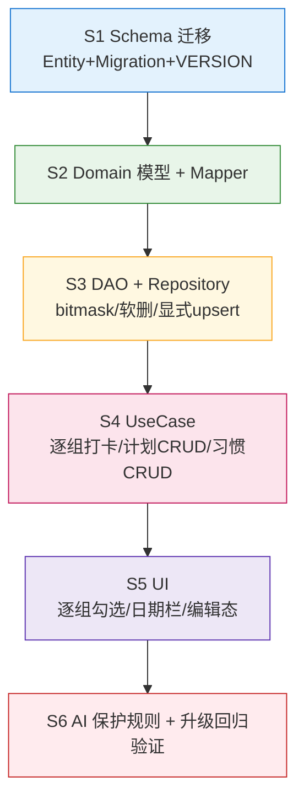

# IronHabit · Schema v1 → v2 增量设计

> 版本：v1.0 ｜ 作者：高见远（架构师）｜ 上游：主理人（v4/v5/v6 三轮预览需求 + 已核实的现状事实）
> 交付对象：工程师（施工）、主理人（汇总）
> **状态：✅ 已定稿**（主理人已拍板 §10 全部事项，可施工）
> **配套文件**：`docs/ARCHITECTURE.md` 的 §2 / §5.2 文件计数已按本设计同步（171 → 182，新增 §2.9）
> **设计红线**：全本地 CRUD，零网络依赖；禁止 `fallbackToDestructiveMigration()`；不得破坏 `check_ins` 的 `UNIQUE(exercise_id, date_epoch_day)`

---

## 0. 结论摘要（先回答主理人的三个问题）

| # | 主理人的问题 | 我的结论 |
|---|-------------|---------|
| Q-A | 逐组完成用 **bitmask** 还是 **JSON + TypeConverter**？ | **采纳 bitmask**（`completed_sets_mask INTEGER NOT NULL DEFAULT 0`）。JSON 方案在「只存布尔」这个场景下**严格更差**，理由见 §2.1 |
| Q-B | `exercises` 三态来源：改名 `source TEXT` 还是 `is_built_in` 另加字段？ | **新增 `source TEXT`，但 `is_built_in` 不能删、只能废弃**。理由：**`DROP COLUMN` 需要 SQLite ≥ 3.35（Android 12 / API 31）**，而 `minSdk = 24`，硬删会让老设备迁移直接崩。详见 §3 |
| Q-C | 「周一改了动作，下周一会不会跟着变」—— `day_of_week` 模板语义是否成立？ | **成立，确认采用**。但里面有 **6 个坑**，其中一个（删除被 AI 复活）会导致用户操作被静默撤销，**必须在 v2 修掉**。详见 §6 |

**另发现一个主理人清单里遗漏的缺口（✅ 已拍板纳入 v2）**：预览里习惯的 ✎ 可改「**目标值**」，
但 `habits` 表**当前没有任何数值目标字段**（只有 `frequency` + `weekly_days_mask`）。
主理人已拍板补 `target_value` + `target_unit`，理由之一是：**若 v2 不加，装机后用户改了目标值却存不住，
这是一个会立刻被用户撞到的 bug**。详见 §5.3。

---

## 1. 背景与硬约束

### 1.1 已采信的现状（主理人核实，不重查）

| 表 | 现状关键字段 | v2 要动的地方 |
|----|------------|--------------|
| `exercises` | `muscle_group`(单值 String?) / `is_built_in`(Boolean 两态) | 多肌群 + 三态来源 + `note` |
| `week_plans` | `day_of_week`(星期模板) / 目标组次重量 | 用户手动改过标记 |
| `check_ins` | `completed_sets`(总数) / **唯一索引 `(exercise_id, date_epoch_day)`** | 逐组明细 + `rpe` |
| `habits` | `sort_order`(已有) / `frequency` / `weekly_days_mask` | `note`（+ 目标值**缺口**） |

### 1.2 硬约束（设计必须满足）

1. **`check_ins` 唯一索引 `(exercise_id, date_epoch_day)` 不得破坏** → 一个动作在某天**只有一行** → 逐组明细**不能用子表**（这是 bitmask 方案的根因）。
2. **禁止 `fallbackToDestructiveMigration()`**，只允许保留现有 `fallbackToDestructiveMigrationOnDowngrade()`。
3. **`minSdk = 24`** → 以下 SQLite 能力**不可用**（这是本设计多处"只能加列不能删列"的根因）：
   - `ALTER TABLE ... DROP COLUMN` 需 SQLite ≥ 3.35（**API 31+**）❌
   - `ALTER TABLE ... RENAME COLUMN` 需 SQLite ≥ 3.25（**API 28+**）❌
   - `ALTER TABLE ... ADD COLUMN` ✅ 全程可用（**故本次迁移一律用 ADD COLUMN**）
4. 全本地 CRUD，零网络。

---

## 2. `check_ins`：逐组完成明细（bitmask 方案）

### 2.1 方案评估：为什么选 bitmask，而不是 JSON + TypeConverter

| 维度 | **bitmask（选用）** | JSON + TypeConverter | 子表 `check_in_sets` |
|------|-------------------|---------------------|---------------------|
| 满足唯一索引约束 | ✅ 仍是单行 | ✅ 仍是单行 | ❌ **直接违反**（一动作一天多行） |
| Room 原生类型 | ✅ `Int`，零适配 | ❌ 需新增/扩展 `Converters` | — |
| 运行时解析开销 | ✅ 位运算，O(1) | ❌ 每行一次 JSON 解析 | — |
| SQL 可聚合 | ⚠️ 需冗余列（见 §2.2） | ❌ 完全不可聚合 | ✅ |
| 未来可扩展 | ⚠️ 只能存布尔 | ✅ 可存每组的重量/次数 | ✅ |
| 迁移成本 | ✅ 一条 ADD COLUMN + 一条 UPDATE | ❌ 同左 + 新增 TypeConverter 及其单测 | ❌ 重建表 |

**结论**：需要存的只是「第几组完成没完成」——**纯布尔序列**。为纯布尔引入 JSON，等于用最灵活的容器装最简单的东西：多一个 TypeConverter（多一个文件 + 单测）、每行多一次解析、且彻底丧失 SQL 聚合能力。**在"只存布尔"这个前提下 JSON 严格更差**，故采纳 bitmask。

**已知边界（诚实登记）**：bitmask **存不了每组各自的重量/次数**（如"第 2 组 65kg×8"）。
- v1 的 `completed_sets`/`completed_reps`/`weight_kg` 本来就是**聚合值**，所以这不是回归，能力持平。
- **逃生通道**：若将来真要做"逐组负荷记录"（渐进超负荷的下下阶段），届时再升 v3 引入子表 `check_in_sets`，同时**重新评审唯一索引**——那个时点再谈，现在不做。

### 2.2 权威关系（主理人点名要的）：`completed_sets` vs `completed_sets_mask`

**这是最容易埋雷的地方，定死如下：**

| 字段 | 角色 | 规则 |
|------|------|------|
| `completed_sets_mask` | **唯一真源（authoritative）** | bit i = 第 i+1 组是否完成。只有它记录"哪几组完成了" |
| `completed_sets` | **派生冗余列（denormalized cache）** | **恒等于** `completed_sets_mask.countOneBits()` |

**三条铁律：**

1. **禁止对 `completed_sets` 独立赋值**。它只允许在**同一个 DAO 写入路径**里与 mask 一起写死（同一个 `@Transaction` / 同一条 UPDATE 语句）。
2. **Domain 层不暴露可写的 `completedSets`**：
   ```kotlin
   data class CheckIn(
       ...
       val completedSetsMask: Int,   // 唯一真源
       val rpe: Int?,
   ) {
       /** 派生值：禁止独立写入 */
       val completedSets: Int get() = completedSetsMask.countOneBits()
   }
   ```
3. **为什么要保留这个冗余列（而不是删掉）**：`StatsDao` 的聚合查询依赖 `SUM(completed_sets)` 这类 SQL 汇总，而 **SQLite 里做位计数极不现实**。保留一个 Int 冗余列，可以让**所有 v1 已有的统计查询一行都不用改**。这是**有意的反范式**，不是设计失误。

**不变量（invariant）**：对任意一行，恒有 `completed_sets == completed_sets_mask.countOneBits()`。
→ **迁移必须让存量数据也满足这个不变量**，做法见 §7（`mask = (1 << completed_sets) - 1`）。

### 2.3 字段定义

| 字段 | 类型 | 默认 | 说明 |
|------|------|------|------|
| `completed_sets_mask` | `INTEGER NOT NULL` | `0` | bit i（0-based）= 第 i+1 组完成。**上限 32 组**（`Int` 宽度），实际训练计划通常 ≤ 10 组 |
| `rpe` | `INTEGER` | `NULL` | 主观强度 1~10。**渐进超负荷算法的唯一输入源**，是整个 App 的灵魂字段 |

**上限保护**：`completed_sets_mask` 最多 31 位可用（bit 31 会溢出 Kotlin `Int`）。工程侧常量：
```kotlin
/** 单动作单日最多支持的组数（Int 位宽 - 1，避开符号位）。 */
const val MAX_SETS: Int = 31
```
写入时**钳制而非崩溃**：`setIndex` 超出 `0 until MAX_SETS` 时直接忽略该次点击（并可在 UI 提示），**绝不用 `require()` 抛异常**——真机上抛异常就是崩。

---

## 3. `exercises`：三态来源 `source`

### 3.1 决策：新增 `source TEXT NOT NULL DEFAULT 'BUILT_IN'`；`is_built_in` **保留但废弃**

**为什么不能"两个 Boolean"**：
`is_built_in` + `is_ai_suggested` 会组合出 **4 种状态，其中 1 种非法**（`built_in=true AND ai=true`）。非法状态无法在 schema 层禁止，只能靠运行时代码守卫——这是典型的 boolean-pair 反模式，迟早出 bug。单个 `source TEXT` 枚举**天然只有 3 个合法值**。

**为什么用 TEXT 而不是 INTEGER**：与现有 `category` 列**完全同构**（§3.1 ER 图里 `category` 就是 `String` 存 `"BODYWEIGHT/STRENGTH/CARDIO/CUSTOM"`）。用 TEXT 不引入任何新机制，`Converters` 已有枚举转换能力。

**⚠️ 为什么 `is_built_in` 只能废弃、不能删（关键）**：
`ALTER TABLE ... DROP COLUMN` **需要 SQLite ≥ 3.35，即 Android 12 / API 31+**。本项目 **`minSdk = 24`**，在 Android 7~11 的设备上执行 DROP COLUMN 会**直接让迁移崩溃 → 用户一升级 App 就打不开**。
可选替代是 Room 官方的「建新表 → 拷数据 → 删旧表 → 改名」四步重建，但这会重写全表、风险显著更高，**且违背"禁止 destructive migration"的红线**。
→ **结论：本次只加列。`is_built_in` 留着，代码停止读写，等未来 minSdk 抬到 31+ 再清理（或永远不清理，代价为零）。**

### 3.2 三态定义与产品规则

```kotlin
enum class ExerciseSource { BUILT_IN, CUSTOM, AI_SUGGESTED }
```

| source | 含义 |
|--------|------|
| `BUILT_IN` | 内置动作库（首启播种，≥40 个） |
| `CUSTOM` | 用户自建，**或**任何被用户编辑过的动作 |
| `AI_SUGGESTED` | AI 推荐、用户尚未改过 |

**产品规则（对用户承诺过，不能丢）**：
> **「内置动作被用户修改后自动降级为自定义」**

落地为一条极简规则：
> **任何用户编辑动作（改名/改备注/改默认组次/改肌群）→ `source = 'CUSTOM'`。**

补充两条衍生语义（建议一并明确，避免歧义）：
- `AI_SUGGESTED` 动作被用户编辑 → 同样变 `CUSTOM`（用户把它变成自己的了）。
- `BUILT_IN` → `CUSTOM` 是**单向**的，没有回到 `BUILT_IN` 的出口（正确，因为已不是原始内置数据）。

### 3.3 `note`

新增 `note TEXT DEFAULT NULL` —— 动作要点备注（预览里每个动作都能写）。纯加法，无风险。

---

## 4. `exercises`：多肌群（含主/辅次序）

### 4.1 决策：**复用现有 `muscle_group` 列，语义改为「有序 CSV，第一个 = 主肌群」**

**零 DDL、零迁移**（现有单值本身就是长度为 1 的合法 CSV）。

| 方案 | 评价 |
|------|------|
| **A. 有序 CSV 复用 `muscle_group`（选用）** | `muscle_group = "CHEST,TRICEPS,FRONT_DELT"`，**顺序即主→辅**。Room 原生 String、无需 TypeConverter、不新增表、迁移零成本 |
| B. JSON 数组 + TypeConverter | 需 TypeConverter、无法 SQL 过滤；比 CSV 只多了"结构化"这一点，对纯字符串列表没有实际收益 |
| C. 新表 `exercise_muscles(exercise_id, muscle, position)` | 最规范、可查询，但为**纯展示字段**新增第 7 张表 + DAO + Mapper + 迁移，属于过度工程。**逃生通道**：将来若出现"按副肌群筛选动作库"的真实需求，再迁到 C，CSV 可无损转换 |

**为什么不能改列名为 `muscle_groups`**：
`ALTER TABLE ... RENAME COLUMN` 需 SQLite ≥ 3.25（**API 28+**），`minSdk = 24` 同样有老设备崩的风险。
→ **保留列名 `muscle_group`（单数），只改语义**。这条"列名是单数、内容是有序复数列表"的反直觉点，**必须在 `ExerciseEntity` 的 KDoc 里用大字写明**，否则后来者一定会踩。

**放弃的能力（明确登记）**：SQLite 无法对 CSV 内部元素建索引或精确匹配，因此
`WHERE muscle_group = 'BICEPS'` **只能命中主肌群**。
主肌群过滤仍可用且高效：`WHERE muscle_group = 'CHEST' OR muscle_group LIKE 'CHEST,%'`。
在几百行动作库的规模下，副肌群过滤做全表扫描也毫无压力——真需要时再升方案 C。

---

## 5. `habits`

### 5.1 `sort_order` —— ✅ 已满足，无需改动

主理人已核实 `habits.sort_order` 存在。**用户要求的"支持排序"由现有字段直接满足，本次不做任何 schema 变更。确认通过。**

### 5.2 `note` —— 建议加

预览里习惯的 ✎ 可改「备注」。新增 `note TEXT DEFAULT NULL`。纯加法。

### 5.3 ✅ 习惯「目标值」（原清单遗漏的缺口 —— **已拍板纳入 v2**）

预览的 ✎ 明确包含「**改目标值**」，但 `habits` 表**当前没有任何数值目标字段**（只有 `frequency` 频率 + `weekly_days_mask` 星期掩码）。
例如"每天喝 8 杯水""每天冥想 30 分钟""每天 10000 步"这类习惯，**没有地方存那个 8 / 30 / 10000**。

**主理人已拍板纳入 v2**（纯加法）。除"避免将来再走一次 v3 迁移"外，还有一层决定性理由：
> **若 v2 不加，装机后用户改了目标值却存不住 —— 这是一个会立刻被用户撞到的 bug。**

| 字段 | 类型 | 默认 | 说明 |
|------|------|------|------|
| `target_value` | `REAL` | `NULL` | 目标数值。`NULL` = 纯勾选型习惯（如"不熬夜"），非 NULL = 计量型（如 8 杯） |
| `target_unit` | `TEXT` | `NULL` | 单位文案（杯 / 分钟 / 步） |

**语义**：`target_value == NULL` → 习惯仍是"勾一下就完成"；非 NULL → 今日页显示 `done / target` 进度。
→ **已拍板，已写进 §7 的迁移脚本**（`ALTER TABLE habits ADD COLUMN target_value/target_unit`）。

---

## 6. `week_plans`：日期语义确认 + `is_user_edited`

### 6.1 ✅ 确认：`day_of_week` 模板语义成立

**主理人的判断正确，我确认采用**：`week_plans` 里的一天 = **每周的那一天**（模板），**不存在"仅某周例外"**。
→ 用户在「9月14日 周一」改动作，**下周一确实会跟着变**。**这是特性，不是 bug**，完全符合"训练计划"的心理模型，且**不需要新增日期维度表**。

**预览里的日期游标如何映射到模板（定义死）**：
```
planOf(date) = SELECT * FROM week_plans WHERE day_of_week = weekdayMon1(date)
```
- 那排 chip（周一/周二/周四/周六）**不是日期集合，而是"有计划的日子"**：
  `SELECT DISTINCT day_of_week FROM week_plans WHERE is_active = 1 ORDER BY day_of_week`
  —— 这正好解释了预览里为什么只出现 4 个而不是 7 个 chip。
- chip 上的"9月14日"只是**展示层的日期标签**，由游标日期算出，**与存储无关**。

### 6.2 `is_user_edited` 字段定义

| 字段 | 类型 | 默认 | 语义 |
|------|------|------|------|
| `is_user_edited` | `INTEGER NOT NULL` | `0` | **行级**标记：这一条计划（某天 × 某动作）被用户手动改过 |

命名沿用现有 `is_active` / `is_built_in` / `is_quick` 的 `is_` 前缀，保持一致。

**在模板语义下它的含义**（回答主理人的问题）：
> AI 重新生成整周计划时，**凡是 `is_user_edited = 1` 的行，一律跳过**（不更新、不覆盖、不删除）。

**关键澄清：它是行级，不是日级。**
用户只改了周一的**深蹲** → 只有「周一 × 深蹲」这一行被标记；周一的其他动作（卧推等）AI 仍可自由覆盖。
→ **这个更细的粒度是对的**（保护范围最小化），但带来一条 UI 要求：**被用户改过的行要有可见标记**（例如卡片上一个"已改"小角标），否则用户会困惑"为什么 AI 改了这一半没改那一半"。

### 6.3 ⚠️ 六个坑（其中一个会让用户操作被静默撤销）

**坑 1 · 日期游标锚点必须定死（否则 UI 二义）**
必须明确"chip 上的日期是哪一天"：今天是周三时，「周一」chip 显示**本周一（已过）**还是**下周一（未来）**？
**建议**：以**包含今天的那一周（周一起算）**为锚，7 个日期都在本周内，"今天"高亮；`‹ ›` 允许跨周，跨周后仍套用同一 weekday 模板。

**坑 2 · 行级标记需要 UI 可视化**（见上）

**🔴 坑 3 · 删除必须是软删除，否则用户的删除会被 AI 静默复活（最严重）**
用户删掉某个动作，如果执行 `DELETE FROM week_plans WHERE id = ?`，那么 **AI 下次生成整周计划时会把它重新插回来** —— 用户的删除操作被无声撤销，且没有任何提示。
**必须改为软删除**：
```sql
UPDATE week_plans SET is_active = 0, is_user_edited = 1 WHERE id = :id
```
**并且 AI 生成规则必须写成**：`is_user_edited = 1` 的行（**包括 `is_active = 0` 的软删行**）**完全跳过，既不更新也不插入**。

**🔴 坑 4 · 软删除 + 唯一索引 = 加回同一动作会冲突**
`week_plans` 有 `UNIQUE(day_of_week, exercise_id)`，**软删掉的行仍然占着唯一槽位**。
用户"删掉深蹲 → 又想把深蹲加回来"时：
- 若用 `OnConflictStrategy.REPLACE` → 会**重建整行**，`is_active` 被重置为默认、`is_user_edited` 也被冲掉，**语义全乱**。
- **必须显式 upsert**：命中已有行 → `UPDATE ... SET is_active = 1, is_user_edited = 1, 目标值 = 新值`；未命中 → `INSERT`。

**坑 5 · 缺少"恢复为 AI 推荐"的出口**
一旦打上 `is_user_edited = 1` 就永久生效，用户改错了没法回头。
**需要**：编辑弹窗里提供「恢复为推荐」→ `UPDATE week_plans SET is_user_edited = 0 WHERE id = :id`，之后 AI 下次生成即可重新接管。

**坑 6 · 用户"新增"的动作也必须标记，且 AI 不得删除它**
用户手动"添加动作到周X" → 新行写入 `is_user_edited = 1`。
因此 AI 生成的正确规则是 **"只动 `is_user_edited = 0` 的行"**，而**不是"整周推倒重建"**。伪码见 §9.4。

---

## 7. 迁移：`Migration(1, 2)`

### 7.1 字段变更总表

| 表 | 列 | 类型 | 默认 | 存量数据灌什么值 |
|----|----|------|------|-----------------|
| `exercises` | `source` | `TEXT NOT NULL` | `'BUILT_IN'` | `CASE WHEN is_built_in = 1 THEN 'BUILT_IN' ELSE 'CUSTOM' END` |
| `exercises` | `note` | `TEXT` | `NULL` | `NULL` |
| `exercises` | `muscle_group` | （**无 DDL**） | — | **不动**，仅语义变为有序 CSV（旧单值天然合法） |
| `check_ins` | `completed_sets_mask` | `INTEGER NOT NULL` | `0` | `(1 << MIN(completed_sets, 31)) - 1` → **保证不变量成立** |
| `check_ins` | `rpe` | `INTEGER` | `NULL` | `NULL`（历史无 RPE，不可伪造） |
| `habits` | `note` | `TEXT` | `NULL` | `NULL` |
| `habits` | `target_value` | `REAL` | `NULL` | `NULL`（已拍板纳入） |
| `habits` | `target_unit` | `TEXT` | `NULL` | `NULL`（已拍板纳入） |
| `week_plans` | `is_user_edited` | `INTEGER NOT NULL` | `0` | `0`（现有计划均视为 AI/模板生成，未被用户改过） |

**为什么 `completed_sets_mask` 的存量值要这么灌**：
若简单填 `0`，则老行会违反 §2.2 的不变量（`completed_sets = 3` 但 `mask = 0` → 派生值 0，历史组数丢失）。
`(1 << n) - 1` 把"做了 3 组"变成 `0b111`，**不变量对全表成立，历史零丢失**。
`MIN(completed_sets, 31)` 是上限钳制，避免 `1 << 31` 溢出 Kotlin `Int`（`31` 组时 mask = `2147483647` = `Int.MAX_VALUE`，正好不溢出）。

### 7.2 完整迁移代码

新建文件 `app/src/main/java/com/ironhabit/app/data/local/Migrations.kt`：

```kotlin
package com.ironhabit.app.data.local

import androidx.room.migration.Migration
import androidx.sqlite.db.SupportSQLiteDatabase

/**
 * v1 → v2：支持逐组打卡 / RPE / 动作三态来源 / 多肌群 / 计划用户改动标记。
 *
 * 约束：minSdk = 24，**禁止**使用 DROP COLUMN / RENAME COLUMN（需 SQLite 3.35 / 3.25）。
 * 故本次一律 ADD COLUMN；废弃列只停止读写，不做物理删除。
 */
val MIGRATION_1_2: Migration = object : Migration(1, 2) {

    override fun migrate(db: SupportSQLiteDatabase) {
        // ---- exercises：三态来源 + 备注 ----
        db.execSQL(
            "ALTER TABLE exercises ADD COLUMN source TEXT NOT NULL DEFAULT 'BUILT_IN'"
        )
        db.execSQL(
            "ALTER TABLE exercises ADD COLUMN note TEXT DEFAULT NULL"
        )
        // 存量回填：原 is_built_in = true → BUILT_IN；否则（用户自建）→ CUSTOM。
        // 注：v1 无 AI_SUGGESTED 数据，故不产生该值。is_built_in 列保留但停止读写。
        db.execSQL(
            "UPDATE exercises SET source = CASE WHEN is_built_in = 1 THEN 'BUILT_IN' ELSE 'CUSTOM' END"
        )

        // ---- check_ins：逐组完成 bitmask + RPE ----
        db.execSQL(
            "ALTER TABLE check_ins ADD COLUMN completed_sets_mask INTEGER NOT NULL DEFAULT 0"
        )
        db.execSQL(
            "ALTER TABLE check_ins ADD COLUMN rpe INTEGER DEFAULT NULL"
        )
        // 存量回填：把"做了 n 组"展开为低 n 位全 1，保证
        //   completed_sets == completed_sets_mask.countOneBits()
        // 这个不变量对全表成立（历史组数零丢失）。MIN(...,31) 防 Int 溢出。
        db.execSQL(
            "UPDATE check_ins SET completed_sets_mask = " +
                "CASE WHEN completed_sets > 0 " +
                "THEN (1 << MIN(completed_sets, 31)) - 1 " +
                "ELSE 0 END"
        )

        // ---- habits：备注 + 目标值（目标值已由主理人拍板纳入 v2）----
        db.execSQL(
            "ALTER TABLE habits ADD COLUMN note TEXT DEFAULT NULL"
        )
        db.execSQL("ALTER TABLE habits ADD COLUMN target_value REAL DEFAULT NULL")
        db.execSQL("ALTER TABLE habits ADD COLUMN target_unit TEXT DEFAULT NULL")

        // ---- week_plans：用户手动改过标记（行级）----
        // 默认 0 = 现有计划均视为未被用户改过，AI 可自由覆盖。
        db.execSQL(
            "ALTER TABLE week_plans ADD COLUMN is_user_edited INTEGER NOT NULL DEFAULT 0"
        )
    }
}
```

### 7.3 注册与版本号（两处必改）

**① `AppDatabase.kt:63` —— 版本号 1 → 2**
```kotlin
companion object {
    const val DATABASE_NAME: String = "ironhabit.db"

    /** 当前 schema 版本。 */
    const val VERSION: Int = 2      // ← 由 1 改为 2
}
```

**② `DatabaseModule.kt:42` —— 注册迁移**
```kotlin
): AppDatabase = Room.databaseBuilder(
    context,
    AppDatabase::class.java,
    DATABASE_NAME,
)
    .addMigration(MIGRATION_1_2)                    // ← 新增
    .fallbackToDestructiveMigrationOnDowngrade()    // 保留，不动
    .build()
```

**红线复核**：此处**只有** `fallbackToDestructiveMigrationOnDowngrade()`（仅降级时破坏性），
**绝不允许**追加 `fallbackToDestructiveMigration()` —— 那会让升级时用户记录被静默清空。

### 7.4 两个容易漏的收尾动作

1. **生成 `2.json`**：`exportSchema = true` + `room.schemaLocation` 已配（`app/build.gradle.kts:93-96`），
   工程师**必须真实编译一次**让 KSP 产出 `app/schemas/com.ironhabit.app.AppDatabase/2.json` 并纳入版本管理，
   否则将来 v2 → v3 无法写迁移。
2. **跑一次升级验证**：装 v1 的 APK → 造几条打卡/计划数据 → 覆盖安装 v2 → 确认数据仍在、
   且 `completed_sets == completed_sets_mask.countOneBits()`。**没有这一步，迁移等于没验过。**

---

## 8. 受影响文件清单

### 8.1 需修改的现有文件（相对 `app/src/main/java/com/ironhabit/app/`）

| 文件 | 改什么 |
|------|--------|
| `data/local/AppDatabase.kt` | `VERSION` 1 → 2（`AppDatabase.kt:63`） |
| `data/local/Migrations.kt` | **新增文件**，放 `MIGRATION_1_2` |
| `data/local/entity/ExerciseEntity.kt` | +`source`、+`note`；`muscle_group` 加 KDoc 说明"有序 CSV，首个=主"（**列名不改**）；`is_built_in` 标注 `@Deprecated` 并停止写入 |
| `data/local/entity/CheckInEntity.kt` | +`completed_sets_mask`、+`rpe`；`completed_sets` 加 KDoc 标注"派生冗余列，禁止独立写" |
| `data/local/entity/HabitEntity.kt` | +`note` +`target_value` +`target_unit`（均已拍板） |
| `data/local/entity/WeekPlanEntity.kt` | +`is_user_edited` |
| `data/local/dao/CheckInDao.kt` | 新增 `updateSetMask` / `updateRpe`；upsert 必须同写 mask 与 completed_sets |
| `data/local/dao/WeekPlanDao.kt` | 新增 `observePlannedWeekdays()` / `softDelete()` / `resetToRecommended()` / `hasUserEdited()`；新增动作走显式 upsert |
| `data/local/dao/HabitDao.kt` | 新增 `updateSortOrder()` / `softDelete()`；习惯 CRUD 补齐 |
| `data/local/dao/ExerciseDao.kt` | 编辑动作时同写 `source = 'CUSTOM'` |
| `data/mapper/ExerciseMapper.kt` | `source` ⇄ `ExerciseSource`；`muscle_group` CSV ⇄ `List<String>` |
| `data/mapper/CheckInMapper.kt` | `completed_sets_mask` ⇄ domain；`completed_sets` **只出不进**（写回时由 mask 派生） |
| `data/mapper/HabitMapper.kt` / `PlanMapper.kt` | 新字段映射 |
| `data/repository/CheckInRepositoryImpl.kt` | 暴露 `toggleSet` / `setRpe`；保证不变量 |
| `data/repository/PlanRepositoryImpl.kt` | 软删除语义；显式 upsert；`plannedWeekdays` |
| `data/repository/HabitRepositoryImpl.kt` | 增删改 + 排序 |
| `domain/model/CheckIn.kt` | +`completedSetsMask`；`completedSets` 改为**派生 getter**；+`rpe` |
| `domain/model/Exercise.kt` | +`ExerciseSource` 枚举；+`note`；`muscleGroup` → `muscleGroups: List<String>` |
| `domain/model/Habit.kt` | +`note` +`targetValue` +`targetUnit`（均已拍板） |
| `domain/model/WeekPlan.kt` | +`isUserEdited` |
| `domain/repository/*.kt` | 对应接口补方法 |
| `di/DatabaseModule.kt` | `.addMigration(MIGRATION_1_2)`（`DatabaseModule.kt:42`） |
| `ui/components/ExerciseCheckCard.kt` | 逐组勾选 UI（①②③④） |
| `ui/screens/today/TodayScreen.kt` / `TodayViewModel.kt` | 日期栏 + chip + 左右滑动切换；逐组打卡回调 |
| `ui/screens/discipline/DisciplineScreen.kt` / VM | 习惯编辑态（✎ / ✕ / +新建） |
| `ui/screens/train/TrainScreen.kt` / VM | 计划编辑弹窗、添加动作弹窗、删除 |

### 8.2 需新增的文件

| 文件 | 职责 |
|------|------|
| `data/local/Migrations.kt` | `MIGRATION_1_2`（见 §7.2） |
| `domain/usecase/ToggleSetUseCase.kt` | 勾选/取消某一组，维护 bitmask 与派生值 |
| `domain/usecase/UpdateExerciseUseCase.kt` | 改动作并置 `source = CUSTOM` |
| `domain/usecase/UpsertPlanItemUseCase.kt` | 新增/改计划条目并置 `is_user_edited = 1` |
| `domain/usecase/RemovePlanItemUseCase.kt` | **软删除**（`is_active=0` + `is_user_edited=1`） |
| `domain/usecase/ResetPlanItemUseCase.kt` | 恢复为推荐（`is_user_edited=0`） |
| `domain/usecase/ReorderHabitsUseCase.kt` | 习惯排序（写 `sort_order`） |
| `domain/usecase/DeleteHabitUseCase.kt` | 删除习惯 |
| `ui/components/SetCheckboxRow.kt` | 逐组勾选行 |
| `ui/components/PlanDateStrip.kt` | 日期栏 `‹ 日期 [今天] ›` + weekday chip 行 + 滑动手势 |
| `app/schemas/com.ironhabit.app.AppDatabase/2.json` | KSP 生成，纳入版本管理 |

> **文件计数影响（主理人已拍板确认）**：上表 **11 个新增文件**会突破 §2 原有的 171 个文件。
> 已在 `docs/ARCHITECTURE.md` 增补 **§2.9「v2 增量新增文件（11）」**，总数 **171 → 182**，
> 并同步更新了 §5.2 认领表与 §5.1 依赖图的任务文件数。
>
> **⭐「171 个文件」红线的适用范围（写清以免后人误判）**：
> 该红线**仅适用于"只改版本数字 / 只改文档表述、不引入新功能"的变更**（例：compileSdk 34 → 35 那次）。
> **凡是真实功能增量**（如本 v2：逐组打卡、RPE、计划 CRUD、习惯 CRUD、日期切换），
> **允许且应当新增文件**，并同步更新 §2 计数与 §5.2 认领表 —— **数字变化本身不是违规，数字与代码脱节才是违规**。

---

## 9. 关键接口签名（Kotlin）

### 9.1 Domain 模型

```kotlin
/** 动作来源（三态）。任何用户编辑 → CUSTOM。 */
enum class ExerciseSource { BUILT_IN, CUSTOM, AI_SUGGESTED }

data class Exercise(
    val id: Long,
    val name: String,
    val category: ExerciseCategory,
    val source: ExerciseSource,          // 新增（唯一真源，取代 is_built_in）
    /** 有序肌群列表：**第一个 = 主肌群**，其后为辅。 */
    val muscleGroups: List<String>,      // 由 muscle_group 的 CSV 解析而来
    val note: String?,                   // 新增
    val isActive: Boolean,
    val sortOrder: Int,
    // ...其余同 v1
)

data class CheckIn(
    val id: Long,
    val exerciseId: Long,
    val dateEpochDay: Long,
    /** 唯一真源：bit i = 第 i+1 组是否完成。上限 31 组。 */
    val completedSetsMask: Int,
    val rpe: Int?,                       // 新增：1..10，渐进超负荷输入源
    // ...其余同 v1
) {
    /** 派生值，禁止独立写入：恒等于 mask 的置位数。 */
    val completedSets: Int get() = completedSetsMask.countOneBits()

    /** 第 setIndex 组（0-based）是否完成。 */
    fun isSetCompleted(setIndex: Int): Boolean =
        setIndex in 0 until MAX_SETS && (completedSetsMask shr setIndex) and 1 == 1
}

data class Habit(
    // ...同 v1
    val note: String?,                   // 新增
    val targetValue: Double?,            // 新增：NULL = 纯勾选型习惯
    val targetUnit: String?,             // 新增：单位文案（杯 / 分钟 / 步）
)

data class WeekPlan(
    // ...同 v1
    /** 行级：本条（某天 × 某动作）被用户手动改过 → AI 生成时整行跳过。 */
    val isUserEdited: Boolean,           // 新增
)
```

### 9.2 DAO

```kotlin
@Dao
interface CheckInDao {
    /** 勾选/取消某一组：mask 与派生列必须同写，保证不变量。 */
    @Query(
        "UPDATE check_ins SET completed_sets_mask = :mask, completed_sets = :completedSets " +
            "WHERE exercise_id = :exerciseId AND date_epoch_day = :epochDay"
    )
    suspend fun updateSetMask(exerciseId: Long, epochDay: Long, mask: Int, completedSets: Int)

    @Query(
        "UPDATE check_ins SET rpe = :rpe " +
            "WHERE exercise_id = :exerciseId AND date_epoch_day = :epochDay"
    )
    suspend fun updateRpe(exerciseId: Long, epochDay: Long, rpe: Int?)
}

@Dao
interface WeekPlanDao {
    /** 「有计划的日子」→ 预览里的 chip 行（周一/周二/周四/周六）。 */
    @Query(
        "SELECT DISTINCT day_of_week FROM week_plans " +
            "WHERE is_active = 1 ORDER BY day_of_week"
    )
    fun observePlannedWeekdays(): Flow<List<Int>>

    /** 软删除：保留唯一索引槽位 + 阻止 AI 复活。禁止用 DELETE。 */
    @Query("UPDATE week_plans SET is_active = 0, is_user_edited = 1 WHERE id = :id")
    suspend fun softDelete(id: Long)

    /** 用户点「恢复为推荐」→ 交还 AI 接管。 */
    @Query("UPDATE week_plans SET is_user_edited = 0 WHERE id = :id")
    suspend fun resetToRecommended(id: Long)

    /** AI 生成前的保护判定：该「天 × 动作」是否被用户动过（含软删）。 */
    @Query(
        "SELECT EXISTS(SELECT 1 FROM week_plans " +
            "WHERE day_of_week = :dayOfWeek AND exercise_id = :exerciseId AND is_user_edited = 1)"
    )
    suspend fun hasUserEdited(dayOfWeek: Int, exerciseId: Long): Boolean
}
```

### 9.3 UseCase

```kotlin
/** 勾选/取消第 setIndex 组（0-based）。越界时静默忽略，绝不抛异常。 */
class ToggleSetUseCase @Inject constructor(
    private val checkInRepository: CheckInRepository,
) {
    suspend operator fun invoke(exerciseId: Long, epochDay: Long, setIndex: Int)
}

/** 编辑动作 → 自动降级为 CUSTOM（对用户承诺过的产品规则）。 */
class UpdateExerciseUseCase @Inject constructor(/* ... */) {
    suspend operator fun invoke(input: UpdateExerciseInput)   // 内部强制 source = CUSTOM
}
```

### 9.4 AI 生成必须遵守的规则（伪码）

```kotlin
suspend fun regenerateWeek(suggestions: List<WeekPlan>) {
    suggestions.forEach { s ->
        // 坑 3 + 坑 6：用户改过、或软删掉的行，一律跳过（不更新、不插入、不复活）
        if (planDao.hasUserEdited(s.dayOfWeek, s.exerciseId)) return@forEach
        planDao.upsert(s.copy(isUserEdited = false))   // 只动 is_user_edited = 0 的行
    }
    // 注意：不是"整周推倒重建"，否则会把用户手动新增的动作删掉
}
```

---

## 10. 拍板记录（✅ 5 项全部已拍板）

| # | 事项 | 拍板结论 | 落地位置 |
|---|------|---------|---------|
| **1** | **习惯「目标值」是否纳入 v2？**（`target_value` / `target_unit`，原清单遗漏的缺口） | ✅ **纳入**。除避免再走 v3 外，更因为"装机后用户改了却存不住 = 立刻会被撞到的 bug" | §5.3、§7.1、§7.2（两行 `ALTER` 已启用） |
| **2** | 新增文件突破 §2「171 个文件」，是否同步更新 §2 与 §5.2？ | ✅ **同步更新**。171 红线**仅适用于"只改版本数字"的变更**；真实功能增量允许且应当加文件 | §8.2、`ARCHITECTURE.md` §2.9 / §5.1 / §5.2 |
| **3** | 日期游标锚点：**"含今天的这一周"** vs 自由日期（§6.3 坑 1） | ✅ **含今天的这一周**，`‹ ›` 可跨周。该结论印证了"chip = 有计划的日子"的推断 | §6.3 坑 1、`PlanDateStrip.kt` |
| **4** | 是否接受放弃"按副肌群 SQL 精确筛选"换零迁移？（§4.1） | ✅ **接受**。纯布尔不该用 JSON；逃生通道（未来逐组负荷 → 引子表 + 重评唯一索引）登记保留 | §2.1、§4.1 |
| **5** | AI 计划的生成时机与来源 | ✅ **不阻塞 v2**。方向：优先做**离线确定性规则引擎**（渐进超负荷矩阵），符合"离线仍可用、AI 只是增强"。**v2 只约定 AI 必须遵守的保护规则，不约束 AI 怎么来** | §9.4 |

### 10.1 两个红坑的处置（主理人已确认采纳）

| 坑 | 处置 | 落地要求 |
|----|------|---------|
| **坑 3 · 删除必须软删除** | ✅ 采纳。**删除 = `SET is_active = 0, is_user_edited = 1`**，**禁用 `DELETE`** | AI 规则：`is_user_edited = 1` 的行（**含软删行**）**完全跳过，不更新/不插入/不复活** |
| **坑 4 · 软删 + 唯一索引** | ✅ 采纳**显式 upsert**，**禁用 `OnConflictStrategy.REPLACE`**（命中 UPDATE，未命中 INSERT） | `REPLACE` 会重建整行、把 `is_active`/`is_user_edited` 冲掉 |

### 10.2 定稿后仍须写死的两条产品/技术承诺

1. **产品承诺**：**任何用户编辑动作 → `source = 'CUSTOM'`，单向不可逆**（`AI_SUGGESTED` 被编辑同样降级为 `CUSTOM`）。这是我们对用户的承诺，不得在实现中丢失。
2. **技术约束**：`minSdk = 24` ⟹ **迁移只能用 `ADD COLUMN`**；`is_built_in`、`muscle_group` 两列**保留不删、不改列名**（`DROP COLUMN` 需 API 31 / `RENAME COLUMN` 需 API 28）。

---

## 11. 施工任务列表（有序 · 含依赖）

| ID | 任务 | 涉及文件 | 依赖 | 优先级 |
|----|------|---------|------|-------|
| **S1** | **Schema 迁移落地**：Entity 加列 + `Migrations.kt` + `VERSION=2` + `addMigration` | 4 个 Entity、`Migrations.kt`(新)、`AppDatabase.kt:63`、`DatabaseModule.kt:42` | 无 | P0 |
| **S2** | **Domain 模型与 Mapper**：`ExerciseSource`、`completedSetsMask`/派生 getter、`isUserEdited`、`note` | 4 个 domain model、4 个 mapper | S1 | P0 |
| **S3** | **DAO + Repository**：bitmask 同写、软删除、显式 upsert、`observePlannedWeekdays`、习惯排序 | 4 个 DAO、3 个 RepositoryImpl | S2 | P0 |
| **S4** | **UseCase**：`ToggleSet`、`UpdateExercise`(→CUSTOM)、计划 upsert/软删/重置、习惯增删改排序 | 7 个 UseCase（多数新增） | S3 | P0 |
| **S5** | **UI**：逐组勾选、日期栏+chip+滑动、习惯编辑态、计划编辑/添加动作弹窗 | `ExerciseCheckCard`、`PlanDateStrip`(新)、`SetCheckboxRow`(新)、Today/Train/Discipline 三屏 | S4 | P1 |
| **S6** | **AI 保护规则 + 升级回归验证**：`regenerateWeek` 遵守 §9.4；**v1→v2 真机升级验证** | AI 生成处、`app/schemas/.../2.json` | S5 | P1 |

> **S6 的升级验证不可省略**：装 v1 → 造数据 → 覆盖装 v2 → 确认数据仍在且不变量成立。跳过 = 迁移未验证。

### 依赖图


