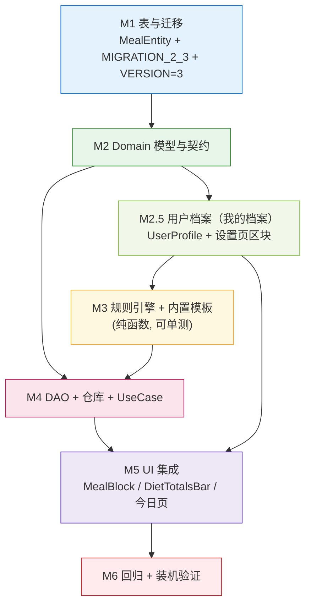

# IronHabit · Schema v3 增量设计 —— 饮食模块（Meals）

> 版本：v1.0 ｜ 作者：高见远（架构师）｜ 上游：主理人（预览版 `ironhabit-preview.html` 实测事实）
> 交付对象：工程师（施工）、主理人（汇总）
> **状态：§10-1（用户档案）已拍板（详见 §7.5）；余 §10-2/3/4 待确认，确认后即可施工**
> **设计红线**：`minSdk = 24` ⟹ 只允许 `CREATE TABLE` / `ADD COLUMN`，**禁止 `DROP COLUMN` / `RENAME COLUMN`**；
> **禁止 `fallbackToDestructiveMigration()`**；全本地零网络；沿用既有分层。

---

## 0. 结论摘要（9 个问题速答）

| # | 问题 | 结论（详见对应节） |
|---|------|------------------|
| 1 | 表设计 | **单表 `meals`**（每日实例），含 `date_epoch_day` / `meal_type` / `items_text` / `kcal` / `protein_g` / `is_completed` / `sort_order` / `is_active` / `is_user_edited`；`UNIQUE(date_epoch_day, meal_type)`（§2） |
| 2 | **周模板 vs 每日实例** | **每日实例**。预览**完全没有周模板痕迹**：`meals` 就是"今天这一份列表"，`doDiet()` 是显式生成、不是"每天自动套用"。详见取舍矩阵（§3） |
| 3 | 合并进 `Migration(1,2)` vs 独立 `Migration(2,3)` | **独立 `Migration(2, 3)`**。技术上可合并（v2 未落地），但**代价是把"零风险建表"绑到"高风险改列+回填"上、并打断在途施工**，收益仅"少一个 Migration 对象"，不对称（§4） |
| 4 | 复用 `check_ins` vs 独立表 | **独立表 `meals`，完成态内联在行上**。`check_ins` 的 `UNIQUE(exercise_id, date_epoch_day)` + `CASCADE` 外键 + `StatsDao` 的 `SUM(completed_sets)` 三处**都会把饮食污染成训练**（§5） |
| 5 | 汇总查询 | `MealDao` 内 `COALESCE(SUM(...), 0)` 取当日"已摄入"与"计划总量"；**`StatsDao` 一行都不动**（§6） |
| 6 | 零网络"生成饮食计划" | **本地确定性规则引擎**（Mifflin-St Jeor BMR × 活动系数 × 目标系数 + 按餐次比例拆分 + 内置餐次模板确定性轮换）。**预览的 4 餐恰好精确加总到 1670 kcal / 126 g**，比例可反解（§7） |
| 7 | 文件清单 | **新增 20**（饮食 19 + 用户档案 1）；**修改 13**（去重；饮食 8 + 档案 5，其中 `strings.xml` 两处共用只计 1）（§8） |
| 8 | 任务分解 | M1 → M2 → **M2.5（用户档案）** → M3 → M4 → M5 → M6（§9） |
| 9 | 待明确 | **3 处待确认**（原 #1「用户档案」已由用户拍板，落点见 **§7.5**；余 §10-2/3/4） |

---

## 1. 背景与预览事实（✅ 实测）

**预览页的饮食模型**（`ironhabit-preview.html:390-393`，逐字）：

```js
meals = [
  {n:"早餐", items:["燕麦 50g + 脱脂牛奶 250ml", "水煮蛋 2 个", "蓝莓 80g"],       kcal:420, p:26, done:true },
  {n:"午餐", items:["糙米饭 150g", "鸡胸肉 150g", "西兰花 200g（少油）"],          kcal:560, p:48, done:true },
  {n:"加餐", items:["无糖希腊酸奶 150g", "杏仁 15g"],                            kcal:210, p:14, done:false},
  {n:"晚餐", items:["三文鱼 120g", "杂粮饭 100g", "菠菜沙拉 200g"],               kcal:480, p:38, done:false}
];
```

**从预览提炼出的 6 条硬事实**（设计必须满足）：

| # | 事实（出处） | 对设计的影响 |
|---|------------|-------------|
| F1 | 一餐 = **多条食物条目**（`items` 是字符串数组） | 单餐需支持**多条目**；但条目**没有单独的 kcal/protein**（只有整餐聚合值）→ 用文本列表即可，**不需要子表** |
| F2 | 每条目只有 `n`（餐次名）、`items`、`kcal`、`p`、`done` | 字段集很小：餐次 + 条目文本 + 热量 + 蛋白 + 完成态 |
| F3 | 顺序是 **早餐 → 午餐 → 加餐 → 晚餐**（加餐在午/晚之间） | `sort_order` 必需；枚举 ordinal 也要按此序，否则排序错 |
| F4 | `kcal(done)` = **只累计 `done=true` 的餐**（`:429`） | "已摄入" = `SUM(kcal) WHERE is_completed = 1`；与"计划总量"是两个不同的聚合 |
| F5 | 4 餐**精确加总**到日目标：`420+560+210+480 = 1670 kcal`、`26+48+14+38 = 126 g`（`:496-498` 显示 `/ 1670 kcal`、`/ 126 g`） | 日目标 = Σ各餐；**餐次比例可反解**（25% / 33.5% / 12.5% / 29%）→ 见 §7 |
| F6 | `doDiet()` 是**显式生成**入口（`:707`），未生成时今日页显示引导而非默认列表 | **不做"每天自动套用"**，生成是用户动作 → 直接支持"每日实例"结论 |

**AI 提示文案里的规则线索**（`:619`、`:623`）：
> "根据你的档案：**基础代谢约 1720 kcal**，建议每日摄入 **1670 kcal**，蛋白质 **1.6g/kg 即 125g**"
> "体重：78.0 → 77.2 kg → 每日热量**下调至 1620 kcal**"

反解（✅ 自洽）：78 kg × 1.6 g/kg = **124.8 ≈ 125 g** —— **蛋白系数 1.6 g/kg 与预览精确吻合**；
BMR ≈ 1720 kcal（78 kg）与 Mifflin-St Jeor 在"175cm / 30 岁 / 男"下的 1729 kcal 高度吻合 → 见 §7。

**App 侧现状**：`meal|diet|nutrition|kcal|protein|饮食|热量|蛋白|餐` 全量 grep = **0 命中**。零表、零 entity、零 DAO、零 UI、零文案。

---

## 2. 表设计：`meals`

### 2.1 字段定义

| 列 | 类型 | 约束/默认 | 说明 |
|----|------|----------|------|
| `id` | `INTEGER` | PK 自增 | |
| `date_epoch_day` | `INTEGER NOT NULL` | **`LocalDate.toEpochDays()`** | 日期口径**与 `check_ins` / `habit_logs` 完全一致**，保证跨模块"同一天"可比 |
| `meal_type` | `TEXT NOT NULL` | 见枚举 | `BREAKFAST` / `LUNCH` / `SNACK` / `DINNER`（**按 F3 的顺序定义 ordinal**） |
| `items_text` | `TEXT NOT NULL DEFAULT ''` | 换行分隔 | 多条食物条目，如 `"燕麦 50g + 脱脂牛奶 250ml\n水煮蛋 2 个\n蓝莓 80g"` |
| `kcal` | `INTEGER NOT NULL DEFAULT 0` | | 整餐热量 |
| `protein_g` | `REAL NOT NULL DEFAULT 0` | | 整餐蛋白质（克） |
| `is_completed` | `INTEGER NOT NULL DEFAULT 0` | | 勾选完成（对应预览 `done`） |
| `sort_order` | `INTEGER NOT NULL DEFAULT 0` | | 同日内排序（默认取 `meal_type` ordinal，允许用户拖动改） |
| `is_active` | `INTEGER NOT NULL DEFAULT 1` | | **软删除**：用户"这餐不吃"→ 置 0，**不物理删** |
| `is_user_edited` | `INTEGER NOT NULL DEFAULT 0` | | 用户改过/删过 → 1；**重新生成时整行跳过** |
| `created_at` | `INTEGER NOT NULL` | | 创建时间戳 |

**索引 / 约束**：
```kotlin
indices = [
    Index(value = ["date_epoch_day"]),                          // 当日查询/聚合走这个
    Index(value = ["date_epoch_day", "meal_type"], unique = true) // 幂等生成 + 软删后"加回"定位
]
```

### 2.2 两个设计点，逐个给理由

**① `items_text` 用换行分隔的文本，不做子表、不用 JSON**

- 依据 **F1**：条目**只有文本，没有各自的 kcal/protein** —— 也就是**没有任何查询需求**打在条目上，条目纯粹是"展示用的字符串列表"。
- 于是子表 `meal_items` 的**唯一收益（可查询）为零**，却要付：多一张表 + 多一个 DAO + 每次读餐都要 JOIN/二次查询。
- 换行分隔 vs JSON：**沿用 v2 已确立的做法**（v2 里 `muscle_group` 用有序 CSV 存展示型列表，理由同样是"只是展示列表"）。此处条目更简单（单值、无次序语义要求外的结构），用 `\n` 即可，Room 原生 TEXT、零 TypeConverter。
- Domain 侧暴露 `items: List<String>`，**切分/拼装在 `MealMapper` 内完成**（与 v2 的 `muscle_group` ⇄ `List<String>` 同一处职责）。
- **诚实登记的边界**：条目内不能包含换行符（食物条目不可能是多行，风险≈0）。

**② `UNIQUE(date_epoch_day, meal_type)` 的取舍**

预览是**每天固定 4 餐、每类一餐**（F1/F2），且 `toggleMeal(i)` 用列表下标操作 —— 一天一类的唯一性成立。

| 方案 | 评价 |
|------|------|
| **`UNIQUE(date_epoch_day, meal_type)`（选用）** | 带来**幂等生成**（重复生成不产脏数据，与本项目一贯的 `IGNORE`/upsert 风格一致）+ 软删后"再加回同一餐"能精确定位到旧行。**代价**：一天不能有两条"加餐" |
| 无唯一约束 | 允许一天多份加餐，但**失去幂等保护**，重新生成极易产生重复餐（正是本项目最忌讳的脏数据来源） |

→ **选用唯一约束**。"今天想吃两份加餐"的诉求用**同一条加餐里多写一行条目**满足（`items_text` 本就来支持多条目）。
**此项列为待明确 §10-2**（若用户坚持要两条独立加餐，需改为 `UNIQUE(date_epoch_day, sort_order)`）。

### 2.3 与 v2 完全一致的"软删 + 重生成不复活"处置

饮食同样有"AI 重新生成会不会把用户删掉的餐复活"的问题 —— **直接复用 v2 已定稿的规则**（见 `docs/schema-v2.md` §6.3 坑 3/坑 4）：

| 动作 | 正确做法 | 禁止 |
|------|---------|------|
| 用户删一餐 | `is_active = 0` **且** `is_user_edited = 1` | ❌ `DELETE`（会被重新生成复活） |
| 用户改一餐 | `is_user_edited = 1` | — |
| 重新生成 | 跳过 `is_user_edited = 1` 的行（**含 `is_active = 0` 的软删行**） | ❌ "先删光再重建" |
| 生成时命中已存在行 | **显式 upsert**（命中 UPDATE / 未命中 INSERT） | ❌ `OnConflictStrategy.REPLACE`（会冲掉 `is_active`/`is_user_edited`） |

---

## 3. 最关键决策：周模板 vs **每日实例**

### 3.1 取舍矩阵

| 维度 | **每日实例（选用）** | 周模板（像 `week_plans`） |
|------|-------------------|------------------------|
| 与预览一致 | ✅ 预览就是"今天这一份列表"，无任何周结构 | ❌ 预览找不到周维度的痕迹 |
| 需几张表 | **1 张**（完成态是行内一列） | **2 张**：`meal_plans`(周模板) + `meal_logs`(每日完成)（因为完成态天然是"每天"的，模板装不下） |
| "改今天的午餐" | ✅ 只改今天一行，不影响明天 | ❌ 改的是模板 → **影响每一周**（就是我们在 v2 训练模块花了大力气修的**同一个坑**） |
| 宏量随训练日/休息日变化 | ✅ 生成"那一天"时按当天是否有训练算出 | ⚠️ 需靠 `day_of_week` 间接表达，且休息日临时调整无处可放 |
| 某天不吃某餐 | ✅ `is_active = 0` 精确到那一天 | ⚠️ 只能改模板（影响所有周）或另建例外机制 |
| 每日聚合 | ✅ `SUM(kcal) WHERE date=?` 直取 | ⚠️ 模板 + 日志两表 JOIN 才能算"今天" |
| "每天都自动有" | ⚠️ 需生成动作（**但预览本来就是显式生成，F6**） | ✅ 天然天天有 |
| 数据量 | 4 行/天 → 一年 ≈ 1460 行（个人应用，完全无压力） | 模板恒定 28 行 |

### 3.2 结论：**每日实例**

三条决定性理由：

1. **预览即事实（F6）**：`doDiet()` 是**显式生成**，未生成时页面显示引导 —— 预览**从不"每天自动套用"**。选周模板等于给一个预览里不存在的、更强的承诺，还要为此背两张表和"改模板影响所有周"的坑。
2. **完成态天然是每日的**：即使选周模板，也必须再建一张 `meal_logs` 才能存"今天哪几餐吃了"。**每日实例把这两件事合成一张表**，反而更简单（对比：习惯模块因为 `frequency`/`weekly_days_mask` 的周期语义真实存在，才用了 `habits` + `habit_logs` 两张表；饮食没有这个周期语义）。
3. **避开 v2 刚修过的坑**：训练模块选模板是因为"周一练腿"的周期心理真实且强；饮食的心理模型是"**今天吃什么**"，改今天不该影响明天。选每日实例，**天然不会**出现"修了周一、下周一跟着变"类问题。

**"每天自动有"的弥补**（可选，非必须）：由于生成是**确定性纯函数**（§7），未来若想要"打开就有"，可在今日页加一条"该日无数据且无用户软删记录时自动生成"的惰性逻辑。**本期不做**（预览也没做），登记为可选增强。

---

## 4. 与 v2 迁移的关系：**独立 `Migration(2, 3)`**

### 4.1 先回答"能否一次到位只出一次迁移"

**技术上能**：v2 **尚未落地**（工程师在途），所以完全可以把 meals 的 `CREATE TABLE` 直接塞进 `Migration(1, 2)`，让 `VERSION` 一次从 1 跳到 2，只出一个迁移。

**但代价不对称，不建议**：

| 代价 | 说明 |
|------|------|
| **打断在途施工** | v2 设计**已定稿、已 review、任务已按它分配**（§11 的 S1~S6）。中途追加内容 = 工程师已写的 `Migrations.kt` / `VERSION` / 实体要返工，且他手上的设计与文档**瞬间不一致** |
| **把零风险绑到高风险上** | v2 是"**改列 + 存量数据回填**"（`source` 回填、`completed_sets_mask` 由 `completed_sets` 重算）——**有数据变换，风险不低**；v3 是"**纯建表**"，**无任何数据变换，风险 ≈ 0**。合并 = 让一个本不可能出错的新模块，被 v2 的回填 bug 连累 |
| **故障无法定位** | 1→2 出问题时，无法判断是"改列"还是"建表"引入的 |
| 收益 | 仅"少一个 Migration 对象 + 少一个版本号"。**微乎其微** |

### 4.2 结论：独立迁移，`VERSION = 3`

```
Room 升级路径：
  v1 设备（如有）──► 1→2（v2：改列+回填）──► 2→3（v3：纯建表）──► 当前
  v2 设备（如有）──► 2→3 ──► 当前
  全新安装 ──────► 直接按实体建表（不跑任何迁移）
```

**Room 原生支持链式路径迁移**，只要两个 Migration **都注册**即可，独立不损失任何东西。

### 4.3 落地要点

```kotlin
// data/local/Migrations.kt —— 同一个文件里放两个对象，各自独立、互不依赖
val MIGRATION_1_2: Migration = object : Migration(1, 2) { /* v2 设计，勿动 */ }

val MIGRATION_2_3: Migration = object : Migration(2, 3) {
    override fun migrate(db: SupportSQLiteDatabase) {
        // 纯建表，无数据变换、无回填 —— 本迁移不可能因为数据出错
        db.execSQL(
            "CREATE TABLE IF NOT EXISTS `meals` (" +
                "`id` INTEGER NOT NULL PRIMARY KEY AUTOINCREMENT, " +
                "`date_epoch_day` INTEGER NOT NULL, " +
                "`meal_type` TEXT NOT NULL, " +
                "`items_text` TEXT NOT NULL DEFAULT '', " +
                "`kcal` INTEGER NOT NULL DEFAULT 0, " +
                "`protein_g` REAL NOT NULL DEFAULT 0, " +
                "`is_completed` INTEGER NOT NULL DEFAULT 0, " +
                "`sort_order` INTEGER NOT NULL DEFAULT 0, " +
                "`is_active` INTEGER NOT NULL DEFAULT 1, " +
                "`is_user_edited` INTEGER NOT NULL DEFAULT 0, " +
                "`created_at` INTEGER NOT NULL)"
        )
        db.execSQL("CREATE INDEX IF NOT EXISTS `index_meals_date_epoch_day` ON `meals` (`date_epoch_day`)")
        db.execSQL(
            "CREATE UNIQUE INDEX IF NOT EXISTS `index_meals_date_epoch_day_meal_type` " +
                "ON `meals` (`date_epoch_day`, `meal_type`)"
        )
    }
}
```

> ⚠️ **DDL 必须与 Room 生成的 `3.json` 逐字对齐**。最稳的做法：**先写好 `MealEntity`，真实编译一次让 KSP 生成 `3.json`，再照抄 `3.json` 里的 `createSql` 原文**（含反引号与 `IF NOT EXISTS` 的确切形态），**不要手写后猜测**。这是 Room 迁移最常见的翻车点。
>
> ⚠️ **`AppDatabase.kt`：`VERSION` 2 → 3，且 `entities` 里加上 `MealEntity::class`**。
> ⚠️ **`DatabaseModule.kt`：用**复数** API 一次性注册两个 —— `.addMigrations(MIGRATION_1_2, MIGRATION_2_3)`**（Room 2.6.1 只有 `addMigrations`（**复数**），**没有** `addMigration`（单数）；两个都传，只注册新的会导致 v1 设备升级时找不到 1→2 路径而崩溃）。
> ⚠️ **`app/schemas/.../2.json` 与 `3.json` 都必须生成并入库**，Room 的迁移测试依赖它们。

---

## 5. 打卡语义：**独立表，不碰 `check_ins`**

**结论：完成态就是 `meals.is_completed` 这一列，绝不复用 `check_ins`。**

### 5.1 为什么复用 `check_ins` 是错的（三条硬伤）

| 硬伤 | 具体后果 |
|------|---------|
| **`UNIQUE(exercise_id, date_epoch_day)`** | `check_ins` 的主键口径是**"某个动作"**。要把"早餐"塞进去，就得先给"早餐"伪造一条 `exercises` 记录 —— 而 `exercises.name` 是 **UNIQUE** 且首启播种 40+ 内置动作，**"早餐"会作为动作出现在动作库里** |
| **`FK exercise_id → exercises` 且 `CASCADE`** | 用户删掉一个动作（哪怕是那个伪造的"早餐"）→ **级联删除他的饮食打卡记录**。错误的耦合方向 |
| **`StatsDao` 聚合 `SUM(completed_sets)` 等** | 饮食行一旦进 `check_ins`，**训练统计（趋势/分类占比/完成率/热力图）会立刻被污染** —— "早餐"会出现在**动作分类饼图**里。主理人已特别标注 StatsDao 依赖这些聚合 |
| 字段语义 | `completed_sets/reps/weight_kg/rpe/completed_sets_mask` 对饮食**全部无意义** → 大面积 NULL 与"有值但没有意义"的字段 |

### 5.2 正确的独立设计

- **独立表 `meals`**，完成态 **`is_completed` 内联**（**不再另建 `meal_logs`** —— 选了每日实例，就没有"模板 + 日志"两张表的必要，见 §3.2）。
- **日期口径统一**：`date_epoch_day` 一律 `LocalDate.toEpochDays()`，与 `check_ins` / `habit_logs` / `body_metrics` **同口径**。这样"饮食和今日训练放在同一屏"只是 UI 层按同一个 `epochDay` 取两份数据，**无需任何跨表转换**。
- 饮食与训练**互不引用**：`meals` **不设任何外键**（没有需要级联的对象），比 v2 的 `week_plans` 更简单。

---

## 6. 汇总查询与 `StatsDao` 影响

### 6.1 DAO 查询

```kotlin
@Dao
interface MealDao {

    @Query("SELECT * FROM meals WHERE date_epoch_day = :epochDay AND is_active = 1 ORDER BY sort_order")
    fun observeByDate(epochDay: Long): Flow<List<MealEntity>>

    /**
     * 当日合计。⚠️ 空集时 SUM 返回 NULL —— 必须 COALESCE，否则新的一天一进页面就崩。
     * intakeKcal / intakeProtein = 只算已完成的餐（对应预览 kcal(true)，见 F4）
     * planKcal / planProtein       = 全部餐（计划总量）
     */
    @Query(
        "SELECT " +
        "COALESCE(SUM(CASE WHEN is_completed = 1 THEN kcal ELSE 0 END), 0) AS intakeKcal, " +
        "COALESCE(SUM(CASE WHEN is_completed = 1 THEN protein_g ELSE 0 END), 0) AS intakeProtein, " +
        "COALESCE(SUM(kcal), 0) AS planKcal, " +
        "COALESCE(SUM(protein_g), 0) AS planProtein " +
        "FROM meals WHERE date_epoch_day = :epochDay AND is_active = 1"
    )
    fun observeTotals(epochDay: Long): Flow<MealTotalsRaw>

    @Query("UPDATE meals SET is_completed = :done WHERE id = :id")
    suspend fun setCompleted(id: Long, done: Boolean)

    /** 软删除：保留唯一索引槽位 + 阻止重新生成复活。禁止用 DELETE。 */
    @Query("UPDATE meals SET is_active = 0, is_user_edited = 1 WHERE id = :id")
    suspend fun softDelete(id: Long)
}
```

`MealTotalsRaw`（`data/local/dto/MealTotalsRaw.kt`，与既有 `StatsRaw.kt` 同处一个包、同一风格）：
```kotlin
data class MealTotalsRaw(
    val intakeKcal: Int,
    val intakeProtein: Double,
    val planKcal: Int,
    val planProtein: Double,
)
```

### 6.2 对现有 `StatsDao` 的影响：**零**

- **新表 + 新 DAO**：`MealDao` 与 `StatsDao` 完全独立，**`StatsDao` 一行都不动**。
- **不会变慢**：新表自带 `Index(date_epoch_day)`，聚合是索引覆盖的当日小范围扫描（≤4 行）。
- **唯一的间接影响（可忽略）**：`AppDatabase` 多注册一张表/一个 DAO，仅影响 Room 打开时的 schema 校验，与既有聚合查询无关。

> **本期不做**：把饮食并入"我的"页图表（热量/蛋白趋势）。那需要**扩展 `StatsDao`**，属于 v4 范围，且必须**新增**独立查询而**不得改动**现有 `SUM(completed_sets)` 等语句。

### 6.3 一处必须写死的口径（防回归）

`is_active = 1` 过滤 **必须**出现在 `observeByDate` 与 `observeTotals` 两处。
`is_completed` 只影响 **intake**，**不影响 plan** —— 若误把 `is_completed = 1` 加进 `observeByDate`，用户取消勾选后整餐会从列表消失。这与 v2 §7.6 的"软删口径红线"是同一类问题。

---

## 7. 零网络下的"生成饮食计划"：本地确定性规则引擎

**结论：纯本地纯函数规则引擎，不引入任何网络、不用任何随机数。**

### 7.1 输入（全部来自已有的本地数据）

| 输入 | 来源 | 现状 |
|------|------|------|
| 体重 `weightKg` | `body_metrics`（`type = WEIGHT`，取最新一条） | ✅ 已有 |
| 性别 / 年龄 / 身高 | **用户档案**（存 `SettingsDataStore`，**不建表**） | ✅ **已拍板：落点见 §7.5**（字段 / 默认值 / 降级规则见 §7.5.2、§7.5.3） |
| 目标（减脂/维持/增肌） | 用户档案（同 `SettingsDataStore`） | ✅ **已拍板：落点见 §7.5**（`Goal` 枚举，默认 `MAINTAIN`） |
| 该日是否训练日 | `week_plans` 中该 `day_of_week` 是否有 `is_active = 1` 的行 | ✅ 已有 |

### 7.2 规则（系数全部为**集中定义的可调常量**，便于单人校准）

```
① BMR（Mifflin-St Jeor，与预览 BMR≈1720 kcal／78kg 吻合）
    男：BMR = 10·kg + 6.25·cm − 5·age + 5
    女：BMR = 10·kg + 6.25·cm − 5·age − 161
② TDEE = BMR × 活动系数          （训练日 1.55 / 休息日 1.375）
③ 目标热量 targetKcal = TDEE × 目标系数   （取 `Goal.kcalFactor`：减脂 0.85 / 增肌 1.10 / 减脂增肌 1.00 / 塑形 0.95 / 保持 1.00，见 §7.5.2）
④ 目标蛋白 targetProtein = kg × 1.6      ← 预览 78×1.6 = 124.8 ≈ 126/125 g，✅ 精确吻合
⑤ 按餐次比例拆分（比例由预览 4 餐精确反解，见下）
```

**餐次比例（✅ 由预览 F5 反解，4 餐加总正好等于日目标）**：

| 餐次 | 比例 | 预览实测 | 目标 1670 时 |
|------|------|---------|-------------|
| 早餐 BREAKFAST | 0.25 | 420 kcal / 26 g | 418 kcal |
| 午餐 LUNCH | 0.335 | 560 / 48 | 559 |
| 加餐 SNACK | 0.125 | 210 / 14 | 209 |
| 晚餐 DINNER | 0.29 | 480 / 38 | 484 |
| **合计** | **1.000** | **1670 / 126** | **1670** |

**餐次内容**：内置模板库 `BuiltInMealTemplates`（本地常量，按 `meal_type` 分组，各若干条）。
选取用**确定性伪随机**，保证**可复现、可单测**：
```kotlin
val index = ((dateEpochDay + mealType.ordinal) % templates.size).toInt()
```
→ 每天内容不同，但同一天同一餐**永远算出同一条**（不依赖时钟、不依赖随机种子）。**这是让规则引擎可单测的关键。**

### 7.3 生成流程（幂等，绝不覆盖用户修改）

```
GenerateDietPlanUseCase(epochDay):
  1. 读 weightKg（`body_metrics` 最新 WEIGHT）/ 档案（`SettingsDataStore`，§7.5）/ 该日是否训练日
  2. 缺项**不中断**：走 §7.5.3 的"默认值补全 + 出口钳制"（性别缺→FEMALE、年龄缺→30、身高缺→175、体重缺→70kg；
     最终 targetKcal.coerceIn(1200,4000)），仅置 usedDefaults=true 供 UI 提示。
     **不再使用早期的粗口径"2000 kcal / 120 g"兜底**（已由 §7.5.3 的精细规则取代）
  3. targetKcal / targetProtein = 规则计算
  4. 对 4 个 meal_type：
        if (该 (epochDay, mealType) 已存在且 is_user_edited = 1) → 跳过（保护用户修改/软删）
        else → 用模板 + 比例算出 kcal/protein/items，走【显式 upsert】写入
  5. 绝不 "先 DELETE 再重建"
```

### 7.4 为什么这是"AI 只是增强、离线仍可用"的正确落地

- 规则引擎是**纯函数**（`domain/diet/DietPlanGenerator.kt`），**零 Android 依赖、零 IO、零网络** → **JVM 单测全覆盖**（不需要设备，与本项目既有 `StreakCalculator` 的范式一致）。
- 断网、飞行模式下**功能完全一致**。
- 若将来接入真正的 AI，只需在同一个 `GenerateDietPlanUseCase` 后面换一个"计划来源"，**表结构与 UI 完全不用动**。

### 7.5 用户档案（「我的档案」）—— 规则引擎的必填输入（✅ 用户已拍板）

> 本节结掉原 **§10 待明确 #1**。**用户已拍板：档案放 `SettingsDataStore`（不建表），UI 落在「设置」页新增的「我的档案」区块。**

#### 7.5.1 结论与理由：为什么是 DataStore，而不是再加一张 Room 表

| 维度 | **DataStore（选用）** | 新建 Room 表 `user_profile` |
|------|---------------------|--------------------------|
| 数据形态 | **单人单份配置**（全库恒定 0 或 1 行），与"主题 / 单位 / 提醒"同类 | 一张只会存 1 行的表 —— 关系型表的最差用法 |
| 迁移成本 | **零 schema 迁移**（DataStore 是键值文件，加 key 不需要 `Migration`） | v3 要多一个 `CREATE TABLE`，多一次 `Migration(3,4)`（或并入 `(2,3)`） |
| 与其它设置一致 | 与 `theme_mode` / `unit_system` 同处 `ironhabit_settings` 文件、同一套读写路径 | 引入第二种"设置"存储方式，形成双写 |
| 备份 / 换机 | 与既有设置同一体系（注：本项目 DataStore **本就不随 DB 备份**，主题/提醒亦然，**行为一致**） | 需额外接入 `Export/Import` |
| 读取代价 | `Flow<UserProfile>`，本就异步、廉价 | 需 DAO + Flow |

→ **结论：放 `SettingsDataStore`。** 唯一"代价"是档案不进 Room schema —— 但这与主题/单位/提醒完全一致（它们也不进 DB 备份），**没有引入任何新的不一致**。

#### 7.5.2 字段定义（**完整版** · 类型 / 单位 / 默认值 / 合法域 / 键名）

> **范围**：本节从"4 字段（性别/年龄/身高/目标）"**扩展为完整档案**，对齐预览 `ironhabit-preview.html` 的「我的身体档案」卡（`:594-604`、编辑表单 `:731-747`）。
> 该完整档案同时是 **本地 AI 教练**（见 `docs/ai-coach-local.md`）与 **饮食模块** 的**共同前置**。

| 字段 | 领域类型 | DataStore 键 | 单位 | 默认值 | 合法域 | 说明 |
|------|---------|-------------|------|--------|--------|------|
| 性别 `gender` | `Gender?` | `profile_gender`（String：`Gender.name`） | — | `null`（未填） | `MALE` / `FEMALE` | BMR 的 ±常数项（+5 / −161） |
| 年龄 `age` | `Int?` | `profile_age`（Int） | 岁 | `null` | **14–100**（写入 `coerceIn`） | BMR 年龄项 |
| 身高 `heightCm` | `Int?` | `profile_height_cm`（Int） | cm | `null` | **140–220**（写入 `coerceIn`） | BMR 身高项 |
| **体脂率** `bodyFatPct` | `Float?` | `profile_body_fat_pct`（Float） | % | `null` | **3–60**（写入 `coerceIn`） | 仅展示/参考；**缺失时回落** `body_metrics` 的 `BODY_FAT` 最新值（见 §7.5.3） |
| 目标 `goal` | `Goal`（5 值） | `profile_goal`（String） | — | `MAINTAIN` | `CUT`/`BULK`/`RECOMP`/`SHAPE`/`MAINTAIN` | 目标热量系数，见 §7.2 |
| **目标体重** `goalWeightKg` | `Float?` | `profile_goal_weight_kg`（Float） | kg | `null` | **30–300**（写入 `coerceIn`） | **仅展示/激励**；本地规则**不用它**算热量（用当前体重） |
| **可用器械** `equipment` | `Set<Equipment>` | `profile_equipment`（**StringSet**） | — | 空集（=未选） | `Equipment` 枚举子集 | 训练计划生成的**硬约束**（只用用户有的器械） |
| **伤病部位** `injuryAreas` | `Set<InjuryArea>` | `profile_injury_area`（**StringSet**） | — | 空集 | `InjuryArea` 枚举子集 | 训练计划生成的**机械排除项** |
| **伤病备注** `injuryNote` | `String?` | `profile_injury_note`（String） | — | `null` | ≤ 200 字 | **仅展示**；本地规则**不解析**自由文本 |
| **饮食忌口** `dietaryAvoid` | `Set<DietRestriction>` | `profile_diet_avoid`（**StringSet**） | — | 空集 | `DietRestriction` 枚举子集 | 饮食生成的**排除项** |
| ~~体重~~ | **不入档案** | — | kg | — | — | **走 `body_metrics` 表**（`BodyMetricType.WEIGHT` 最新值），见 §7.5.3 与 §7.5.5 |

**为什么"多选集合"用 DataStore 原生 `stringSetPreferencesKey`，而不是 CSV 或位掩码**（主理人给了 CSV/位掩码两个选项，我选第三个并说明）：

| 方案 | 评价 |
|------|------|
| **DataStore `stringSetPreferencesKey`（选用）** | **DataStore 原生 Set<String>**，零手写编解码；存 `Equipment.name` 等**枚举名**（改动枚举顺序也不受影响）。**无序**正合此场景（器械/伤病/忌口都无次序语义） |
| 单字符串 CSV（如 v2 的 `muscle_group`） | v2 用 CSV 是因为那是 **Room TEXT 列**、且要保序（主肌群在前）。**此处是 DataStore、无 SQL、无次序**，CSV 只会引入手写 split/join 与"分隔符转义"的额外风险 |
| 位掩码 Int | 适合"布尔 + 需要 SQL 聚合"（如 `completed_sets_mask`）。此处**无聚合需求**，位掩码反而**不可读、依赖枚举 ordinal**（增删枚举会错位） |

→ **结论：三个多选字段用 `stringSetPreferencesKey`（存枚举 `name`）**。展示顺序由 UI 按**枚举声明顺序**排序（不依赖 Set 迭代顺序）。**淘汰**该字段时（如清空器械），写空集即可。

**领域模型**（**新文件** `domain/model/UserProfile.kt`，与现有 `AppSettings` / `ThemeMode` / `UnitSystem` 同处 `domain/model/`；枚举与 data class **同一文件**，沿用 `StatsModels.kt` / `DietModels.kt` 的"同文件多模型"先例）：

```kotlin
/** 生理性别：仅用于 BMR 公式的常数项。 */
enum class Gender { MALE, FEMALE }

/**
 * 健身目标（对齐预览 `GOALS` 的 5 项；预览 `P.goal = "减脂增肌"`）。
 * @property kcalFactor 目标热量系数（相对 TDEE），被饮食规则 §7.2 使用。
 */
enum class Goal(val kcalFactor: Double) {
    CUT(0.85),       // 减脂
    BULK(1.10),      // 增肌
    RECOMP(1.00),    // 减脂增肌（体重维持 + 高蛋白）
    SHAPE(0.95),     // 塑形（轻微热量缺口）
    MAINTAIN(1.00),  // 保持
}

/** 可用器械（对齐预览 `EQUIP`）。 */
enum class Equipment {
    NONE,             // 无器械
    DUMBBELL,         // 哑铃
    BARBELL,          // 杠铃
    YOGA_MAT,         // 瑜伽垫
    PULLUP_BAR,       // 单杠
    RESISTANCE_BAND,  // 弹力带
    MACHINE,          // 器械区
    TREADMILL,        // 跑步机
}

/**
 * 伤病部位（**结构化**，供本地规则**机械排除**动作）。
 *
 * ⚠️ 预览把伤病存成**纯自由文本**（"右膝旧伤（避免深跳）"），自由文本**无法被规则可靠消费**；
 * 故本设计改为**部位枚举多选**（驱动规则）+ 可选自由文本备注（仅展示）。
 */
enum class InjuryArea {
    KNEE, LOWER_BACK, SHOULDER, WRIST, ELBOW, ANKLE, NECK, HIP, CARDIO,
    // 膝 / 腰 / 肩 / 腕 / 肘 / 踝 / 颈 / 髋 / 心血管（含"其他慢性病"）
}

/** 饮食忌口（对齐预览 `AVOID`）。 */
enum class DietRestriction { PEANUT, SEAFOOD, DAIRY, GLUTEN, SPICY, ALCOHOL }
// 花生 / 海鲜 / 乳制品 / 麸质 / 辛辣 / 酒精

/**
 * 用户档案（单人单份，存 [SettingsDataStore]，**不落 Room**）。
 *
 * ⚠️ **不含体重** —— 体重走 `body_metrics`（唯一真源），档案只做"展示 + 跳转"，见 §7.5.3。
 *
 * 所有 `?` 字段为 null 表示"用户尚未填写"，是**合法状态**（非错误）。
 */
data class UserProfile(
    val gender: Gender? = null,
    val age: Int? = null,
    val heightCm: Int? = null,
    val bodyFatPct: Float? = null,
    val goal: Goal = Goal.MAINTAIN,
    val goalWeightKg: Float? = null,
    val equipment: Set<Equipment> = emptySet(),
    val injuryAreas: Set<InjuryArea> = emptySet(),
    val injuryNote: String? = null,
    val dietaryAvoid: Set<DietRestriction> = emptySet(),
) {
    /** 体征三件套是否填全（BMR 计算的前提；缺失走 §7.5.3 兜底）。 */
    val isBodyProfileComplete: Boolean
        get() = gender != null && age != null && heightCm != null

    /** 训练档案是否可用：**至少勾选一项器械**（没有器械就选 `NONE`）。决定能否生成训练计划。 */
    val isTrainingProfileComplete: Boolean
        get() = equipment.isNotEmpty()

    /** 是否存在需要规则避让的约束（伤病 / 忌口）。 */
    val hasConstraints: Boolean
        get() = injuryAreas.isNotEmpty() || dietaryAvoid.isNotEmpty()
}
```

- **键命名遵循既有约定**：全部放进 `SettingsDataStore.Keys` 私有对象内、snake_case 且统一 `profile_` 前缀（见 `SettingsDataStore.kt:101-109` 的 `theme_mode` / `unit_system` …）。
- **不新增额外的"是否已配置"布尔键**："是否填全"一律由字段是否为 null / 集合是否为空**直接推导**（`isBodyProfileComplete` / `isTrainingProfileComplete`），少一个可能与事实不同步的冗余键。
- **枚举 ↔ 存储映射**：集合存 `Enum.name`（字符串），**不存 ordinal**（新增/重排枚举值不会错位）；未知 name 读入时**忽略并回落默认**（不崩）。

#### 7.5.3 降级规则（**必须写死；空档案也不得算出荒谬值、不得崩**）

**总原则：默认值补全 + 出口钳制 + 显式提示，三重保险。任何输入下都产出一个 `[1200, 4000]` 区间内的有限热量值，绝不为负 / NaN / 极低，绝不抛异常。**

| 缺失项 | 补全规则（**写死**） | 理由 |
|--------|-------------------|------|
| **体重**（`body_metrics` 无 WEIGHT 记录） | 用 **70.0 kg** | 取中性成人值；体重是唯一真正必需的输入，绝不能用 0（否则 BMR 失真且可能触发除零类问题） |
| **性别** 为 `null` | 按 **`FEMALE`** 计算 | `FEMALE` 公式常数项（−161）比 `MALE`（+5）小 → **BMR 更低 → 目标热量更保守**，避免"高估摄入"这一对减脂用户更危险的方向 |
| **年龄** 为 `null` | 用 **30 岁** | 预览实测锚点（BMR≈1729@175cm/30岁/男 ≈ 预览 1720 kcal）正是 30 岁 |
| **身高** 为 `null` | 用 **175 cm** | 同上，预览锚点身高 |
| **目标** 为 `null` | 用 **`MAINTAIN`** | 系数 1.0，最中性、无倾向 |
| **体脂率** 为 `null` | **展示回落**：读 `body_metrics` 的 `BODY_FAT` 最新值；仍无则**整行不显示** | 体脂率**不参与** BMR / 热量计算（Mifflin-St Jeor 不含体脂），缺失**不影响任何数值**，仅少显示一行 |
| **目标体重** 为 `null` | 卡片只显示"目标：X"，**不显示"→ 目标体重"**；计算不受影响 | 目标体重是**激励项**，不参与热量计算 |
| **器械** 为空集 | **视为 `{NONE}`（仅自重）**：训练计划只挑"无器械/自重"动作，**绝不假定用户有器材** | "宁可保守"：宁少给动作，也不给用户做不到的动作 |
| **伤病** 为空集 | **不排除任何动作** | 未申报 = 无条件可练 |
| **忌口** 为空集 | **不排除任何食物** | 同上 |
| **伤病备注** 为 `null` | 不显示该行 | 备注仅展示，本地规则**不解析**它 |

**输入 / 出口双重钳制（防荒谬值的最后一道闸）：**

```kotlin
weightKg      = (最新 WEIGHT 值 ?: 70.0).coerceIn(30.0, 300.0)   // 脏数据 / 误录也不至于爆
targetKcal    = (TDEE * goalFactor).coerceIn(1200.0, 4000.0)     // 绝不为负 / 极低 / 极高
targetProtein = (weightKg * 1.6).coerceIn(50.0, 300.0)
```

**提示规则（只加一行提示，不改生成结果）：**

- 当 `!profile.isBodyProfileComplete` **或** 无体重记录 → 生成成功后，在今日页 / 设置页显示**非阻断**提示：
  `profile_incomplete_hint` =「档案未填全，已按默认值估算，去「我的档案」补全更准」。
- **绝不**因档案缺失而**拒绝生成**或**弹错**（预览 `doDiet()` 在无档案时同样照常产出）。

**举例（空档案 + 有体重 78 kg）**：
`gender=null→FEMALE, age=30, height=175` →
`BMR = 10×78 + 6.25×175 − 5×30 − 161 = 780 + 1093.75 − 150 − 161 = 1562.75`；
休息日 `TDEE = ×1.375 ≈ 2148.78`；维持目标 `= ×1.0 ≈ 2149 kcal`（落在 `[1200,4000]` 内，**无荒谬值**）。
→ 这正是本规则要防的场景：**既不崩，也不产出 0 / 负数 / 极低热量。**

#### 7.5.4 与规则引擎的衔接（`GenerateDietPlanUseCase` 从哪里读、走哪条分支）

```
GenerateDietPlanUseCase(epochDay)          // domain 层；构造注入 SettingsRepository + BodyMetricRepository（均为 domain 接口）
  1. profile  = settingsRepository.profile().first()          // Flow<UserProfile>，SettingsRepository 新增方法
  2. weightKg = bodyMetricRepository.latestWeightKg()         // 现有仓库；null → §7.5.3 兜底
  3. target   = DietPlanGenerator.dailyTarget(                 // 纯函数，内部完成 §7.5.3 的全部"补全 + 钳制"
                     weightKg, profile.gender, profile.age, profile.heightCm, profile.goal)
     // ⚠️ 分支只有一条：无论档案是否完整都调用同一个纯函数。
     //    不设"if 档案为空 → 走另一条粗算分支"，否则会产出两套口径、难以单测。
  4. 返回 (targetKcal, targetProtein, usedDefaults)
        usedDefaults = !profile.isBodyProfileComplete || (无体重记录)
  5. UI 据 usedDefaults 决定是否显示 profile_incomplete_hint（**不改变数值**）
```

**关键**：`DietPlanGenerator.dailyTarget(...)` 是**纯函数**（`domain/diet/DietPlanGenerator.kt`），`SettingsRepository` 只是它的数据来源；单测里直接传入 `UserProfile` 即可，无需 Android。`profile()` 走 `SettingsRepository`（domain 接口）→ UI 与 domain **均不直接依赖** `SettingsDataStore`，与既有分层一致（参照 `SettingsViewModel` 只用 `SettingsRepository`）。

#### 7.5.5 UI：**独立「我的档案」编辑页** + 3 处只读入口

> ⚠️ **对早期设计的调整（字段 4 → 10 所致）**：原设计把编辑器做成**设置页内联区块**。字段扩到 10 个后，一个横跨"体征 / 目标 / 器械 / 伤病 / 忌口"的长表单**塞进设置页会很长、且与"设置项"语义不符** → 改为 **独立二级页 `ProfileEditScreen`**，设置页只放一个**跳转条目**。**编辑器全局唯一**，杜绝"两套档案 UI 各改各的"。

**只读入口（3 处，均跳同一个 `ProfileEditScreen`）**：

| 入口 | 位置 | 展示 |
|------|------|------|
| ① 设置页 | 「单位制」之后、「每日训练提醒」之前，新增一行「**我的档案**」 | 一行概要（性别 · 年龄 · 目标）+ `›` |
| ② AI 教练页 | 页首「我的身体档案」卡（见 `docs/ai-coach-local.md`） | 完整只读卡（对齐预览 `:594-604`） |
| ③ 「我的」页 | 「身体档案」卡（预览 `scrProfile` 已有） | 概要卡 |

**`ProfileEditScreen`（二级页 `profile/edit`）分区与控件**：

```
我的档案
 ├─ 【体征】
 │    ├─ 性别     [ 男 | 女 ]                    ← SegmentedButton（2 段）
 │    ├─ 年龄     [____] 岁                      ← 数字输入框
 │    ├─ 身高     [____] cm                      ← 数字输入框
 │    ├─ 体脂率   [____] %    （可空）             ← 数字输入框
 │    └─ 当前体重  78.0 kg         [ 去记录 › ]    ← 只读展示 + 跳 BodyMetricsScreen
 ├─ 【目标】
 │    ├─ 目标     [ 减脂 | 增肌 | 减脂增肌 | 塑形 | 保持 ]   ← SegmentedButton（5 段）
 │    └─ 目标体重 [____] kg    （可空）              ← 数字输入框
 ├─ 【训练条件】
 │    └─ 可用器械  ☐ 无器械 ☐ 哑铃 ☐ 杠铃 ☐ 瑜伽垫 ☐ 单杠 ☐ 弹力带 ☐ 器械区 ☐ 跑步机   ← 多选 chip
 └─ 【约束（可留空）】
      ├─ 伤病部位  ☐ 膝 ☐ 腰 ☐ 肩 ☐ 腕 ☐ 肘 ☐ 踝 ☐ 颈 ☐ 髋 ☐ 心血管   ← 多选 chip
      ├─ 伤病备注  [_______________]   （自由文本，可空）
      └─ 饮食忌口  ☐ 花生 ☐ 海鲜 ☐ 乳制品 ☐ 麸质 ☐ 辛辣 ☐ 酒精          ← 多选 chip
```

| 字段 | 控件 | 选型理由 |
|------|------|---------|
| 性别 | **分段按钮**（2 段） | 互斥 + 仅 2 项：一次点击直达，比下拉少一步 |
| 目标 | **分段按钮 / 横向 chip**（5 段） | 5 项并行可见、当前选中态一眼可见；5 项已到分段按钮舒适上限，若嫌挤可降级为 chip 组 |
| 年龄 / 身高 / 体脂率 / 目标体重 | **数字输入框**（数字键盘） | 需精确键入 + 越界钳制；滑杆难精调 |
| 器械 / 伤病部位 / 忌口 | **多选 chip** | 多选 + 项数适中；chip 组比多选对话框更轻、可一眼看全（对齐预览 `pick` 组） |
| 当前体重 | **只读 + 跳转**（**不在本页录入**） | 体重唯一真源是 `body_metrics`；本页只**展示最新值**并给「去记录」跳 `BodyMetricsScreen`（复用既有页面，不新造） |

- **保存时机**：控件变更**即时落 DataStore**（与主题 / 单位一致，**不设独立"保存"按钮**，避免"改了没保存"）。
- **校验**：数值越界时**钳制 + 轻提示**（`error_profile_*_range`），**不阻断输入、不崩**。
- **空态**：全部字段可留空；性别未选按 §7.5.3 用 `FEMALE` 兜底；目标默认高亮「保持」。
- **体重取数**：`BodyMetricRepository.latest(WEIGHT)`（现有接口）；无记录时该行显示"未记录" + 「去记录」。
- 页面级错误 / Snackbar 复用既有 `errorRes / snackbarRes` 通道，**不新造机制**。

#### 7.5.6 需新增的 `strings.xml` 条目（一次性列全）

沿用命名规范（架构 §7.5）：`settings_*` 属设置页、`hint_*` 为输入提示、`label_*` 为展示标签、`error_*` 为校验文案：

```xml
<!-- ===== 我的档案（v3 增量 · 完整版）===== -->
<!-- 入口与标题 -->
<string name="entry_profile_edit">我的档案</string>
<string name="title_profile_edit">我的档案</string>

<!-- 分区：体征 -->
<string name="section_profile_body">体征</string>
<string name="label_profile_gender">性别</string>
<string name="label_profile_gender_male">男</string>
<string name="label_profile_gender_female">女</string>
<string name="label_profile_age">年龄</string>
<string name="label_profile_height">身高</string>
<string name="label_profile_body_fat">体脂率</string>
<string name="label_profile_current_weight">当前体重</string>
<string name="action_profile_record_weight">去记录</string>
<string name="value_profile_not_recorded">未记录</string>
<string name="hint_profile_age">如 30</string>
<string name="hint_profile_height">如 175</string>
<string name="hint_profile_body_fat">如 22</string>
<string name="suffix_profile_age">岁</string>
<string name="suffix_profile_height">cm</string>
<string name="suffix_profile_body_fat">%</string>

<!-- 分区：目标（5 项，对齐预览 GOALS）-->
<string name="section_profile_goal">目标</string>
<string name="label_profile_goal">目标</string>
<string name="label_profile_goal_weight">目标体重</string>
<string name="label_profile_goal_cut">减脂</string>
<string name="label_profile_goal_bulk">增肌</string>
<string name="label_profile_goal_recomp">减脂增肌</string>
<string name="label_profile_goal_shape">塑形</string>
<string name="label_profile_goal_maintain">保持</string>
<string name="hint_profile_goal_weight">如 72</string>
<string name="suffix_profile_goal_weight">kg</string>

<!-- 分区：训练条件（8 项，对齐预览 EQUIP）-->
<string name="section_profile_training">训练条件</string>
<string name="label_profile_equipment">可用器械（可多选）</string>
<string name="equipment_none">无器械</string>
<string name="equipment_dumbbell">哑铃</string>
<string name="equipment_barbell">杠铃</string>
<string name="equipment_yoga_mat">瑜伽垫</string>
<string name="equipment_pullup_bar">单杠</string>
<string name="equipment_resistance_band">弹力带</string>
<string name="equipment_machine">器械区</string>
<string name="equipment_treadmill">跑步机</string>

<!-- 分区：约束（伤病部位 9 项 / 忌口 6 项，对齐预览 AVOID）-->
<string name="section_profile_constraints">约束（可留空）</string>
<string name="label_profile_injury_area">伤病部位（可多选）</string>
<string name="label_profile_injury_note">伤病备注（可选）</string>
<string name="hint_profile_injury_note">如：右膝旧伤，避免深跳</string>
<string name="label_profile_diet_avoid">饮食忌口（可多选）</string>
<string name="injury_knee">膝</string>
<string name="injury_lower_back">腰</string>
<string name="injury_shoulder">肩</string>
<string name="injury_wrist">腕</string>
<string name="injury_elbow">肘</string>
<string name="injury_ankle">踝</string>
<string name="injury_neck">颈</string>
<string name="injury_hip">髋</string>
<string name="injury_cardio">心血管</string>
<string name="restriction_peanut">花生</string>
<string name="restriction_seafood">海鲜</string>
<string name="restriction_dairy">乳制品</string>
<string name="restriction_gluten">麸质</string>
<string name="restriction_spicy">辛辣</string>
<string name="restriction_alcohol">酒精</string>

<!-- 提示与校验 -->
<string name="profile_incomplete_hint">档案未填全，已按默认值估算，去「我的档案」补全更准</string>
<string name="profile_equipment_missing_hint">还没勾选可用器械，去「我的档案」选一项（没有器械就选「无器械」）</string>
<string name="error_profile_age_range">请输入 14–100 之间的年龄</string>
<string name="error_profile_height_range">请输入 140–220 cm 之间的身高</string>
<string name="error_profile_body_fat_range">请输入 3–60 之间的体脂率</string>
<string name="error_profile_goal_weight_range">请输入 30–300 kg 之间的目标体重</string>
```

> 复用既有 `action_save` / 通用文案，不重复定义。**禁止硬编码中文**（架构 §7.5）：性别 / 目标 / 单位一律走资源。

#### 7.5.7 任务分解（插入位置 + 依赖）

「我的档案」必须先于**任何"按档案生成"**的能力可用 —— 它同时是：① 饮食规则引擎（本文件 §7）、② **本地 AI 教练**（`docs/ai-coach-local.md`）的输入。故**新增任务 `M2.5`，插在 `M2`（Domain 契约）之后、`M3`（规则引擎）之前**（见 §9）：

| ID | 任务 | 涉及文件 | 依赖 | 优先级 |
|----|------|---------|------|-------|
| **M2.5** | **用户档案（完整版）**：`UserProfile`（+5 枚举）+ 设置仓库/DataStore（含 3 个 `stringSetPreferencesKey`）+ **`ProfileEditScreen` 独立编辑页** + `ProfileSummaryCard` + 设置页跳转条目 + 文案 | `domain/model/UserProfile.kt`(新)、`ui/screens/profile/ProfileEditScreen.kt`(新)、`ProfileEditViewModel.kt`(新)、`ui/components/ProfileSummaryCard.kt`(新)、`domain/repository/SettingsRepository.kt`、`data/repository/SettingsRepositoryImpl.kt`、`data/preferences/SettingsDataStore.kt`、`ui/navigation/Destinations.kt`、`ui/screens/settings/SettingsScreen.kt`、`SettingsViewModel.kt`、`res/values/strings.xml` | M2 | **P0** |

**依赖变更**：
- `M3`（饮食规则引擎）与 `M5`（今日页 UI，显示"档案未填全"提示）**新增对 `M2.5` 的依赖**（M3 需 `UserProfile` 类型；M5 需 `usedDefaults` 提示）。
- **`docs/ai-coach-local.md` 的全部任务（AC 系列）依赖 `M2.5`**（档案是本地 AI 的共同前置）。
- M1 / M2 / M4 / M6 不受影响。

> ✅ **M2.5 已落地**（提交 `dcf2df1`，主理人实测：编译通过、63 个单测全绿含 `UserProfileTest` 18 个、`2.json` 指纹未变、模拟器 10 字段杀进程重启全部保留）。

#### 7.5.8 M2.5 已落地偏离登记（**以 git 事实为准**）

> 本节记录**施工实际形态与 §7.5.5 设计建议的差异**。差异均为**实现方式层面的取舍**，**字段定义（§7.5.2）、默认值、合法域、降级规则（§7.5.3）均已按设计落地，未变**。

| # | 设计建议（§7.5.5） | 实际落地（`dcf2df1`） | 影响 |
|---|------------------|---------------------|------|
| **1** | **独立二级页** `ProfileEditScreen`（路由 `profile/edit`）+ `ProfileEditViewModel` | **设置页内联「我的档案」区块**（`SettingsScreen.kt` 内的 `ProfileSection` 可组合项，四区：体征 / 目标 / 训练条件 / 约束）；读写走既有 `SettingsViewModel` | ❌ 少 **2 个新文件**；✅ **未新增任何路由**，`Destinations.kt` 未被修改；标题同时在设置页上下文，少了"二级页跳转"这一步 |
| **2** | 独立共享组件 `ui/components/ProfileSummaryCard.kt`（三处共用） | `ProfileScreen.kt` 内的 **private 可组合项** `ProfileSummaryCard`（暂只「我的」页用） | ❌ 少 **1 个新文件**；⚠️ **不得跨页复用** —— ✅ **主理人已裁定：AI 教练页需要同一张卡 → 采用「方案 B」**：由 AI 教练任务创建 `ui/components/ProfileSummaryCard.kt`（+1 文件），**并连带删除 `ProfileScreen.kt` 内的 private 旧版（禁止并存）**。硬约束见 `docs/ai-coach-local.md` §7.5；计数影响见 §8.4（待施工 27 → **28**，含 v3 总数 **218 → 219**） |
| **3** | 「我的」页概要卡点击 → 跳 `profile/edit` | 点击 → 跳**设置页** `Destinations.SETTINGS`（即「我的档案」区块） | 依赖 §1：入口语义由"去编辑页"变为"去设置页档案区" |
| **4** | — | 新增 `ProfileLimits`（放在 `UserProfile.kt` 内）+ `UserProfileTest.kt`（18 个单测） | ⚠️ 测试文件**原设计未登记**，已由 git 补登（§8.3） |

**为什么记录它**：这是个合理的落地取舍（内联省 3 个文件、省一条路由），但它是"设计 → 事实"的偏离 —— **不登记的话，后来者会照着 §7.5.5 去找一个并不存在的 `ProfileEditScreen.kt`**。

**对下游的连带修正**（必须同步）：
1. `docs/ai-coach-local.md` §2 / §3.1 / §3.3：AI 教练页档案卡的「编辑」入口改为**跳设置页**（`Destinations.SETTINGS`），**不再**规划 `PROFILE_EDIT` 路由；`Destinations.kt` 仍被 AI 教练修改（仅加 `AI_COACH` 一级路由）。
2. `ARCHITECTURE.md` §2.10：删除 3 个**未落地**的文件行（`ProfileEditScreen.kt` / `ProfileEditViewModel.kt` / `ProfileSummaryCard.kt`），预留数 31 → **27**；**再因主理人采纳"方案 B"**（概要卡不得有两份）**+1** → **28**（新增 `ui/components/ProfileSummaryCard.kt`，见 §7.5.8 表 #2）。
3. `ARCHITECTURE.md` **新增 §2.12** 登记 M2.5 已落地的 **2** 个文件（`UserProfile.kt` / `UserProfileTest.kt`）→ 已落地总数 **189 → 191**（**未变**，方案 B 只影响"待施工"侧）。
4. **🔗 跨任务连带修改**：`ProfileSummaryCard.kt` 由 AI 教练任务创建，但同一任务**必须回头删掉 `ProfileScreen.kt` 内的 private 旧版**（禁止并存）。约束见 `docs/ai-coach-local.md` §7.5。

---

## 8. 文件清单

### 8.1 新增（19）

> ⚠️ **计数更正**：本节标题原写「新增（18）」，但**表体实为 19 行**（`3.json` 与单测 `DietPlanGeneratorTest.kt` 按 §2.7 / §2.8 既有口径**均计入**）。
> **原登记 18，实际 19，原因：标题与表体不一致（少写 1）**。已按表体更正为 **19**。

| 相对路径（`app/src/main/java/com/ironhabit/app/` 或注明） | 职责 |
|------|------|
| `data/local/entity/MealEntity.kt` | `meals` 表实体（含 §2.1 索引/约束） |
| `data/local/dao/MealDao.kt` | 当日查询 / 汇总 / 勾选 / 软删除 / 显式 upsert |
| `data/local/dto/MealTotalsRaw.kt` | 聚合投影 DTO（与 `StatsRaw.kt` 同风格） |
| `data/mapper/MealMapper.kt` | `MealEntity ⇄ domain.Meal`；**`items_text` ⇄ `List<String>` 在此切分拼装** |
| `data/repository/MealRepositoryImpl.kt` | 实现 `MealRepository`（软删/upsert 语义收敛在此） |
| `data/preset/BuiltInMealTemplates.kt` | 内置餐次模板常量（按 `meal_type` 分组） |
| `domain/model/Meal.kt` | 领域模型 `Meal` + `MealType` 枚举（**按 F3 顺序**） |
| `domain/model/DietModels.kt` | `DietTarget` / `MealTotals`（同文件多模型，沿用 `StatsModels.kt` 先例） |
| `domain/repository/MealRepository.kt` | 仓库接口 |
| `domain/diet/DietPlanGenerator.kt` | **纯函数规则引擎**（§7.2），零 Android 依赖 |
| `domain/usecase/GetTodayMealsUseCase.kt` | 组装当日"餐列表 + 合计 + 目标" |
| `domain/usecase/ToggleMealUseCase.kt` | 勾选/取消一餐（对应预览 `toggleMeal`） |
| `domain/usecase/GenerateDietPlanUseCase.kt` | 生成饮食计划（对应预览 `doDiet`），幂等、保护用户修改 |
| `domain/usecase/UpsertMealUseCase.kt` | 编辑一餐（内容/kcal/蛋白）→ 置 `is_user_edited = 1` |
| `domain/usecase/DeleteMealUseCase.kt` | **软删除**一餐 |
| `ui/components/MealBlock.kt` | 餐次列表渲染（对应预览 `mealBlock()`） |
| `ui/components/DietTotalsBar.kt` | 热量/蛋白汇总条（对应预览 `kcal`/`prot` 与进度条） |
| `app/schemas/com.ironhabit.app.data.local.AppDatabase/3.json` | Room schema v3（**KSP 生成**，必须入库） |
| `app/src/test/java/com/ironhabit/app/domain/diet/DietPlanGeneratorTest.kt` | 规则引擎单测（纯 JVM，覆盖比例拆分/幂等/缺输入兜底） |

### 8.2 修改（8）

> ⚠️ **计数更正**：本节标题原写「修改（7）」，但**表体实为 8 行**（`strings.xml` 亦为一行）。
> **原登记 7，实际 8，原因：标题与表体不一致（少写 1）**。已更正为 **8**。

| 文件 | 改什么 |
|------|--------|
| `data/local/Migrations.kt` | **追加 `MIGRATION_2_3`**（不改 `MIGRATION_1_2`） |
| `data/local/AppDatabase.kt` | `entities` += `MealEntity::class`；`VERSION` 2 → 3 |
| `di/DatabaseModule.kt` | 用**复数** API `.addMigrations(MIGRATION_1_2, MIGRATION_2_3)`（两个都要传；**无** `addMigration` 单数形式）；新增 `provideMealDao` |
| `di/RepositoryModule.kt` | `@Binds` 绑定 `MealRepositoryImpl → MealRepository` |
| `ui/screens/today/TodayScreen.kt` | 训练区下方插入 `MealBlock` + `DietTotalsBar` + "生成/重新生成"入口 |
| `ui/screens/today/TodayViewModel.kt` | 组合 meals Flow + 目标计算 + 勾选/生成/编辑动作 |
| `ui/screens/today/TodayUiState.kt` | 增加 meals/totals/target 字段 |
| `res/values/strings.xml` | 餐次文案（`meal_breakfast/lunch/snack/dinner`）、汇总与生成入口文案 |

> 🔴 **禁止硬编码中文**（架构 §7.5）：餐次名（早餐/午餐/加餐/晚餐）**必须**走 `strings.xml`，
> 与预览的 `n:"早餐"` 不同 —— 预览是 HTML 无法外置，App 侧必须资源化。

### 8.3 用户档案增量（**完整版** · 见 §7.5 · ✅ **已落地**，提交 `dcf2df1`）

> ✅ **本节已由 M2.5 施工落地（提交 `dcf2df1`）**，下列清单改为**以 git 事实为准**（不再是设计推算）。

**新增（2）**

> ⚠️ **计数更正（以 git 事实为准）**：**原登记 4，实际 2** ——
> ① `ProfileEditScreen.kt` / `ProfileEditViewModel.kt` **未独立成件**：实际落地把档案编辑器做成**设置页内联的「我的档案」区块**（`SettingsScreen.kt` 内的 `ProfileSection` 可组合项），**未采用** §7.5.5 建议的"独立二级页 `profile/edit`"方案（详见 §7.5.8 偏离登记）；
> ② `ProfileSummaryCard.kt` **未独立成件**：实际落地为 `ProfileScreen.kt` 内的 **private 可组合项**（不跨页复用）；
> ③ `UserProfileTest.kt`（18 个单测）**原设计未登记**，现已补登。

| 相对路径 | 职责 |
|---------|------|
| `domain/model/UserProfile.kt` | `UserProfile` + `Gender` / `Goal` / `Equipment` / `InjuryArea` / `DietRestriction` + **`ProfileLimits`**（§7.5.2，同文件多模型） |
| `app/src/test/java/.../domain/model/UserProfileTest.kt` | `UserProfile` 单测（18 个：派生属性 / 边界 / 默认值 / 枚举映射）⚠️ **原设计未登记，git 补登** |

**修改（10）**

> ⚠️ **计数更正（以 git 事实为准）**：**原登记 9，实际 10** ——
> ① `Destinations.kt` **实际未被修改**（编辑器改为设置页内联 → **无需新增路由**），移除该行；
> ② 补登 2 个漏登：`ProfileViewModel.kt`、`ProfileUiState.kt`（概要卡状态与展示在其上）。

| 文件 | 改什么 |
|------|--------|
| `domain/repository/SettingsRepository.kt` | 新增 `profile(): Flow<UserProfile>` + 各字段保存方法 |
| `data/repository/SettingsRepositoryImpl.kt` | 委托到 `SettingsDataStore` |
| `data/preferences/SettingsDataStore.kt` | `Keys` 增 **10 个** `profile_*` 键（含 3 个 `stringSetPreferencesKey`）+ `profile` Flow + 写方法（含 `coerceIn` 写入钳制） |
| `ui/navigation/IronHabitNavGraph.kt` | 仅 +1 行：给 `ProfileScreen` 补 `onOpenBodyMetrics` 回调（**未注册新路由**）；同文件另被 `ai-coach-local.md` 注册 `AI_COACH` 一级页，去重只计 1 次 |
| `ui/screens/settings/SettingsScreen.kt` | 新增**「我的档案」内联编辑区块**（`ProfileSection`：体征 / 目标 / 训练条件 / 约束 四区） |
| `ui/screens/settings/SettingsViewModel.kt` | 档案读写 + 越界校验（各 `onProfileXxxChange`）+ `UiState.profile` |
| `ui/screens/profile/ProfileScreen.kt` | 「我的」页新增**身体档案概要卡**（private `ProfileSummaryCard`），点击跳设置页「我的档案」区块 |
| `ui/screens/profile/ProfileViewModel.kt` | 加载 `profile`（供概要卡展示）⚠️ **git 补登** |
| `ui/screens/profile/ProfileUiState.kt` | `UiState` 增 `profile` 字段 ⚠️ **git 补登** |
| `res/values/strings.xml` | §7.5.6 文案（**与 §8.2 共用同一文件，去重只计 1 行**；同样被 `ai-coach-local.md` 追加文案，仍只计 1 行） |

> ⚠️ **净变化**：新增 **4 → 2（−2）**、修改 **9 → 10（+1）**；合计 M2.5 实际涉及 **12** 个文件（2 新 + 10 改），原设计登记 13 个（4 新 + 9 改）。
> ⚠️ **本文件不重复登记**：`UserProfile` 的**消费方**（饮食规则 §7、本地 AI 教练 `docs/ai-coach-local.md`）只在各自章节登记自己的文件；档案文件**只登记在此处**，避免两处重复计数。
> ⚠️ **跨增量共用文件**（`IronHabitNavGraph.kt` / `strings.xml`）被「饮食」「档案」「AI 教练」三个增量修改 → **全局去重后各只计 1 次**（见 §8.4）。

### 8.4 对文件计数的影响（以 **git 事实**为准）

> ⚠️ **M2.5（档案）已落地（提交 `dcf2df1`）** → 本节的档案部分**由设计推算改为 git 事实**：新增 **4 → 2**、修改 **9 → 10**（详见 §8.3 的更正注）。

**① 本文件范围（饮食 + 档案）净增**：
- 新增 **21** = 饮食 19（§8.1，**待施工**）+ 用户档案 **2**（§8.3，**已落地**）；
- 修改**去重后 17** = 饮食 8（§8.2）+ 档案 9（§8.3 的 10 行，去掉与 §8.2 重复的 `strings.xml`）。

**② 含 AI 教练增量（`docs/ai-coach-local.md` §7）**：
- 新增 **9**（`ProfileSummaryCard` / `PlanAdvisor` / `AdviceModels` / `LocalRuleAdvisor` / `GenerateTrainingPlanUseCase` / `SuggestExercisesUseCase` / `AiCoachScreen` / `AiCoachViewModel` / `LocalRuleAdvisorTest`）
  —— 首项 `ui/components/ProfileSummaryCard.kt` 源于主理人裁定「**方案 B：概要卡不得有两份**」；
- 修改 **10**（`Destinations.kt` / `BottomBar.kt` / `IronHabitNavGraph.kt` / `AppModule.kt` / `strings.xml` / `domain/repository/CheckInRepository.kt` / `data/repository/CheckInRepositoryImpl.kt` / `data/local/dao/CheckInDao.kt` / `app/src/androidTest/.../CheckInDaoTest.kt` / **`ui/screens/profile/ProfileScreen.kt`**）
  —— 后 4 个源于「**只增不改**地加一条按动作聚合的只读查询」；末项 `ProfileScreen.kt` 是 **🔗 跨任务连带修改**（删 private 概要卡 → 调新共享组件，**禁止新旧并存**）。
  其中 `IronHabitNavGraph.kt`、`strings.xml` 与①**重复**（`Destinations.kt` 与 `ProfileScreen.kt` 均已在①中 → **不再算重复**）→ 去重后**再 +7**（`Destinations.kt` / `BottomBar.kt` / `AppModule.kt` / `CheckInRepository.kt` / `CheckInRepositoryImpl.kt` / `CheckInDao.kt` / `CheckInDaoTest.kt`）。

**③ v3 全域合计**（= 饮食 + 档案 + AI 教练）：
- **新增 30** = 21 + 9 —— 其中**已落地 2**（档案 `UserProfile.kt` + `UserProfileTest.kt`）、**待施工 28**（饮食 19 + AI 教练 9）；
- **修改去重 24** = 17 + 7。

**`docs/ARCHITECTURE.md` 计数联动**（以 git 事实为准，单一口径）：
- §2 **当前已落地**总数：原登记 182 → 更正 **183**（v2 实为 12 个新增，见 ARCHITECTURE §2.9）；→ 更正 **189**（`938210c` 后 +6 `.kt`，见 §2.11）；→ **再更正 191（截至 `015d637`）**：M2.5 新增 **2** 个 app 文件（`UserProfile.kt` + `UserProfileTest.kt`，见 ARCHITECTURE §2.12）。
  **原登记 189，实际 191，原因：M2.5 落地新增 2 个 app 文件**（`git diff --name-status d734746..015d637` 的 `A` 行实测；`docs/ai-coach-local.md` 亦为 `A` 但**非 app 源文件，不计入**；`kt/java` 计数 150 → 152 印证）。
- v3 **剩余预留**：§2.10 由「31」→「27」→ **「28」** = 21 − 2（已落地）＋ 9 = 饮食 19 + AI 教练 9（**+1 来自主理人裁定的共享组件 `ProfileSummaryCard.kt`**）。
- 含 v3 预留的总数：**191 → 219**（191 已落地 + 28 待施工）。
- §2.10 维持"**设计预留（待施工）**"标注，避免"数字先到、代码未到"的脱节（§0.1 红线）。

---

## 9. 任务分解（有序 · 含依赖）

| ID | 任务 | 涉及文件 | 依赖 | 优先级 |
|----|------|---------|------|-------|
| **M1** | **表与迁移落地**：`MealEntity` + `MIGRATION_2_3` + `VERSION=3` + 两个 migration 注册 + 生成 `3.json` | `MealEntity.kt`(新)、`Migrations.kt`、`AppDatabase.kt`、`DatabaseModule.kt` | v2 的 S1 落地后 | **P0** |
| **M2** | **Domain 模型与契约**：`Meal`/`MealType`/`DietTarget`/`MealTotals` + `MealRepository` 接口 + `MealMapper` | `domain/model/Meal.kt`、`DietModels.kt`、`domain/repository/MealRepository.kt`、`data/mapper/MealMapper.kt` | M1 | **P0** |
| **M3** | **规则引擎 + 内置模板**（纯函数，可独立单测） | `domain/diet/DietPlanGenerator.kt`、`data/preset/BuiltInMealTemplates.kt`、`DietPlanGeneratorTest.kt` | M2 | **P0** |
| **M4** | **DAO + 仓库实现 + UseCase** | `MealDao.kt`、`MealTotalsRaw.kt`、`MealRepositoryImpl.kt`、`RepositoryModule.kt`、5 个 UseCase | M2、M3 | **P0** |
| **M5** | **UI 集成**：`MealBlock`/`DietTotalsBar` + 今日页接线 + 文案资源（含"档案未填全"提示） | `ui/components/MealBlock.kt`、`DietTotalsBar.kt`、`ui/screens/today/*`(3)、`strings.xml` | M4、**M2.5**（`usedDefaults` 提示） | **P1** |
| **M6** | **回归与装机验证** | `3.json`、升级验证、真机走查 | M5 | **P1** |



**M6 的两个不可省略项**：
1. **跑一次 `./gradlew :app:checkDebugAarMetadata`**（§0.2 经验条目）。
2. **升级验证**：装 v2 版 → 造饮食数据 → 覆盖装 v3 → 确认数据仍在；再装 **v1 版** → 覆盖装 v3，**确认 1→2→3 链式路径走得通**（这一步最容易漏，也正是"独立迁移"唯一需要额外验证的点）。

---

## 10. 待明确事项（原 4 项，**#1 已拍板**，余 3 项待确认）

| # | 事项 | 我的建议 | 影响 |
|---|------|---------|------|
| **1** | ✅ **已拍板（原 🔴 真缺口）**：用户档案（性别/年龄/身高/目标）**放 `SettingsDataStore`（不建表）**，UI 落在设置页「我的档案」区块 | 详见 **§7.5**（字段 / 默认值 / 降级规则 / UI 选型 / `strings.xml` 清单 / 任务 `M2.5`） | 落地文件：`domain/model/UserProfile.kt`(新)、`SettingsRepository/Impl`、`SettingsDataStore`、`SettingsScreen/ViewModel`、`strings.xml`（§8.3） |
| **2** | 一天是否允许**多条同类餐**（如两份加餐）？ | **不允许**（`UNIQUE(date_epoch_day, meal_type)`），两份加餐写在**同一条**的多行条目里。若坚持要两条独立加餐，唯一约束需改为 `UNIQUE(date_epoch_day, sort_order)` | §2.2②、索引定义 |
| **3** | 是否需要 **碳水 / 脂肪** 字段（`carbs_g` / `fat_g`）？ | **本期不加**（预览只显示 kcal + 蛋白，F2/F4）。将来要加走 `ADD COLUMN`，成本很低 | §2.1 字段表 |
| **4** | 日目标（`targetKcal`/`targetProtein`）**是否落库**？ | **不落库**，每次由规则现算（保证与当前体重一致，也省一张表）。代价：历史某天的目标会随体重变化而变化；若将来要"历史目标"，再加表 | §7.2；今日页"已摄入 / 目标"的显示 |

---

## 11. 我认为风险最高的技术点（2 高 + 1 低）

### 🔴 风险 1 · 与并行施工的 v2 争夺同一批文件（**协作风险，不是技术难度**）

`Migrations.kt`、`AppDatabase.kt`、`DatabaseModule.kt` 三个文件**v2 和 v3 都要改**。工程师生怕已在按 v2 施工，我这份设计又要动同样三个文件 —— **这是真正会出事的地方**。

**必须明确的顺序**：
1. 工程师**先把 v2 的 S1 落地并确认编译通过**（`VERSION = 2`、`2.json` 生成完毕、`MIGRATION_1_2` 注册好）；
2. **然后**再在同一个 `Migrations.kt` 里**追加** `MIGRATION_2_3`、把 `VERSION` 提到 3、注册第二个 migration。
3. **任何时候都不要**由两个人同时改这三个文件。
4. `MIGRATION_1_2` 一旦由 v2 定稿，**v3 不得修改它**。

> 若主理人希望"一次到位只出一个迁移"，请**明确指定由一个人**在同一时间窗口内完成 v2+v3 的迁移代码，否则必然冲突。

### 🔴 风险 2 · "重新生成"把用户数据冲掉 / 空集聚合返回 NULL

两个具体的、极易写错的点：

1. **`GenerateDietPlanUseCase` 绝不能写成"先 DELETE 当天所有 meals 再重建"** —— 那会**一次丢失用户的全部勾选状态与手动编辑**，且与 v2 刚定稿的"软删除 + `is_user_edited` 保护"规则**直接矛盾**。必须"命中即跳过 `is_user_edited = 1` 的行 + 显式 upsert"，**禁用 `REPLACE`**。
2. **`SUM()` 在空集上返回 `NULL`，不是 0** —— 新的一天（一条数据都没有）首次进入今日页时，若不 `COALESCE`，`MealTotalsRaw` 的 `Int`/`Double` 字段会因 NULL 而抛异常。这正是 v2 里"空态 `.first()`/`0/0`"同一类陷阱，**在饮食模块会以"每天第一次打开就崩"的形式出现**，且**只在真实装机、跨天后才会暴露**（静态审查很难发现）。

### 🟡 风险 3（低，须知悉）· 档案存 DataStore，**不随 DB 备份/换机迁移**

用户档案放 `SettingsDataStore`（§7.5）带来一个**有意接受的**副作用：本项目 DB 退避备份（`backup_rules.xml`）**只备份 Room 库**，DataStore（设置）本就**不在**其中 —— 主题 / 单位 / 提醒亦然。
→ 后果：**换机时档案需重新填写**（与主题/提醒一致，不是新问题）。**已登记为可接受**；若将来要求"档案随换机保留"，再单列一项把 DataStore 纳入备份，**不影响 v3 表结构与迁移**。

---

## 12. 附：与预览函数的一一对应（便于验收时逐项核对）

| 预览函数 | 本次落点 |
|---------|---------|
| `mealBlock()`（`:506`） | `ui/components/MealBlock.kt` |
| `toggleMeal(i)`（`:696`） | `ToggleMealUseCase` + `MealDao.setCompleted` |
| `kcal(done)` / `prot(done)`（`:429-430`） | `MealDao.observeTotals`（`intake*` / `plan*` 两组） |
| `doDiet()` / 生成入口（`:607`、`:707`） | `GenerateDietPlanUseCase` + 今日页入口按钮 |
| 日目标 `1670 kcal` / `126 g`（`:496-498`） | `DietPlanGenerator.dailyTarget(...)`（**不落库**） |
| `items` 多条目（`:390-393`） | `MealEntity.items_text` ⇄ `Meal.items: List<String>` |
